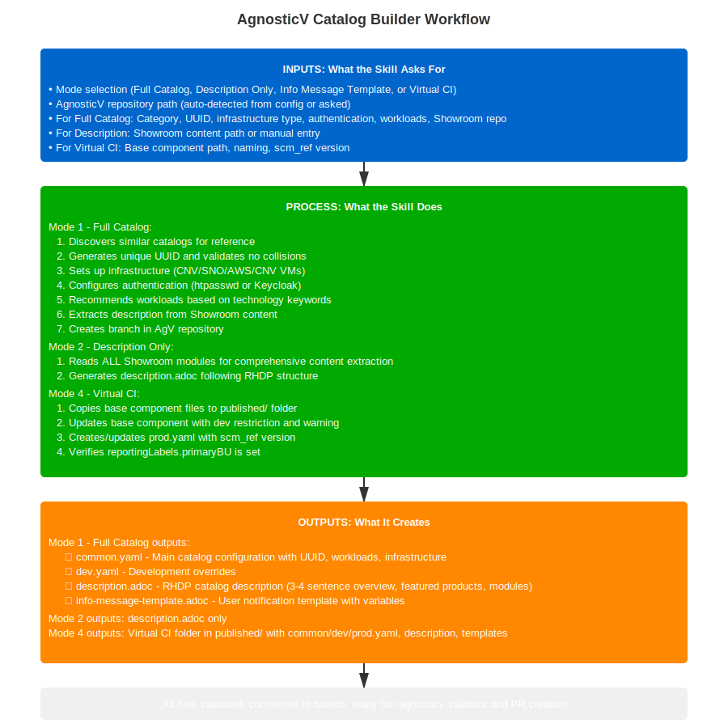

---
context: main
model: claude-opus-4-6
---

# Skill: agnosticv-catalog-builder

**Name:** AgnosticV Catalog Builder
**Description:** Create or update AgnosticV catalog files for RHDP deployments
**Version:** 2.1.0
**Last Updated:** 2026-02-03

---

## ⚠️ CRITICAL: Keep Questions Simple and Direct

**When asking for paths, URLs, or locations:**
- Just ask for the path or URL directly
- DO NOT ask about GitHub organizations, root folders, subdirectories, or try to find/detect them
- DO NOT offer multiple options to search or auto-detect
- Accept exactly what the user provides - don't try to be smart about it

**Example of what NOT to do:**
```
❌ Which GitHub organization? (rhpds / redhat-scholars / Other)
❌ Should I auto-detect your catalog directory? [Y/n]
❌ Which subdirectory should I use?
```

**Example of what TO do:**
```
✅ What is the URL or path to your Showroom repository?
✅ What is the path to the catalog/CI directory?
```

Just ask, use what they give you, move on. Users know their paths - trust them.

---

## Purpose

Unified skill for creating and updating AgnosticV catalog configurations. Handles everything from full catalog creation to updating individual files like description.adoc or info-message-template.adoc.

## Workflow Diagram



## What You'll Need Before Starting

Have these ready before running this skill:

**Choose your mode first:**
1. **Full Catalog** - Creating complete new catalog
2. **Description Only** - Just updating description.adoc
3. **Info Message Template** - Creating info-message-template.adoc
4. **Virtual CI** - Creating published/ Virtual CI

**For Full Catalog mode:**
- 📁 **AgnosticV repo path** - Where your local AgnosticV repository is (e.g., `~/work/code/agnosticv`)
- 🏢 **Catalog details**:
  - Display name (appears in RHDP UI)
  - Short name (directory name, lowercase with hyphens)
  - Brief description (1-2 sentences)
  - Category (workshop, demo, integration, etc.)
- 🔧 **Infrastructure choices**:
  - Cloud provider (AWS, Azure, OpenShift CNV, None)
  - Sandbox architecture (single-node, multi-node)
  - Workloads needed (which ocp4_workload_* roles)
- 🔗 **Showroom URL** (optional) - Link to your workshop/demo repository

**For Description Only mode:**
- 📁 **Showroom path or URL** - Where your workshop content is
- 📁 **Catalog directory path** - Where to save description.adoc
- 📋 **Module content** - Completed Showroom modules to extract from

**For Info Message Template:**
- 📁 **Catalog path** - Path to existing AgV catalog
- 📊 **User data keys** - List of data your workload shares via agnosticd_user_info

**For Virtual CI:**
- 📁 **Base component path** - Existing component to create Virtual CI from
- 🏷️ **Naming** - Virtual CI folder name (must be unique)

**Access needed:**
- ✅ Write permissions to AgnosticV repository
- ✅ Git configured with SSH access to GitHub
- ✅ RHDP account with AgnosticV repository access

---

## When to Use This Skill

Use `/agnosticv-catalog-builder` when you need to:

- Create a complete new RHDP catalog item
- Generate just description.adoc from Showroom content
- Create info-message-template.adoc for user data display
- Update catalog files after Showroom content changes
- Set up infrastructure provisioning for workshops/demos

**Prerequisites:**
- RHDP account with AgnosticV repository access
- AgnosticV repository cloned locally (e.g., `~/work/code/agnosticv` or `~/devel/git/agnosticv`)
- Git configured with SSH access to GitHub
- For description generation: Showroom content in `content/modules/ROOT/pages/`

---

## Skill Workflow Overview

```
Step 0:   Prerequisites & Scope Selection
  ↓
  ├─ Full Catalog →
  │    Step 1: Context (event + type + technologies)
  │    Step 2: Discovery (search AgV for reference)
  │    Step 3: Infrastructure gate (OCP or VMs?)
  │            ├─ OCP → @agnosticv/docs/ocp-catalog-questions.md
  │            │        (Steps 3B-8: cluster size, version, pool, auth,
  │            │         workloads, LiteMaaS, showroom+console_embed, multi-user)
  │            └─ VMs → @agnosticv/docs/cloud-vms-base-catalog-questions.md
  │                     (Steps 3B-8: CNV/AWS, RHEL image, ports, auth skip,
  │                      VM workloads, vm_workload_showroom, multi-user warning)
  │    Step 7: Catalog Details  +  Step 7a: Repo setup  ← return point
  │    Step 9: Generate Files (common.yaml, dev.yaml, description, info-message)
  │    Step 10: Directory Path
  │    Step 11: Write Files
  │    Step 12: Commit
  ├─ Description Only  → Steps 1-4
  ├─ Info Message      → Steps 1-2
  └─ Virtual CI        → Steps 1-10
```

---

## Step 0: Prerequisites & Scope Selection (FIRST)

**CRITICAL:** Start by asking what the user wants to generate.

### Ask for Scope

```
🏗️  AgnosticV Catalog Builder

What would you like to create or update?

1. Full Catalog (common.yaml, dev.yaml, description.adoc, info-message-template.adoc)
   └─ For: New catalog from scratch with infrastructure setup

2. Description Only (description.adoc)
   └─ For: Generate/update description from Showroom content

3. Info Message Template (info-message-template.adoc)
   └─ For: Display user data from your workload CI

4. Create Virtual CI (published/ folder)
   └─ For: Create Virtual CI from existing base component

Your choice [1-4]:
```

### Get AgnosticV Repository Path

Detect AgV path automatically by checking config files (`~/CLAUDE.md`, `~/claude/*.md`, `~/.claude/*.md`) for a line containing `agnosticv` with a path. If found, confirm with user. If not found, ask the user for their AgV repository path (e.g., `~/work/code/agnosticv`). Validate the path exists and is a git repo.

See `@agnosticv/docs/AGV-COMMON-RULES.md` for the full detection procedure.

### Git Branch Selection

```bash
cd "$agv_path"

# Show current branch
current_branch=$(git rev-parse --abbrev-ref HEAD 2>/dev/null || echo "unknown")
```

**Ask about branch:**
```
📍 I see you are working on branch: $current_branch

Q: Do you want to use this branch or should I create a new one?

1. Use current branch: $current_branch
2. Create new branch

Choice [1/2]:
```

**If user chooses 1 (Use current branch):**
```
✓ Using your current branch: $current_branch
```

**If user chooses 2 (Create new branch):**
```
Q: New branch name (e.g., add-my-catalog or update-description):
   (no 'feature/' prefix needed)

Branch name:
```

```bash
# Strip feature/ prefix if user added it
branch_name="${branch_name#feature/}"

# Create and switch to new branch
git checkout -b "$branch_name"

echo "✓ Created and switched to branch: $branch_name"
```

---

## MODE 1: Full Catalog Creation

**When selected:** User chose option 1 (Full Catalog)

### Step 1: Context (REQUIRED — ask before anything else)

Ask these THREE questions sequentially before touching anything else.

**Question 1 — Catalog type:**

```
🏗️  What type of catalog is this?

1. Workshop  (multi-user, hands-on lab)
2. Demo      (single-user, presenter-led)
3. Sandbox   (self-service)

Choice [1-3]:
```

Auto-set from choice:

| Choice | catalog_type | category | multiuser |
|---|---|---|---|
| 1 | workshop | Workshops | true |
| 2 | demo | Demos | false |
| 3 | sandbox | Sandboxes | false |

**Question 2 — Event (MANDATORY — never skip):**

**CRITICAL: Always ask this, even if the user did not mention an event.** Event catalogs require different directory structure, branding labels, and access restrictions.

```
Q: Is this for a specific Red Hat event? [Y/n]
```

If YES:
```
Which event?

1. Red Hat Summit 2026  (summit-2026)
2. Red Hat One 2026     (rh1-2026)
3. Other — enter event name

Choice [1-3]:
```

If event selected → category becomes `Brand_Events` (overrides Question 1 category).
If event selected → ask immediately:
```
Q: Lab ID? (e.g., lb2298)
```

Auto-set from event:

| Event | event_name | category override | Brand_Event label | keywords auto-added |
|---|---|---|---|---|
| Summit 2026 | `summit-2026` | `Brand_Events` | `Red_Hat_Summit_2026` | `summit-2026`, `<lab-id>` |
| RH One 2026 | `rh1-2026` | `Brand_Events` | `Red_Hat_One_2026` | `rh1-2026`, `<lab-id>` |
| Other | `<entered>` | `Brand_Events` | _(ask user)_ | `<event-name>`, `<lab-id>` |
| No event | `none` | _(from Q1)_ | _(omit)_ | _(none)_ |

**Question 3 — Technologies:**

```
Q: What technologies will users learn or see? (comma-separated)
   Examples: ansible, openshift ai, pipelines, gitops, kubevirt

Technologies:
```

Store: `event_name`, `lab_id`, `catalog_type`, `category`, `technologies`.

**Naming standards** (applied automatically from here):

| Item | Pattern | Example |
|---|---|---|
| AgnosticV directory (event) | `<event-name>/<lab-id>-<short-name>-<cloud_provider>` | `summit-2026/lb1234-ocp-fish-swim-aws` |
| AgnosticV directory (no event) | `<subdirectory>/<short-name>` | `agd_v2/ocp-fish-swim` |
| Showroom repo | `<short-name>-showroom` | `ocp-fish-swim-showroom` |
| Slack channel (event) | `<event-name>-<lab-id>-<short-name>` | `summit-2026-lb1234-ocp-fish-swim` |

All GitHub repositories must be in `github.com/rhpds`.

---

### Step 2: Catalog Discovery (Search Existing)

Silently search `agd_v2/` and `openshift_cnv/` using technologies from Step 1. Read each result's `config:` field to show infra type.

```bash
grep -rl "$technologies" "$AGV_PATH/agd_v2/" "$AGV_PATH/openshift_cnv/" \
  --include="common.yaml" -l 2>/dev/null \
  | xargs -I{} dirname {} | head -5
```

**Show results with infra type — ask ONE question:**

```
📖 Found similar catalogs:

1. agd_v2/ansible-aap-workshop/         [OCP cluster]
   └─ Ansible Automation Platform Self-Service

2. openshift_cnv/ocp-cnv-kubevirt-demo/ [OCP cluster]
   └─ KubeVirt Virtualization Demo

3. agd_v2/vllm-playground-aws/          [RHEL/AAP VMs]
   └─ vLLM Playground on AWS

Would you like to use one of these as a reference? [Y/n]
```

**If YES:** `Which one? Enter number:`

Read that catalog's `common.yaml`:
- Copy workloads, collections as defaults
- **Read `config:` field → auto-set infra type** (`openshift-workloads` → OCP, `cloud-vms-base` → VMs)
- Skip Step 3 Question A (OCP or VMs?) — infra type already known
- **Still ask all sizing questions in Step 3** (SNO vs multinode, OCP version, autoscale, AWS) — reference may be SNO but user may want multinode with scaling

**If NO or none found:** Proceed to Step 3 and ask all questions including infra type.

### Category *(auto — set from Step 1, no question)*

Category is already determined from Step 1. Confirm internally:

| Type answered in Step 1 | Event? | Category set |
|---|---|---|
| Lab / Workshop | Yes | `Brand_Events` |
| Demo | Yes | `Brand_Events` |
| Lab / Workshop | No | `Workshops` |
| Demo | No | `Demos` |
| Sandbox | No | `Sandboxes` |

Multiuser auto-set: `Brand_Events` / `Workshops` → `true`, `Demos` → `false`.

### UUID *(auto — generated and collision-checked silently)*

```
🔑 UUID Generation

Every catalog needs a unique RFC 4122 compliant UUID.

Generating UUID...
```

**Generate and validate:**
```bash
# Generate lowercase UUID
new_uuid=$(uuidgen | tr '[:upper:]' '[:lower:]')

# Check for collisions
echo "Generated: $new_uuid"
echo "Checking for collisions..."

# Search all common.yaml files
grep -r "asset_uuid: $new_uuid" $AGV_PATH/ --exclude-dir=.git

if [[ $? -eq 0 ]]; then
  echo "⚠️  Collision detected! Regenerating..."
  # Regenerate until unique
fi
```

### Step 3: Infrastructure Selection

Ask sequentially — ONE question at a time.

**Question A — Infrastructure type gate:**

**SKIP if infra type was determined from reference catalog in Step 2.**
If no reference, ask once — then follow the appropriate question file:

```
🏗️  What type of infrastructure?

1. OpenShift cluster  (OCP — workshops, demos on OpenShift)
2. RHEL / AAP VMs     (cloud-vms-base — RHEL demos, AAP, non-OCP)

Choice [1/2]:
```

**BRANCH 1: OpenShift cluster**
→ Follow `@agnosticv/docs/ocp-catalog-questions.md` for Steps 3B through 8.
  That file covers: cluster size, OCP version, pool, autoscale, AWS gate, authentication, OCP workloads, LiteMaaS, collection versions, Showroom (with console embed), and multi-user config.
  Return here for Step 7 when complete.

**BRANCH 2: RHEL / AAP VMs — `cloud-vms-base`**
→ Follow `@agnosticv/docs/cloud-vms-base-catalog-questions.md` for Steps 3B through 8.
  That file covers: CNV or AWS gate, RHEL image, sizing, port exposure, authentication skip, VM workloads, VM showroom (no console embed), and multi-user isolation warning.
  Return here for Step 7 when complete.

### Step 7: Catalog Details

```
📝 Catalog Details

Q: Display name (appears in RHDP UI):
   Example: Ansible Automation Platform with OpenShift AI

Name:

Q: Short name (lowercase, hyphens, descriptive):
   Example: ansible-aap-ai-workshop

Short name:

Q: Brief description (1-2 sentences):
   This appears in the catalog listing.

Description:

Q: Maintainer name and email?
   This goes into __meta__.owners.maintainer
   Example: Wolfgang Kulhanek / wkulhanek@redhat.com

Name:
Email:
```

**Validate directory doesn't exist across entire repo:**
```bash
# Check if directory name exists anywhere in AgV repo
if find "$AGV_PATH" -maxdepth 2 -type d -name "$short_name" 2>/dev/null | grep -q .; then
  echo "⚠️  Directory '$short_name' already exists in AgnosticV repo"
  echo "Choose a different name."
  exit 1
fi
```

### Step 7a: Repository Setup

**If no Showroom repo was provided in Step 6**, show creation instructions and pause:

```
📚 Create Showroom Repository (Showroom 1.5.3+ REQUIRED)

1. Create a new empty GitHub repo in github.com/rhpds
   Naming: {short-name}-showroom

2. Clone it locally and run: /showroom:create-lab --new
   Creates: default-site.yml, ui-config.yml, supplemental-ui/,
            content/lib/, .github/workflows/gh-pages.yml

   Reference: https://github.com/rhpds/lb2298-ibm-fusion

⚠️  Do NOT use showroom_template_nookbag — it is pre-1.5.3.

⏸️  Re-run this skill once the Showroom repo is ready.
```

**If Showroom repo URL was already provided in Step 6**, skip this step.

**Ask about custom Ansible collection:**
```
Q: Will this catalog use a custom Ansible collection? [Y/n]

ℹ️  Custom collections are needed when:
   - Creating new workloads specific to this catalog
   - Sharing workload logic across multiple catalogs
   - Building reusable automation components
```

**If YES:**
```
Collection naming: rhpds.{short-name}
Repository: https://github.com/rhpds/rhpds.{short-name}

Note:
- Collection must be created in github.com/rhpds organization
- Will be added to requirements_content in common.yaml
- Use this for catalog-specific workloads

Example structure:
  rhpds.{short-name}/
  ├── galaxy.yml
  ├── roles/
  │   └── ocp4_workload_{catalog_feature}/
  └── README.md
```

**If NO:**
```
✓ Using standard collections only (agnosticd.core_workloads, agnosticd.showroom, etc.)
```

### Step 9: Generate Files

Now generate all four files:

#### 9.1: Generate common.yaml

Read the template at `@agnosticv/skills/catalog-builder/templates/common.yaml.template` and use it as the base structure. Replace all `<placeholders>` with actual values collected from the user in previous steps.

**Bundled real examples — read the one matching the infra type:**
- `@agnosticv/skills/catalog-builder/examples/ocp-demo/` — OCP openshift-workloads via CNV pool
- `@agnosticv/skills/catalog-builder/examples/ocp-cnv/` — OCP via openshift_cnv pool
- `@agnosticv/skills/catalog-builder/examples/ocp-aws/` — OCP via AWS pool (Route53 includes)
- `@agnosticv/skills/catalog-builder/examples/cloud-vms-base/` — RHEL VMs on AWS
- `@agnosticv/skills/catalog-builder/examples/published-virtual-ci/` — Virtual CI structure (MODE 4)

**Developer Guidelines** (naming, __meta__ rules, FTL requirement): `@agnosticv/skills/catalog-builder/references/developer-guidelines.md`

**Auto-add `#include` lines at the top — only what's needed:**

**CRITICAL — Avoid duplicate includes (causes include loop):**
Before adding any `#include` line, check if it already appears in:
1. The event directory's `account.yaml` (e.g. `summit-2026/account.yaml`)
2. The AgV root `account.yaml`
3. Anywhere else in `common.yaml` itself

If an include is already present in any of these files, do NOT add it again — AgnosticV will error with `"included more than once / include loop"`. This applies to ALL includes, not just event restriction includes.

**Standard boilerplate** (always):

**Icon include — conditional on infra type:**
- OCP catalogs: `#include /includes/catalog-icon-openshift.yaml`
- cloud-vms-base catalogs: Ask user which icon applies:
  ```
  Q: Which product icon should this catalog use?
  1. catalog-icon-openshift.yaml  (OpenShift)
  2. catalog-icon-rhel.yaml       (RHEL)
  3. catalog-icon-aap.yaml        (Ansible Automation Platform)
  ```
  Use the answer in the include line below.

```
#include /includes/agd-v2-mapping.yaml
#include /includes/catalog-icon-<chosen>.yaml
#include /includes/terms-of-service.yaml
#include /includes/parameters/purpose.yaml
#include /includes/parameters/salesforce-id.yaml
#include /includes/secrets/ocp4_token.yaml
#include /includes/secrets/demosat-rhel-9-10-latest.yaml
```

**Event restriction** (event catalogs — in common.yaml until event.yaml is created):

**Before adding:** check if the event directory already has an `account.yaml` that includes the restriction:
```bash
grep "access-restriction-summit-devs" $AGV_PATH/summit-2026/account.yaml 2>/dev/null
```
- **If found in `account.yaml`**: do NOT add to `common.yaml` — it would create an include loop error
- **If NOT found**: add to `common.yaml`:
```
#include /includes/access-restriction-summit-devs.yaml   # summit-2026
#include /includes/access-restriction-rh1-2026-devs.yaml # rh1-2026
```

**AWS only** (CNV pool handles cert_manager and auth — AWS needs explicit Route53/letsencrypt):
```
#include /includes/aws-sandbox-meta.yaml
#include /includes/parameters/aws-regions-standard.yaml
#include /includes/secrets/letsencrypt_with_zerossl_fallback.yaml
```

**LiteMaaS** (added automatically if user answers YES in Step 5):
```
#include /includes/secrets/litemaas-master_api.yaml       # LiteLLM API URL + master key
#include /includes/parameters/litellm_metadata.yaml        # LiteLLM metadata (model list, endpoints)
```

**Workload-specific secrets not in pool** (e.g. `ibm-fusion.yaml`, partner credentials) — add manually, leave TODO comment otherwise.

#### 9.2: Generate dev.yaml

```yaml
---
# -------------------------------------------------------------------
# Purpose - Cost tag. One of development, ilt, production, event
# -------------------------------------------------------------------
purpose: development
__meta__:
  deployer:
    scm_ref: main
    scm_type: git
```

**Note:** dev.yaml is minimal — only overrides scm_ref and sets purpose tag for cost tracking.

#### 9.2a: Generate `__meta__` block for `common.yaml` (REQUIRED — ask sequentially)

**This block goes into `common.yaml`, not `dev.yaml`.** The `__meta__` block is generated based on all information collected. Use the following rules exactly.

**NEVER define `anarchy.namespace`** — it is set at the top level of AgV now. Omit it entirely.

**Ask: deployer actions** (for workloads that touch resources OUTSIDE the cluster/sandbox):

```
Q: Does any workload in this catalog deploy or configure something
   outside the provisioned environment? (e.g., external DNS,
   cloud resources, external registries, shared services) [Y/n]

If YES: which lifecycle actions should be disabled?
  - start  (disable if base component already handles cluster start)
  - stop   (disable if base component already handles cluster stop)

Note: remove_workloads is controlled separately via sandbox_api below — not here.
All default to false. Only set true to DISABLE that action.
```

Generate only the actions the user marks true:
```yaml
__meta__:
  deployer:
    actions:
      stop:
        disable: true    # only if user said yes
      start:
        disable: true    # only if user said yes
```

If user says No or unsure → omit `deployer.actions` entirely.

**deployer.ee** — use the current chained EE image (from summit-2026/lb2298-ibm-fusion reference):

```yaml
  deployer:
    scm_url: https://github.com/agnosticd/agnosticd-v2
    scm_ref: main
    execution_environment:
      image: quay.io/agnosticd/ee-multicloud:chained-2026-02-16
      pull: missing
```

**Ask: remove_workloads on destroy** (always ask — important for any catalog):

```
Q: Do you want remove_workloads to run when the environment is destroyed?

remove_workloads cleans up everything the workloads installed when a user
deletes their environment. This is usually what you want.

Set to NO only if your workload deployed something that should persist
after destroy (e.g., data in an external system, a shared service, etc.)

Run remove_workloads on destroy? [Y/n]  (default: Yes)
```

- YES (default) → omit `sandbox_api` entirely (catch_all defaults to true)
- NO → add:
```yaml
  sandbox_api:
    actions:
      destroy:
        catch_all: false
```

**catalog.reportingLabels** — always ask:

```
Q: What is the primary business unit (primaryBU)?

Valid values (from @agnosticv/docs/constants.md):
- Hybrid_Platforms
- Application_Services
- Ansible
- RHEL
- Cloud_Services
- AI

primaryBU:

Q: Secondary BU? (optional, press Enter to skip)

secondaryBU:
```

**catalog.labels.Brand_Event** — auto-set from event selection (Step 0.5):

| Event | Value |
|---|---|
| summit-2026 | `Red_Hat_Summit_2026` |
| rh1-2026 | `Red_Hat_One_2026` |
| No event | _(omit entirely)_ |

**catalog.keywords** — build from event + lab ID + user input:

```
Q: What specific keywords describe this catalog? (3-4 max)

Rules:
- 3-4 keywords maximum — more dilutes search relevance
- Use specific technology or topic terms only
- Do NOT use generic words already implied by category or title:
  ✗ workshop, demo, lab, sandbox, openshift, ansible, rhel, tutorial
  ✓ ibm-fusion, cnv, kubevirt, rag, llm, leapp, mcp, cnpg, tekton

Examples: ibm-fusion, cnv, kubevirt
          leapp, rhel-upgrade
          mcp, librechat, gitea

Keywords:
```

Auto-add event keywords silently (user should not add these manually):
- summit-2026 → add `summit-2026` and `<lab-id>`
- rh1-2026 → add `rh1-2026` and `<lab-id>`

**Validate before writing:** If user provides more than 4 keywords or includes generic terms, ask them to trim/replace before proceeding.

**catalog.labels.Product and Product_Family** — ask:

```
Q: What is the primary Red Hat product featured in this catalog?
   This goes into catalog.labels.Product

Common values:
- Red_Hat_OpenShift_Container_Platform
- Red_Hat_Ansible_Automation_Platform
- Red_Hat_OpenShift_AI
- Red_Hat_Enterprise_Linux

Product:

Q: Product family?
   Common values: Red_Hat_Cloud, Red_Hat_Automation, Red_Hat_Linux

Product_Family:
```

**catalog.workshopLabUiRedirect** — already set by the infra reference file (Step 8). Do not ask again.

- OCP multi-user workshops: auto-set to `true` by `ocp-catalog-questions.md`
- Demos / VM catalogs: omitted by the respective reference file

**Full `__meta__` output:**

```yaml
__meta__:
  asset_uuid: <auto-generated>
  owners:
    maintainer:
    - name: <maintainer name from Step 7>
      email: <maintainer email from Step 7>
    instructions:
    - name: TBD
      email: tbd@redhat.com

  deployer:
    scm_url: https://github.com/agnosticd/agnosticd-v2
    scm_ref: main
    execution_environment:
      image: <latest ee-multicloud chained from AgV grep>
      pull: missing
    # actions:          # Only add if workload touches external resources
    #   stop:
    #     disable: true
    #   start:
    #     disable: true

  # sandbox_api:        # Only add if remove_workloads should be skipped
  #   actions:
  #     destroy:
  #       catch_all: false

  catalog:
    reportingLabels:
      primaryBU: <primaryBU from Step 9.2a>
      # secondaryBU: <optional>
    namespace: babylon-catalog-{{ stage | default('?') }}
    display_name: "<display name from Step 7>"
    category: <auto from Step 1>
    keywords:
    - <event_name>      # auto: summit-2026 or rh1-2026 (event catalogs only)
    - <lab_id>          # auto: lbxxxx (event catalogs only)
    - <user keywords split from comma-separated input>
    labels:
      Product: <Product from Step 9.2a>
      Product_Family: <Product_Family from Step 9.2a>
      Provider: RHDP
      # Brand_Event: Red_Hat_Summit_2026   # auto-set for event catalogs
    multiuser: <auto from Step 1>
    # workshopLabUiRedirect: true          # auto-set for OCP multi-user workshops
```

**For no-event catalogs**: omit `Brand_Event` label and event keywords.

#### 9.3: Generate description.adoc

**Ask for description content:**
```
📄 Description Generation

I can extract description content from your Showroom, or you can provide it manually.

Q: Do you want me to extract from Showroom content? [Y/n]
```

**If YES and Showroom URL provided:**
```bash
# Clone showroom temporarily
temp_dir=$(mktemp -d)
git clone <showroom-url> "$temp_dir"

# Extract modules
find "$temp_dir/content/modules/ROOT/pages" -name "*.adoc" | sort

# Read module titles
grep "^= " "$temp_dir/content/modules/ROOT/pages"/*.adoc
```

Read the template and examples at `@agnosticv/skills/catalog-builder/templates/description.adoc.template`. Follow Nate's RHDP format exactly -- the template includes key guidelines and two real examples (demo + workshop).

#### 9.4: Generate info-message-template.adoc

```
📧 Info Message Template

This template displays user data after deployment.

Q: Does your catalog use agnosticd_user_info to share data? [Y/n]
```

**If YES:**
```
Q: What data keys does your workload share via agnosticd_user_info.data?

Examples:
  - litellm_api_base_url
  - litellm_virtual_key
  - grafana_admin_password

Data keys (comma-separated):
```

Read the template at `@agnosticv/skills/catalog-builder/templates/info-message.adoc.template`. It includes both variants (with and without user data) and explains how `agnosticd_user_info` works.

### Step 10: Determine Catalog Directory Path

**If event was selected (summit-2026 or rh1-2026):**

Auto-generate path from event, lab ID, short name, and cloud provider. No question needed.

```bash
# Pattern: <event-name>/<lab-id>-<short-name>-<cloud_provider>
# Example: summit-2026/lb2298-ocp-fish-swim-aws
directory_name="${lab_id}-${short_name}-${cloud_provider}"
catalog_path="$AGV_PATH/${event_name}/${directory_name}"
```

Show the user what will be created:
```
📂 Catalog path (from event + naming standards):
   summit-2026/lb2298-ocp-fish-swim-aws

Using: $catalog_path
```

**If no event (standard catalog):**

```
📂 Catalog Directory Path

Q: Which subdirectory should I create the catalog in?

Common options:
- agd_v2 (standard catalogs)
- openshift_cnv (CNV-based catalogs)
- sandboxes-gpte (sandbox catalogs)
- published (Virtual CIs)

Enter subdirectory (e.g., agd_v2):
```

```bash
catalog_path="$AGV_PATH/$subdirectory/$short_name"
```

**Validate doesn't exist:**
```bash
if [[ -d "$catalog_path" ]]; then
  echo "⚠️  Directory already exists: $catalog_path"
  echo "Choose a different name or location."
  exit 1
fi
```

### Step 11: Write Files

```
💾 Writing Files

Creating catalog directory: $catalog_path

Writing:
  ✓ common.yaml
  ✓ dev.yaml
  ✓ description.adoc
  ✓ info-message-template.adoc
```

**Execute:**
```bash
mkdir -p "$catalog_path"

# Write all four files
cat > "$catalog_path/common.yaml" <<'EOF'
<generated-content>
EOF

cat > "$catalog_path/dev.yaml" <<'EOF'
<generated-content>
EOF

cat > "$catalog_path/description.adoc" <<'EOF'
<generated-content>
EOF

cat > "$catalog_path/info-message-template.adoc" <<'EOF'
<generated-content>
EOF
```

### Step 12: Git Commit (Optional)

```
🚀 Ready to Commit

Files created in: $catalog_path

Q: Commit these changes? [Y/n]
```

**If YES:**
```bash
# Get relative path from AgV root for commit message
rel_path="${catalog_path#$AGV_PATH/}"

cd "$AGV_PATH"

git add "$rel_path/"

git commit -m "Add $directory_name catalog

- Category: $category
- Infrastructure: $cloud_provider ($sandbox_architecture)
- Workloads: $num_workloads selected
- UUID: $asset_uuid
- Path: $rel_path"

current_branch=$(git rev-parse --abbrev-ref HEAD)
echo "✓ Committed to branch: $current_branch"
echo ""
echo "Next steps:"
echo "  1. Test locally: cd $rel_path && agnosticv_cli dev.yaml"
echo "  2. Run validator: /agnosticv-validator"
echo "  3. Create PR: git push origin $current_branch && gh pr create --fill"
```

---

## MODE 2: Description Only

Generate or update `description.adoc` from Showroom content. Reads ALL .adoc modules locally — no GitHub API.

→ Full workflow: `@agnosticv/skills/catalog-builder/references/mode-2-description.md`

---

## MODE 3: Info Message Template Only

Ask for catalog path and agnosticd_user_info data keys, then generate `info-message-template.adoc`.

→ Full workflow: `@agnosticv/skills/catalog-builder/references/mode-3-info-message.md`

---

## MODE 4: Create Virtual CI

Create Virtual CI in `published/` from base component. Uniqueness check, UUID, dev restriction, prod.yaml pinning, bulk processing.

→ Full workflow: `@agnosticv/skills/catalog-builder/references/mode-4-virtual-ci.md`

## Related Skills

- `/agnosticv:validator` -- Validate catalog configurations after creation
