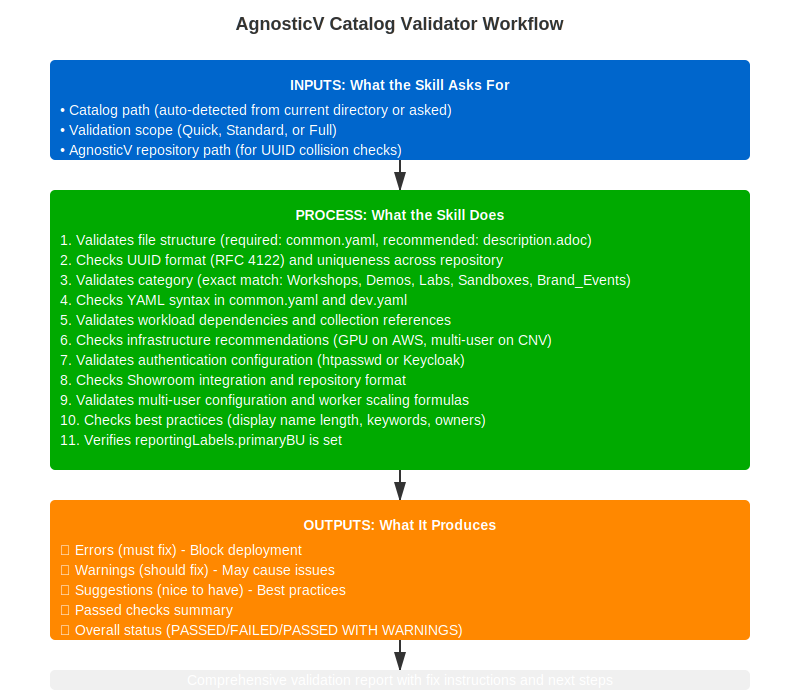

---
context: main
model: claude-opus-4-6
---

# Skill: agnosticv-validator

**Name:** AgnosticV Catalog Validator
**Description:** Validate AgnosticV configurations against best practices and deployment requirements
**Version:** 1.0.0
**Last Updated:** 2026-01-22

---

## Purpose

Comprehensive validation of AgnosticV catalog configurations before deployment. Checks UUID format, YAML syntax, workload dependencies, category correctness, and best practices to prevent deployment failures.

## Workflow Diagram



## What You'll Need Before Starting

Have these ready before running this skill:

**Required:**
- 📁 **Path to catalog directory** - Location of the catalog you want to validate
  - Example: `~/work/code/agnosticv/agd_v2/my-workshop`
  - Example: `/path/to/agnosticv/catalogs/my-demo`
  - Can be relative path if you're in the AgV repo

**The catalog should have:**
- ✅ **common.yaml** (minimum requirement)
- 📋 Optional: dev.yaml, prod.yaml, description.adoc

**Access needed:**
- ✅ Read permissions to the catalog directory
- ✅ Read permissions to AgnosticV repository

**What gets validated:**
- UUID format and uniqueness
- YAML syntax (common.yaml, dev.yaml, prod.yaml)
- Workload dependencies and availability
- Category correctness and structure
- Infrastructure recommendations
- Best practices compliance
- Asset metadata completeness

**Good to know:**
- Validation produces errors (must fix), warnings (should fix), and suggestions (nice to have)
- Best run BEFORE creating a PR
- Can run multiple times as you fix issues

---

## When to Use This Skill

Use `/agnosticv-validator` when you need to:

- Validate a new catalog before creating PR
- Troubleshoot catalog deployment failures
- Check catalog quality before testing in RHDP
- Verify updates to existing catalogs
- Ensure best practices compliance

**Prerequisites:**
- AgnosticV repository cloned locally
- Catalog files exist (common.yaml minimum)
- Git configured and repository accessible

---

## Skill Workflow Overview

```
Step 1: Path Detection (Auto-detect or ask)
  ↓
Step 2: Validation Scope Selection
  ↓
Step 3: Run Validation Checks
  ↓
Step 4: Generate Report (Errors/Warnings/Suggestions)
  ↓
Step 5: Offer Follow-up Actions
```

---

## Configuration Detection

### Get AgnosticV Repository Path (For Full Repo Validation)

Detect AgV path automatically by checking config files (`~/CLAUDE.md`, `~/claude/*.md`, `~/.claude/*.md`) for a line containing `agnosticv` with a path. If found, confirm with user. If not found, ask when needed for full repository validation.

See `@agnosticv/docs/AGV-COMMON-RULES.md` for the full detection procedure.

---

## Step 1: Setup

### Auto-detect AgnosticV Repository Path

Silently check `~/CLAUDE.md`, `~/claude/*.md`, `~/.claude/*.md` for a line containing `agnosticv` with a path. If found, confirm with user. If not found, ask.

See `@agnosticv/docs/AGV-COMMON-RULES.md` for full detection procedure.

### Ask which catalog to validate

```
🔍 AgnosticV Catalog Validator

AgnosticV repo: {{ agv_path }}

Q: Which catalog do you want to validate?
   Provide the path relative to the AgV repo root, or full path.

   Examples:
   - agd_v2/my-workshop
   - openshift_cnv/my-demo
   - summit-2026/lb2298-ibm-fusion-aws

Catalog path:
```

**Validate the provided path:**

```bash
full_path="$AGV_PATH/$catalog_input"

if [ -f "$full_path/common.yaml" ]; then
  echo "✅ Found: $full_path"
  echo "   common.yaml ✓"
  [ -f "$full_path/dev.yaml" ] && echo "   dev.yaml ✓" || echo "   dev.yaml (not found)"
  [ -f "$full_path/description.adoc" ] && echo "   description.adoc ✓" || echo "   ⚠ description.adoc (missing)"
else
  echo "❌ No common.yaml found at: $full_path"
  echo "   Check the path and try again."
fi
```

**Store validated path** for all subsequent checks.

---

## Step 1.5: Event Context Detection

Auto-detect event from the catalog directory path. Then confirm with user.

**Detection logic:**

```bash
# Extract parent directory from catalog path
# e.g., /path/to/agnosticv/summit-2026/lb2298-ibm-fusion → summit-2026
parent_dir=$(basename $(dirname $CATALOG_PATH))
# e.g., lb2298-ibm-fusion → lb2298
lab_id=$(echo $(basename $CATALOG_PATH) | grep -oP '^lb\d+')
```

| Detected parent | Conclusion |
|---|---|
| `summit-2026` | Event: summit-2026 |
| `rh1-2026` | Event: rh1-2026 |
| anything else | No event detected |

**Ask ONE question:**

```
🎪 Event Context


Detected event catalog: {{ parent_dir }}/{{ catalog_slug }}
Lab ID detected: {{ lab_id }}

Is this for event: {{ parent_dir }}? [Yes/No]

Is this catalog for a specific event?

1. Red Hat Summit 2026  (summit-2026)
2. Red Hat One 2026     (rh1-2026)
3. No event

Choice [1/2/3]:

```

Store: `event_context` (summit-2026 | rh1-2026 | none), `lab_id` (lbxxxx | empty).

If event confirmed → run **Check 16a: Event Catalog Validation** (event-specific checks).

---

## Step 2: Validation Scope Selection

```
Q: What level of validation do you want?

1. ⚡ Quick check (file structure, UUID, basic YAML)
   Duration: ~5 seconds
   Checks: Essential blocking issues only
   
2. ✅ Standard validation (recommended)
   Duration: ~15-30 seconds
   Checks: Files, UUID, YAML, workloads, schema, best practices
   
3. 🔬 Full validation (everything + GitHub API)
   Duration: ~30-60 seconds
   Checks: Standard + GitHub tag/branch validation, collection URLs

Recommended: 2 (Standard)

Your choice: [1/2/3]
```

**Set validation scope:**

```python
if choice == 1:
  validation_scope = "quick"
  checks_to_run = ["file_structure", "uuid", "yaml_syntax"]
  
elif choice == 2:
  validation_scope = "standard"
  checks_to_run = ["file_structure", "uuid", "yaml_syntax", "category",
                   "workloads", "authentication", "showroom", "infrastructure",
                   "stage_files", "multiuser", "bastion", "collections",
                   "deployer", "reporting_labels", "components", "asciidoc",
                   "anarchy_namespace", "best_practices",
                   "litemaas", "event_restriction", "duplicate_includes",
                   "event_catalog"]  # event_catalog only runs if event_context != none

elif choice == 3:
  validation_scope = "full"
  checks_to_run = ["file_structure", "uuid", "yaml_syntax", "category",
                   "workloads", "authentication", "showroom", "infrastructure",
                   "stage_files", "multiuser", "bastion", "collections",
                   "deployer", "reporting_labels", "components", "asciidoc",
                   "anarchy_namespace", "best_practices",
                   "litemaas", "event_restriction", "duplicate_includes",
                   "event_catalog",   # event_catalog only runs if event_context != none
                   "github_api", "collection_urls", "scm_refs"]
```

---

## Step 3: Run Validation Checks

### Initialize Error Collection

```python
errors = []         # ERRORS (must fix) - Block deployment
warnings = []       # WARNINGS (should fix) - May cause issues  
suggestions = []    # SUGGESTIONS (nice to have) - Best practices
passed_checks = []  # Passed checks for summary
```

### Check 1: File Structure

```python
def check_file_structure(catalog_path):
  """Required files validation"""
  
  required_files = ["common.yaml"]
  recommended_files = ["description.adoc", "dev.yaml"]
  
  # Check required
  for file in required_files:
    filepath = f"{catalog_path}/{file}"
    if os.path.exists(filepath):
      passed_checks.append(f"✓ Required file present: {file}")
    else:
      errors.append({
        'check': 'file_structure',
        'severity': 'ERROR',
        'message': f'Missing required file: {file}',
        'location': catalog_path,
        'fix': f'Create {file} in catalog directory'
      })
  
  # Check recommended
  for file in recommended_files:
    filepath = f"{catalog_path}/{file}"
    if not os.path.exists(filepath):
      warnings.append({
        'check': 'file_structure',
        'severity': 'WARNING',
        'message': f'Recommended file missing: {file}',
        'location': catalog_path,
        'fix': f'Create {file} for better catalog quality'
      })
```

### Check 2: UUID Format and Uniqueness

```python
import re
import yaml

def check_uuid(catalog_path, agv_repo_path):
  """UUID validation - CRITICAL"""
  
  # Load common.yaml
  with open(f"{catalog_path}/common.yaml") as f:
    config = yaml.safe_load(f)
  
  # Check if UUID exists
  if '__meta__' not in config:
    errors.append({
      'check': 'uuid',
      'severity': 'ERROR',
      'message': 'Missing __meta__ section',
      'location': 'common.yaml',
      'fix': 'Add __meta__ section with asset_uuid'
    })
    return
  
  if 'asset_uuid' not in config['__meta__']:
    errors.append({
      'check': 'uuid',
      'severity': 'ERROR',
      'message': 'Missing __meta__.asset_uuid',
      'location': 'common.yaml:__meta__',
      'fix': 'Generate UUID with: uuidgen'
    })
    return
  
  uuid = config['__meta__']['asset_uuid']
  
  # Validate UUID format (RFC 4122)
  uuid_pattern = r'^[0-9a-f]{8}-[0-9a-f]{4}-[0-9a-f]{4}-[0-9a-f]{4}-[0-9a-f]{12}$'
  
  if not re.match(uuid_pattern, str(uuid).lower()):
    errors.append({
      'check': 'uuid',
      'severity': 'ERROR',
      'message': f'Invalid UUID format: {uuid}',
      'location': 'common.yaml:__meta__.asset_uuid',
      'fix': 'Generate proper UUID with: uuidgen',
      'example': '5ac92190-6f0d-4c0e-a9bd-3b20dd3c816f'
    })
    return
  
  # Check for UUID collision
  collision = search_uuid_in_repo(uuid, agv_repo_path, current_catalog=catalog_path)
  
  if collision:
    errors.append({
      'check': 'uuid',
      'severity': 'ERROR',
      'message': f'UUID collision detected',
      'location': 'common.yaml:__meta__.asset_uuid',
      'details': f'UUID {uuid} already used in: {collision["path"]}',
      'catalog': collision["name"],
      'fix': 'Generate new unique UUID with: uuidgen'
    })
    return
  
  passed_checks.append(f"✓ UUID format valid: {uuid}")
  passed_checks.append(f"✓ UUID is unique")

def search_uuid_in_repo(uuid, repo_path, current_catalog):
  """Search for UUID in all catalogs"""
  import glob
  
  for catalog in glob.glob(f"{repo_path}/**/common.yaml", recursive=True):
    if os.path.dirname(catalog) == current_catalog:
      continue  # Skip current catalog
    
    with open(catalog) as f:
      try:
        config = yaml.safe_load(f)
        if config.get('__meta__', {}).get('asset_uuid') == uuid:
          return {
            'path': catalog,
            'name': config.get('__meta__', {}).get('catalog', {}).get('display_name', 'Unknown')
          }
      except:
        continue
  
  return None
```

### Check 3: Category Validation

```python
def check_category(config):
  """Category correctness validation"""

  valid_categories = ["Workshops", "Demos", "Sandboxes", "Labs", "Brand_Events"]

  if '__meta__' not in config or 'catalog' not in config['__meta__']:
    errors.append({
      'check': 'category',
      'severity': 'ERROR',
      'message': 'Missing __meta__.catalog section',
      'location': 'common.yaml',
      'fix': 'Add __meta__.catalog section with category'
    })
    return

  category = config['__meta__']['catalog'].get('category')

  if not category:
    errors.append({
      'check': 'category',
      'severity': 'ERROR',
      'message': 'Missing __meta__.catalog.category',
      'location': 'common.yaml:__meta__.catalog',
      'fix': f'Add category: {valid_categories}'
    })
    return

  if category not in valid_categories:
    errors.append({
      'check': 'category',
      'severity': 'ERROR',
      'message': f'Invalid category: "{category}"',
      'location': 'common.yaml:__meta__.catalog.category',
      'current': category,
      'valid_options': valid_categories,
      'fix': f'Use one of: {", ".join(valid_categories)} (case-sensitive)'
    })
    return

  passed_checks.append(f"✓ Category valid: {category}")

  # Validate category alignment with configuration
  multiuser = config['__meta__']['catalog'].get('multiuser', False)

  # Workshops can be single-user or multi-user — no restriction enforced
  # Only Demos are always single-user

  if category == "Demos" and multiuser:
    errors.append({
      'check': 'category',
      'severity': 'ERROR',
      'message': 'Category "Demos" should not be multi-user',
      'location': 'common.yaml:__meta__.catalog',
      'current': 'multiuser: true',
      'expected': 'multiuser: false',
      'fix': 'Set multiuser: false for demos'
    })

  # Check workshopLabUiRedirect - should NOT be enabled for demos
  workshop_ui_redirect = config['__meta__']['catalog'].get('workshopLabUiRedirect', False)

  if category == "Demos" and workshop_ui_redirect:
    errors.append({
      'check': 'category',
      'severity': 'ERROR',
      'message': 'Demos should not have workshopLabUiRedirect enabled',
      'location': 'common.yaml:__meta__.catalog',
      'current': 'workshopLabUiRedirect: true',
      'fix': 'Remove workshopLabUiRedirect or set to false for demos'
    })
```

### Check 4: YAML Syntax

```python
def check_yaml_syntax(catalog_path):
  """YAML syntax validation"""
  
  files_to_check = ["common.yaml", "dev.yaml"]
  
  for filename in files_to_check:
    filepath = f"{catalog_path}/{filename}"
    
    if not os.path.exists(filepath):
      continue
    
    try:
      with open(filepath) as f:
        yaml.safe_load(f)
      passed_checks.append(f"✓ {filename} syntax valid")
    except yaml.YAMLError as e:
      errors.append({
        'check': 'yaml_syntax',
        'severity': 'ERROR',
        'message': f'YAML syntax error in {filename}',
        'location': f'{filename}:line {e.problem_mark.line if hasattr(e, "problem_mark") else "?"}',
        'details': str(e),
        'fix': 'Fix YAML syntax errors'
      })
```

### Check 5: Workload Dependencies

```python
def check_workload_dependencies(config):
  """Workload and collection dependency validation"""
  
  if 'workloads' not in config:
    errors.append({
      'check': 'workloads',
      'severity': 'ERROR',
      'message': 'No workloads defined',
      'location': 'common.yaml',
      'fix': 'Add workloads list'
    })
    return
  
  workloads = config.get('workloads', [])
  collections = config.get('requirements_content', {}).get('collections', [])
  
  # Extract collection names
  collection_names = []
  for coll in collections:
    if 'name' in coll:
      # Extract org/repo from GitHub URL or collection name
      if 'github.com' in coll['name']:
        # https://github.com/agnosticd/core_workloads.git → core_workloads
        repo_name = coll['name'].split('/')[-1].replace('.git', '')
        collection_names.append(repo_name)
      else:
        collection_names.append(coll['name'])
  
  # Check each workload format and dependencies
  for workload in workloads:
    # Validate format: namespace.collection.role
    parts = workload.split('.')
    
    if len(parts) < 3:
      errors.append({
        'check': 'workloads',
        'severity': 'ERROR',
        'message': f'Invalid workload format: {workload}',
        'location': 'common.yaml:workloads',
        'expected': 'namespace.collection.role_name',
        'example': 'agnosticd.core_workloads.ocp4_workload_authentication_htpasswd',
        'fix': 'Use fully qualified workload name'
      })
      continue
    
    namespace, collection, role = parts[0], parts[1], '.'.join(parts[2:])
    
    # Check if collection is in requirements
    if collection not in collection_names and collection not in ['showroom']:
      warnings.append({
        'check': 'workloads',
        'severity': 'WARNING',
        'message': f'Workload "{workload}" requires collection "{collection}"',
        'location': 'common.yaml:requirements_content.collections',
        'fix': f'Add collection to requirements_content.collections',
        'example': f'''
requirements_content:
  collections:
  - name: https://github.com/{namespace}/{collection}.git
    type: git
    version: main
'''
      })
  
  if workloads:
    passed_checks.append(f"✓ Workload format correct ({len(workloads)} workloads)")
```

### Check 6: Infrastructure — Config Type Gate

Detect `config:` type from `common.yaml` and route to the appropriate infra-specific check file.

```python
config_type = config.get('config', '')

if config_type == 'cloud-vms-base':
    # → Run checks from @agnosticv/docs/cloud-vms-base-validator-checks.md
    #   Covers: Check 6A (instances, bastion image, multiuser isolation warning)
    #           Check 7  (authentication SKIP — no OCP auth on VMs)
    #           Check 8  (VM showroom only, no ocp_console_embed)
    #           Check 11 (multiuser isolation warning only)
    pass
else:
    # config: openshift-workloads or openshift-cluster
    # → Run checks from @agnosticv/docs/ocp-validator-checks.md
    #   Covers: Check 6B (pool /prod suffix, OCP version, GPU, SNO limits)
    #           Check 7  (unified auth role, deprecated roles, RHSSO block)
    #           Check 8  (both OCP showroom workloads together, dev_mode)
    #           Check 11 (num_users param, worker scaling, workshopLabUiRedirect)
    #           Check 15 (component propagation for OCP cluster component)
    #           Check 17 (LiteMaaS — OCP-only workload)
    pass
```

After infra-specific checks complete, continue with shared checks below.

### Check 9: Best Practices

```python
def check_best_practices(config):
  """Best practice recommendations"""
  
  # Check for display_name
  display_name = config.get('__meta__', {}).get('catalog', {}).get('display_name', '')
  
  if len(display_name) > 60:
    suggestions.append({
      'check': 'best_practices',
      'message': 'Display name is quite long',
      'current_length': len(display_name),
      'recommendation': 'Keep display names under 60 characters for better UX'
    })
  
  # Check keywords exist and are meaningful
  # Count doesn't matter — search indexes display_name and description already.
  # Keywords must add specific discriminating value beyond what category/title implies.
  keywords = config.get('__meta__', {}).get('catalog', {}).get('keywords', [])

  if not keywords:
    suggestions.append({
      'check': 'best_practices',
      'message': 'No keywords defined',
      'recommendation': 'Add 3-4 specific technology keywords (e.g., "mcp", "leapp", "tekton", "cnpg")'
    })
  else:
    if len(keywords) > 4:
      suggestions.append({
        'check': 'best_practices',
        'message': f'Too many keywords ({len(keywords)}) — keep to 3-4 meaningful terms',
        'current': keywords,
        'recommendation': 'Trim to 3-4 specific technology keywords. More is not better — '
                          'dilutes discoverability and search relevance.'
      })

    generic_keywords = {'workshop', 'demo', 'lab', 'sandbox', 'openshift', 'ansible',
                        'rhel', 'tutorial', 'training', 'course', 'test', 'example'}
    generic_found = [k for k in keywords if k.lower() in generic_keywords]
    if generic_found:
      suggestions.append({
        'check': 'best_practices',
        'message': f'Keywords contain generic terms that add no value: {generic_found}',
        'recommendation': 'Replace with specific technology terms (e.g., "mcp", "leapp", "tekton") — '
                          'generic words like "workshop" or "openshift" are already implied by category and title'
      })

  # Check for owners/maintainers
  if 'owners' not in config.get('__meta__', {}):
    suggestions.append({
      'check': 'best_practices',
      'message': 'No maintainer/owner defined',
      'recommendation': 'Add __meta__.owners.maintainer for accountability'
    })
```

### Check 10: Stage Files Validation

```python
def check_stage_files(catalog_path):
  """Validate stage-specific override files"""

  stage_files = {
    'dev.yaml': {
      'required': True,
      'expected_purpose': 'development'
    },
    'event.yaml': {
      'required': False,
      'expected_purpose': 'events'
    },
    'prod.yaml': {
      'required': False,
      'expected_purpose': 'production'
    }
  }

  for filename, requirements in stage_files.items():
    filepath = f"{catalog_path}/{filename}"

    if os.path.exists(filepath):
      try:
        with open(filepath) as f:
          stage_config = yaml.safe_load(f)

        # Check purpose field
        if 'purpose' in stage_config:
          purpose = stage_config['purpose']
          expected = requirements['expected_purpose']

          if purpose != expected:
            warnings.append({
              'check': 'stage_files',
              'severity': 'WARNING',
              'message': f'{filename} has unexpected purpose value',
              'location': f'{filename}:purpose',
              'current': purpose,
              'expected': expected,
              'recommendation': f'Set purpose: {expected}'
            })
          else:
            passed_checks.append(f"✓ {filename} purpose correct: {purpose}")

        # Check scm_ref differentiation for event/prod
        if filename in ['event.yaml', 'prod.yaml']:
          scm_ref = stage_config.get('__meta__', {}).get('deployer', {}).get('scm_ref')

          if scm_ref == 'main':
            suggestions.append({
              'check': 'stage_files',
              'message': f'{filename} uses scm_ref: main',
              'recommendation': 'Consider using tagged release (e.g., catalog-name-1.0.0) for production stability'
            })

      except yaml.YAMLError:
        # YAML syntax errors handled elsewhere
        pass

    elif requirements['required']:
      warnings.append({
        'check': 'stage_files',
        'severity': 'WARNING',
        'message': f'Missing {filename}',
        'location': catalog_path,
        'fix': f'Create {filename} with purpose: {requirements["expected_purpose"]}'
      })
```

### Check 11: Multi-User Configuration

Handled by the infra-specific check file loaded in Check 6:

- **OCP** → `@agnosticv/docs/ocp-validator-checks.md` (Check 11: num_users param, worker scaling, workshopLabUiRedirect, SNO conflict)
- **cloud-vms-base** → `@agnosticv/docs/cloud-vms-base-validator-checks.md` (Check 11: isolation warning only, no worker scaling)

### Check 12: Bastion Configuration

```python
def check_bastion_config(config):
  """Bastion instance validation for CNV/AWS catalogs"""

  cloud_provider = config.get('cloud_provider', '')
  config_type = config.get('config', '')

  # cloud-vms-base bastion is validated in Check 6A (instances block) — skip here
  if config_type == 'cloud-vms-base':
    return

  # Only check bastion for OCP CNV and AWS
  if cloud_provider not in ['openshift_cnv', 'aws', 'none']:
    return

  # Check bastion image
  bastion_image = config.get('bastion_instance_image', config.get('default_instance_image', ''))

  if bastion_image:
    valid_images = ['rhel-9.4', 'rhel-9.5', 'rhel-9.6', 'rhel-10.0', 'RHEL-10.0-GOLD-latest']

    if not any(img in bastion_image for img in valid_images):
      warnings.append({
        'check': 'bastion',
        'severity': 'WARNING',
        'message': f'Unusual bastion image: {bastion_image}',
        'location': 'common.yaml:bastion_instance_image',
        'valid_images': valid_images,
        'recommendation': 'Use supported RHEL 9.x or 10.x images'
      })
    else:
      passed_checks.append(f"✓ Bastion image valid: {bastion_image}")

  # Check bastion resources
  bastion_cores = config.get('bastion_cores')
  bastion_memory = config.get('bastion_memory')

  if bastion_cores and int(str(bastion_cores).replace('G', '').replace('i', '')) < 2:
    warnings.append({
      'check': 'bastion',
      'severity': 'WARNING',
      'message': f'Bastion has low CPU: {bastion_cores}',
      'location': 'common.yaml:bastion_cores',
      'recommendation': 'Minimum 2 cores recommended for bastion'
    })

  if bastion_memory and int(str(bastion_memory).replace('G', '').replace('i', '')) < 4:
    warnings.append({
      'check': 'bastion',
      'severity': 'WARNING',
      'message': f'Bastion has low memory: {bastion_memory}',
      'location': 'common.yaml:bastion_memory',
      'recommendation': 'Minimum 4Gi recommended for bastion'
    })
```

### Check 13: Collection Versions (tag pattern)

```python
def check_collection_versions(config, agv_repo_path, catalog_path):
  """Validate tag pattern, showroom fixed version, and standard collection versions"""
  import glob, re

  collections = config.get('requirements_content', {}).get('collections', [])

  if not collections:
    warnings.append({
      'check': 'collections',
      'severity': 'WARNING',
      'message': 'No collections defined',
      'location': 'common.yaml:requirements_content.collections',
      'recommendation': 'Add required collections for workloads'
    })
    return

  # --- Check 1: tag: variable must be defined ---
  tag_defined = 'tag' in config
  if not tag_defined:
    errors.append({
      'check': 'collections',
      'severity': 'ERROR',
      'message': 'Missing top-level tag: variable',
      'location': 'common.yaml',
      'fix': 'Add: tag: main  # Override in prod.yaml with specific release tag'
    })
  else:
    passed_checks.append(f"✓ tag variable defined: {config['tag']}")

  # --- Check each collection ---
  showroom_found = False

  for coll in collections:
    coll_name = coll.get('name', '')
    coll_version = str(coll.get('version', ''))

    if 'github.com' not in coll_name:
      continue

    is_showroom = 'agnosticd/showroom' in coll_name

    if is_showroom:
      showroom_found = True

      # Showroom must NOT use {{ tag }} — must be a fixed pinned version
      if '{{' in coll_version and 'tag' in coll_version:
        errors.append({
          'check': 'collections',
          'severity': 'ERROR',
          'message': 'Showroom collection must use a fixed pinned version, not {{ tag }}',
          'location': 'common.yaml:requirements_content.collections',
          'current': coll_version,
          'fix': 'Set version: v1.5.1 (or highest in use across AgV)'
        })
        continue

      # Showroom must be v1.5.1 or above
      version_nums = re.findall(r'\d+', coll_version)
      if version_nums:
        major, minor, patch = (int(version_nums[i]) if i < len(version_nums) else 0
                               for i in range(3))
        if (major, minor, patch) < (1, 5, 1):
          errors.append({
            'check': 'collections',
            'severity': 'ERROR',
            'message': f'Showroom collection version below minimum: {coll_version}',
            'location': 'common.yaml:requirements_content.collections',
            'fix': 'Set version: v1.5.1 or above'
          })
        else:
          passed_checks.append(f"✓ Showroom collection version: {coll_version} (≥ v1.5.1)")

    else:
      # Standard collections should use {{ tag }}
      if '{{' in coll_version and 'tag' in coll_version:
        passed_checks.append(f"✓ Collection uses tag pattern: {coll_name.split('/')[-1]}")
      elif coll_version == 'main':
        warnings.append({
          'check': 'collections',
          'severity': 'WARNING',
          'message': f'Collection hardcodes "main" instead of using tag pattern: {coll_name}',
          'location': 'common.yaml:requirements_content.collections',
          'fix': 'Use version: "{{ tag }}" — allows prod.yaml to override with release tag'
        })
      elif coll_version == 'HEAD':
        errors.append({
          'check': 'collections',
          'severity': 'ERROR',
          'message': f'Collection uses HEAD: {coll_name}',
          'location': 'common.yaml:requirements_content.collections',
          'fix': 'Use version: "{{ tag }}"'
        })
      elif not coll_version:
        errors.append({
          'check': 'collections',
          'severity': 'ERROR',
          'message': f'Git collection missing version: {coll_name}',
          'location': 'common.yaml:requirements_content.collections',
          'fix': 'Add version: "{{ tag }}"'
        })

  # For cloud-vms-base, showroom is optional — only warn if vm_workload_showroom is in use
  config_type = config.get('config', '')
  workloads = config.get('workloads', [])
  vm_showroom_in_use = any('vm_workload_showroom' in w for w in workloads)
  ocp_showroom_in_use = any('ocp4_workload_showroom' in w for w in workloads)

  if not showroom_found:
    if config_type == 'cloud-vms-base' and not vm_showroom_in_use:
      passed_checks.append("✓ No showroom collection (VM catalog without showroom — correct)")
    elif config_type == 'cloud-vms-base' and vm_showroom_in_use:
      warnings.append({
        'check': 'collections',
        'severity': 'WARNING',
        'message': 'vm_workload_showroom in use but showroom collection missing',
        'location': 'common.yaml:requirements_content.collections',
        'fix': '''Add:
  - name: https://github.com/agnosticd/showroom.git
    type: git
    version: v1.5.1'''
      })
    else:
      warnings.append({
        'check': 'collections',
        'severity': 'WARNING',
        'message': 'Showroom collection not found in requirements_content',
        'location': 'common.yaml:requirements_content.collections',
        'fix': '''Add:
  - name: https://github.com/agnosticd/showroom.git
    type: git
    version: v1.5.1'''
      })

  passed_checks.append(f"✓ Collections defined ({len(collections)} collections)")
```

### Check 14: Deployer Configuration

```python
def check_deployer_config(config):
  """Validate deployer configuration"""

  deployer = config.get('__meta__', {}).get('deployer', {})

  if not deployer:
    errors.append({
      'check': 'deployer',
      'severity': 'ERROR',
      'message': 'Missing __meta__.deployer section',
      'location': 'common.yaml:__meta__',
      'fix': 'Add deployer section with scm_url, scm_ref, execution_environment'
    })
    return

  # Check required fields
  required_fields = {
    'scm_url': 'https://github.com/agnosticd/agnosticd-v2',
    'scm_ref': 'main',
    'execution_environment': {'image': 'quay.io/agnosticd/ee-multicloud:*'}
  }

  for field, example in required_fields.items():
    if field not in deployer:
      errors.append({
        'check': 'deployer',
        'severity': 'ERROR',
        'message': f'Missing deployer.{field}',
        'location': 'common.yaml:__meta__.deployer',
        'fix': f'Add {field}',
        'example': example
      })

  # Validate EE image
  ee_image = deployer.get('execution_environment', {}).get('image', '')

  if ee_image:
    if not ee_image.startswith('quay.io/agnosticd/ee-multicloud:'):
      warnings.append({
        'check': 'deployer',
        'severity': 'WARNING',
        'message': 'Non-standard execution environment image',
        'location': 'common.yaml:__meta__.deployer.execution_environment.image',
        'current': ee_image,
        'recommendation': 'Use quay.io/agnosticd/ee-multicloud:chained-YYYY-MM-DD'
      })
    else:
      passed_checks.append(f"✓ Execution environment image valid")

  passed_checks.append(f"✓ Deployer configuration present")
```

### Check 14a: Reporting Labels (Critical)

```python
def check_reporting_labels(config):
  """Validate reporting labels for business unit tracking"""

  catalog = config.get('__meta__', {}).get('catalog', {})
  reporting_labels = catalog.get('reportingLabels', {})

  if not reporting_labels:
    warnings.append({
      'check': 'reporting_labels',
      'severity': 'WARNING',
      'message': 'Missing reportingLabels section',
      'location': 'common.yaml:__meta__.catalog',
      'recommendation': 'Add reportingLabels with primaryBU for tracking/reporting'
    })
    return

  # Check for primaryBU (very important for reporting)
  primary_bu = reporting_labels.get('primaryBU')

  if not primary_bu:
    errors.append({
      'check': 'reporting_labels',
      'severity': 'ERROR',
      'message': 'Missing reportingLabels.primaryBU',
      'location': 'common.yaml:__meta__.catalog.reportingLabels',
      'fix': 'Add primaryBU field for business unit tracking',
      'example': 'primaryBU: Hybrid_Platforms'
    })
    return

  # Validate primaryBU value — must match known values
  # Canonical list — keep in sync with @agnosticv/docs/constants.md
  valid_bus = [
    'Hybrid_Platforms',
    'Artificial_Intelligence',
    'Automation',
    'Application_Developer',
    'RHEL',
    'Edge',
    'RHDP',
  ]

  if primary_bu not in valid_bus:
    warnings.append({
      'check': 'reporting_labels',
      'severity': 'WARNING',
      'message': f'Unusual primaryBU value: {primary_bu}',
      'location': 'common.yaml:__meta__.catalog.reportingLabels.primaryBU',
      'current': primary_bu,
      'common_values': valid_bus,
      'recommendation': 'Verify primaryBU is correct business unit for tracking'
    })

  passed_checks.append(f"✓ Reporting labels configured: primaryBU={primary_bu}")
```

### Check 15: Component Propagation

OCP-specific check — handled by `@agnosticv/docs/ocp-validator-checks.md` (Check 15).
Not applicable to cloud-vms-base catalogs (no `__meta__.components` cluster component).

### Check 15a: Anarchy Namespace (ALL catalogs)

```python
def check_anarchy_namespace(config):
  """anarchy.namespace must never be defined in catalog files"""

  if config.get('__meta__', {}).get('anarchy', {}).get('namespace'):
    errors.append({
      'check': 'anarchy_namespace',
      'severity': 'ERROR',
      'message': 'anarchy.namespace must NOT be defined in catalog common.yaml',
      'location': 'common.yaml:__meta__.anarchy.namespace',
      'fix': 'Remove __meta__.anarchy.namespace entirely — it is set at the AgV top level',
      'details': 'Defining anarchy.namespace here overrides the platform setting and causes routing failures'
    })
  else:
    passed_checks.append("✓ anarchy.namespace not defined (correct)")
```

### Check 16a: Event Catalog Validation (only if event_context is set)

```python
def check_event_catalog(config, event_context, lab_id, catalog_path):
  """Event-specific validation based on Developer Guidelines naming standards"""

  if event_context == 'none':
    return

  catalog = config.get('__meta__', {}).get('catalog', {})
  labels = catalog.get('labels', {})
  keywords = catalog.get('keywords', [])

  # --- Brand_Event label ---
  brand_event_map = {
    'summit-2026': 'Red_Hat_Summit_2026',
    'rh1-2026':    'Red_Hat_One_2026',
  }
  expected_brand_event = brand_event_map.get(event_context)
  actual_brand_event = labels.get('Brand_Event')

  if not actual_brand_event:
    errors.append({
      'check': 'event_catalog',
      'severity': 'ERROR',
      'message': f'Missing Brand_Event label for {event_context} catalog',
      'location': 'common.yaml:__meta__.catalog.labels',
      'fix': f'Add: Brand_Event: {expected_brand_event}',
    })
  elif actual_brand_event != expected_brand_event:
    errors.append({
      'check': 'event_catalog',
      'severity': 'ERROR',
      'message': f'Incorrect Brand_Event label',
      'location': 'common.yaml:__meta__.catalog.labels.Brand_Event',
      'current': actual_brand_event,
      'expected': expected_brand_event,
      'fix': f'Change Brand_Event to: {expected_brand_event}',
    })
  else:
    passed_checks.append(f"✓ Brand_Event label correct: {actual_brand_event}")

  # --- Event keyword ---
  if event_context not in keywords:
    errors.append({
      'check': 'event_catalog',
      'severity': 'ERROR',
      'message': f'Missing event keyword: {event_context}',
      'location': 'common.yaml:__meta__.catalog.keywords',
      'fix': f'Add "{event_context}" to keywords list',
    })
  else:
    passed_checks.append(f"✓ Event keyword present: {event_context}")

  # --- Lab ID keyword ---
  if lab_id and lab_id not in keywords:
    errors.append({
      'check': 'event_catalog',
      'severity': 'ERROR',
      'message': f'Missing lab ID keyword: {lab_id}',
      'location': 'common.yaml:__meta__.catalog.keywords',
      'fix': f'Add "{lab_id}" to keywords list',
    })
  elif lab_id:
    passed_checks.append(f"✓ Lab ID keyword present: {lab_id}")

  # --- No generic keywords (same list as Check 9) ---
  generic_keywords = ['workshop', 'demo', 'lab', 'sandbox', 'openshift', 'ansible',
                      'rhel', 'tutorial', 'training', 'course', 'test', 'example']
  bad_keywords = [k for k in keywords if k.lower() in generic_keywords]

  if bad_keywords:
    warnings.append({
      'check': 'event_catalog',
      'severity': 'WARNING',
      'message': f'Generic keywords should not be in event catalogs: {bad_keywords}',
      'location': 'common.yaml:__meta__.catalog.keywords',
      'fix': f'Remove generic keywords: {", ".join(bad_keywords)}',
      'reason': 'Generic keywords add noise to search; event name and lab ID are enough',
    })

  # --- Directory naming convention ---
  # Expected: <event-name>/<lab-id>-<short-name>-<cloud_provider>
  # cloud_provider suffix: -aws (AWS pools) or -cnv (CNV/OpenStack pools)
  catalog_slug = os.path.basename(catalog_path)

  if lab_id and not catalog_slug.startswith(lab_id):
    warnings.append({
      'check': 'event_catalog',
      'severity': 'WARNING',
      'message': f'Directory name does not follow naming convention',
      'location': catalog_path,
      'current': catalog_slug,
      'expected_pattern': f'{lab_id}-<short-name>-<cloud_provider>',
      'example': f'{lab_id}-my-lab-aws  OR  {lab_id}-my-lab-cnv',
      'fix': 'Rename directory to match: <lab-id>-<short-name>-<cloud_provider>',
    })
  else:
    passed_checks.append(f"✓ Directory starts with lab ID: {catalog_slug}")

  # --- Cloud provider suffix check ---
  # Detect expected suffix from config or component reference
  components = config.get('__meta__', {}).get('catalog', {}).get('components', [])
  component_str = ' '.join(str(c) for c in components)
  cloud_provider_var = config.get('cloud_provider', '')

  if 'aws' in component_str.lower() or cloud_provider_var == 'ec2':
    expected_suffix = '-aws'
  elif 'cnv' in component_str.lower() or cloud_provider_var in ('openstack', 'azure'):
    expected_suffix = '-cnv'
  else:
    expected_suffix = None  # cloud-vms-base or unknown — skip suffix check

  if expected_suffix:
    if catalog_slug.endswith(expected_suffix):
      passed_checks.append(f"✓ Directory ends with correct cloud provider suffix: {expected_suffix}")
    else:
      warnings.append({
        'check': 'event_catalog',
        'severity': 'WARNING',
        'message': f'Directory name missing cloud provider suffix',
        'location': catalog_path,
        'current': catalog_slug,
        'expected_suffix': expected_suffix,
        'fix': f'Rename to: {catalog_slug}{expected_suffix}  (or correct existing suffix)',
      })

  # --- Showroom repo naming ---
  # OCP catalogs use ocp4_workload_showroom_content_git_repo
  # VM catalogs use showroom_git_repo (verified against real vllm-playground-aws catalog)
  showroom_repo = (config.get('ocp4_workload_showroom_content_git_repo', '') or
                   config.get('showroom_git_repo', ''))
  repo_var = ('ocp4_workload_showroom_content_git_repo'
              if config.get('ocp4_workload_showroom_content_git_repo')
              else 'showroom_git_repo')
  if showroom_repo:
    # Extract repo name from URL
    repo_name = showroom_repo.rstrip('/').split('/')[-1].replace('.git', '')
    if not repo_name.endswith('-showroom'):
      warnings.append({
        'check': 'event_catalog',
        'severity': 'WARNING',
        'message': f'Showroom repo name does not follow convention',
        'location': f'common.yaml:{repo_var}',
        'current': repo_name,
        'expected_pattern': '<short-name>-showroom',
        'example': 'ocp-fish-swim-showroom',
      })
    else:
      passed_checks.append(f"✓ Showroom repo naming correct: {repo_name}")

  # --- Showroom collection version ---
  collections = config.get('requirements_content', {}).get('collections', [])
  showroom_coll = next((c for c in collections
                        if 'agnosticd/showroom' in c.get('name', '')), None)

  # cloud-vms-base: showroom is optional — only error if a showroom workload is in use
  # config_type must be assigned before use here
  config_type = config.get('config', '')
  workloads = config.get('workloads', [])
  showroom_in_use = any('showroom' in w for w in workloads)

  if not showroom_coll:
    if config_type == 'cloud-vms-base' and not showroom_in_use:
      passed_checks.append("✓ No showroom collection (cloud-vms-base without showroom — correct)")
    else:
      errors.append({
        'check': 'event_catalog',
        'severity': 'ERROR',
        'message': 'Showroom collection missing from requirements_content',
        'location': 'common.yaml:requirements_content.collections',
        'fix': '''Add:
  - name: https://github.com/agnosticd/showroom.git
    type: git
    version: v1.5.1''',
      })
  else:
    version = showroom_coll.get('version', '')
    if version != 'v1.5.1':
      warnings.append({
        'check': 'event_catalog',
        'severity': 'WARNING',
        'message': f'Showroom collection version is not v1.5.1',
        'location': 'common.yaml:requirements_content.collections',
        'current': version,
        'expected': 'v1.5.1',
        'fix': 'Set version: v1.5.1 for showroom collection',
      })
    else:
      passed_checks.append("✓ Showroom collection version: v1.5.1")

  # --- ocp4_workload_ocp_console_embed present (OCP only — skip for cloud-vms-base) ---
  workloads = config.get('workloads', [])
  config_type = config.get('config', '')
  has_console_embed = any('ocp_console_embed' in w for w in workloads)

  if config_type != 'cloud-vms-base':
    if not has_console_embed:
      warnings.append({
        'check': 'event_catalog',
        'severity': 'WARNING',
        'message': 'Missing ocp4_workload_ocp_console_embed workload',
        'location': 'common.yaml:workloads',
        'fix': 'Add: agnosticd.showroom.ocp4_workload_ocp_console_embed',
        'reason': 'Required for embedding OCP console and other UIs in Showroom',
      })
    else:
      passed_checks.append("✓ ocp4_workload_ocp_console_embed present")
  else:
    if has_console_embed:
      errors.append({
        'check': 'event_catalog',
        'severity': 'ERROR',
        'message': 'ocp4_workload_ocp_console_embed found in cloud-vms-base event catalog',
        'location': 'common.yaml:workloads',
        'fix': 'Remove — this workload requires an OCP cluster',
      })
    else:
      passed_checks.append("✓ ocp_console_embed correctly absent from cloud-vms-base catalog")

  # --- category must be Brand_Events for event catalogs ---
  category = catalog.get('category', '')
  if category != 'Brand_Events':
    errors.append({
      'check': 'event_catalog',
      'severity': 'ERROR',
      'message': f'Event catalog must use category: Brand_Events',
      'location': 'common.yaml:__meta__.catalog.category',
      'current': category,
      'expected': 'Brand_Events',
      'fix': 'Set category: Brand_Events',
    })
  else:
    passed_checks.append("✓ Category correct: Brand_Events")
```

### Check 16: AsciiDoc Templates

```python
def check_asciidoc_templates(catalog_path):
  """Validate AsciiDoc template files"""

  templates = {
    'description.adoc': True,  # Required
    'info-message-template.adoc': False,  # Recommended — only generated when catalog uses agnosticd_user_info
    'user-message-template.adoc': False  # Optional but recommended for multi-user
  }

  for template, required in templates.items():
    filepath = f"{catalog_path}/{template}"

    if os.path.exists(filepath):
      try:
        with open(filepath) as f:
          content = f.read()

        # Check for variable substitution syntax
        if template.endswith('-template.adoc'):
          if '{' not in content and '}' not in content:
            warnings.append({
              'check': 'asciidoc',
              'severity': 'WARNING',
              'message': f'{template} has no variable substitutions',
              'location': template,
              'recommendation': 'Add UserInfo variables like {bastion_public_hostname}'
            })
          else:
            passed_checks.append(f"✓ {template} has variable substitutions")

      except Exception as e:
        warnings.append({
          'check': 'asciidoc',
          'severity': 'WARNING',
          'message': f'Cannot read {template}: {e}',
          'location': template
        })

    elif required:
      warnings.append({
        'check': 'asciidoc',
        'severity': 'WARNING',
        'message': f'Missing {template}',
        'location': catalog_path,
        'fix': f'Create {template} for catalog documentation'
      })
```

---

## Step 4: Generate Validation Report

### Interactive Report Format

```
╔═══════════════════════════════════════════════════════════╗
║         AgV Catalog Validation Report                     ║
╚═══════════════════════════════════════════════════════════╝

Catalog: {{ catalog_display_name }}
Location: {{ catalog_path }}
Validation Level: {{ validation_scope }}
Timestamp: {{ current_timestamp }}

━━━━━━━━━━━━━━━━━━━━━━━━━━━━━━━━━━━━━━━━━━━━━━━━━━━━━━━━━━


ERRORS (must fix before deployment):


❌ {{ error.message }}
   Location: {{ error.location }}
   Current: {{ error.current }}
   Fix: {{ error.fix }}
   Example: {{ error.example }}




━━━━━━━━━━━━━━━━━━━━━━━━━━━━━━━━━━━━━━━━━━━━━━━━━━━━━━━━━━


WARNINGS (should fix to avoid issues):


⚠️  {{ warning.message }}
   Location: {{ warning.location }}
   Recommendation: {{ warning.recommendation }}
   Fix: {{ warning.fix }}




━━━━━━━━━━━━━━━━━━━━━━━━━━━━━━━━━━━━━━━━━━━━━━━━━━━━━━━━━━


SUGGESTIONS (nice to have):


💡 {{ suggestion.message }}
   Why: {{ suggestion.recommendation }}




━━━━━━━━━━━━━━━━━━━━━━━━━━━━━━━━━━━━━━━━━━━━━━━━━━━━━━━━━━

PASSED ({{ passed_checks|length }} checks):


{{ check }}


━━━━━━━━━━━━━━━━━━━━━━━━━━━━━━━━━━━━━━━━━━━━━━━━━━━━━━━━━━

SUMMARY:
  ❌ {{ errors|length }} error(s) (must fix)
  ⚠️  {{ warnings|length }} warning(s) (should fix)
  💡 {{ suggestions|length }} suggestion(s) (nice to have)
  ✓ {{ passed_checks|length }} check(s) passed

STATUS: ❌ FAILED - Fix errors before deploying to RHDP⚠️ PASSED WITH WARNINGS✅ PASSED

Next steps:

1. Fix the {{ errors|length }} error(s) listed above
2. Run validation again: /agnosticv-validator
3. Address warnings for better quality
4. Test in RHDP Integration environment

1. Review and address warnings for better quality
2. Test in RHDP Integration environment
3. Create PR when ready

1. Catalog looks good! Test in RHDP Integration
2. Create PR for review
3. Request merge after successful testing

```

---

## Step 5: Follow-up Actions

```
Would you like me to:

1. 💾 Create validation report file (validation-report.txt)
2. 🔧 Show detailed fix instructions for errors
3. 🔄 Re-run validation after you fix issues
4. 📋 Generate checklist for manual review
5. ❌ Exit

Your choice: [1/2/3/4/5]
```

### Option 1: Create Report File

```bash
cat > {{ catalog_path }}/validation-report.txt << 'EOF'
{{ full_validation_report }}
EOF

✅ Validation report saved

File: {{ catalog_path }}/validation-report.txt

You can:
- Review offline
- Share with team
- Attach to PR
- Track fixes over time
```

### Option 2: Detailed Fix Instructions

```
🔧 Detailed Fix Instructions


━━━━━━━━━━━━━━━━━━━━━━━━━━━━━━━━━━━━━━━━━━━━━━━━━━━━

Error {{ i+1 }}: {{ error.message }}

Location: {{ error.location }}

Problem:
{{ error.details if error.details else error.message }}

How to fix:

1. Open file: {{ error.location.split(':')[0] }}

2. 
   Generate new UUID:
   $ uuidgen
   
   Update common.yaml:
   __meta__:
     asset_uuid: <paste-uuid-here>


   Update category to valid option:
   __meta__:
     catalog:
       category: {{ error.valid_options[0] if error.valid_options else 'Workshops' }}
   
   Valid options: {{ error.valid_options|join(', ') }}


   Add missing collection:
   requirements_content:
     collections:
     - name: {{ error.example if error.example else 'https://github.com/agnosticd/collection.git' }}
       type: git
       version: main


   {{ error.fix }}


3. Save file

4. Re-run validation: /agnosticv-validator

━━━━━━━━━━━━━━━━━━━━━━━━━━━━━━━━━━━━━━━━━━━━━━━━━━━━

```

### Option 3: Re-validation Loop

```
Re-run validation now? [Yes/No]


🔄 Re-validating catalog...

(Re-run all validation checks from Step 3)


```

### Option 4: Manual Review Checklist

```
📋 Manual Review Checklist

Save this checklist for comprehensive review:

## Catalog Information
- [ ] Display name is clear and descriptive
- [ ] Abstract explains purpose (starts with product name)
- [ ] Category is correct (Workshops/Demos/Sandboxes)
- [ ] Keywords are relevant (3-5 keywords)
- [ ] UUID is unique and valid format

## Infrastructure
- [ ] Infrastructure type matches requirements (CNV/SNO/AWS)
- [ ] Cluster size appropriate for workload
- [ ] GPU configuration if needed (AWS only)
- [ ] Multi-user setting aligns with category

## Workloads
- [ ] All required workloads included
- [ ] Authentication workload present
- [ ] Showroom workload for content delivery
- [ ] All workload collections in requirements

## Configuration
- [ ] Showroom git repository URL is HTTPS format
- [ ] All workload variables defined
- [ ] No hardcoded values (use variables)
- [ ] dev.yaml exists for development overrides

## Testing
- [ ] Tested in RHDP Integration
- [ ] All workloads provision successfully
- [ ] Showroom content loads correctly
- [ ] UserInfo variables available
- [ ] Exercises work as documented

## Documentation
- [ ] description.adoc explains catalog purpose
- [ ] Prerequisites listed
- [ ] Learning outcomes defined
- [ ] Environment details specified
- [ ] User access instructions (if multi-user)

## Git & PR
- [ ] Branch created (no feature/ prefix)
- [ ] Files committed with clear message
- [ ] PR created with test plan
- [ ] PR description includes test results
- [ ] Ready for RHDP team review

## Event Catalog (summit-2026 / rh1-2026 only)
- [ ] Directory name: <lab-id>-<short-name>-<cloud_provider>
- [ ] catalog.category: Brand_Events
- [ ] catalog.labels.Brand_Event: Red_Hat_Summit_2026 or Red_Hat_One_2026
- [ ] catalog.keywords includes event name (summit-2026 or rh1-2026)
- [ ] catalog.keywords includes lab ID (lbxxxx)
- [ ] No generic keywords (workshop, openshift, demo, lab)
- [ ] anarchy.namespace NOT defined
- [ ] Showroom repo named: <short-name>-showroom
- [ ] Showroom repo in github.com/rhpds organization
- [ ] showroom collection version: v1.5.1
- [ ] Both workloads present: ocp4_workload_ocp_console_embed + ocp4_workload_showroom
- [ ] ocp4_workload_showroom_antora_enable_dev_mode: "false" in common.yaml
- [ ] ocp4_workload_showroom_antora_enable_dev_mode: "true" in dev.yaml
```

### Check 17: LiteMaaS Configuration

Workload validation (models, duration) is OCP-specific — handled by `@agnosticv/docs/ocp-validator-checks.md` (Check 17).

**Required includes — applies to ALL catalog types (OCP and cloud-vms-base):**

If any LiteMaaS usage is detected (workload `litellm_virtual_keys` present, OR any `litellm`/`litemaas` variable set, OR one of the two includes already present), both includes are required:

```python
def check_litemaas_includes(config, includes):
  """Both LiteMaaS includes required for any catalog using LiteMaaS — OCP or VM"""

  has_workload = any('litellm_virtual_keys' in w for w in config.get('workloads', []))
  has_vars = any(k.startswith('ocp4_workload_litellm') or 'litemaas' in k.lower()
                 for k in config.keys())
  has_either_include = any('litemaas-master_api' in i or 'litellm_metadata' in i
                           for i in includes)

  if not (has_workload or has_vars or has_either_include):
    return  # Not using LiteMaaS

  has_master_api = any('litemaas-master_api' in i for i in includes)
  has_metadata = any('litellm_metadata' in i for i in includes)

  if not has_master_api:
    errors.append({
      'check': 'litemaas',
      'severity': 'ERROR',
      'message': 'LiteMaaS in use but litemaas-master_api include is missing',
      'location': 'common.yaml',
      'fix': 'Add: #include /includes/secrets/litemaas-master_api.yaml'
    })
  else:
    passed_checks.append("✓ LiteMaaS master API include present")

  if not has_metadata:
    errors.append({
      'check': 'litemaas',
      'severity': 'ERROR',
      'message': 'LiteMaaS in use but litellm_metadata include is missing',
      'location': 'common.yaml',
      'fix': 'Add: #include /includes/parameters/litellm_metadata.yaml'
    })
  else:
    passed_checks.append("✓ LiteMaaS metadata include present")
```

### Check 17a: Event Restriction Include

```python
def check_event_restriction_include(catalog_path, event_context):
  """Warn if event catalog is missing access restriction include.

  IMPORTANT: Check account.yaml first — if the event directory already has
  an account.yaml that includes the restriction, adding it to common.yaml
  would create an include loop error (seen as 'included more than once').
  """

  if event_context == 'none':
    return

  expected_includes = {
    'summit-2026': 'access-restriction-summit-devs.yaml',
    'rh1-2026':    'access-restriction-rh1-2026-devs.yaml',
  }
  expected = expected_includes.get(event_context)
  if not expected:
    return

  # Check if account.yaml in the event directory already includes the restriction
  # e.g. summit-2026/account.yaml may already carry this include at directory level
  event_dir = os.path.dirname(catalog_path)
  account_yaml = os.path.join(event_dir, 'account.yaml')
  covered_by_account = False
  try:
    with open(account_yaml) as f:
      if expected in f.read():
        covered_by_account = True
  except:
    pass

  try:
    with open(f"{catalog_path}/common.yaml") as f:
      content = f.read()

    in_common = expected in content

    if covered_by_account and in_common:
      # Duplicate — account.yaml + common.yaml both have it → include loop
      errors.append({
        'check': 'event_restriction',
        'severity': 'ERROR',
        'message': f'Duplicate event restriction include — causes include loop',
        'location': 'common.yaml',
        'detail': f'{expected} is already in {account_yaml} — adding it to common.yaml too causes the "included more than once" error',
        'fix': f'Remove #include /includes/{expected} from common.yaml (account.yaml already covers it)'
      })
    elif covered_by_account and not in_common:
      # Account.yaml covers it — common.yaml correctly omits it
      passed_checks.append(f"✓ Event restriction covered by account.yaml: {expected}")
    elif not covered_by_account and in_common:
      # common.yaml has it and account.yaml doesn't — correct
      passed_checks.append(f"✓ Event restriction include present in common.yaml: {expected}")
    else:
      # Neither has it — warn
      warnings.append({
        'check': 'event_restriction',
        'severity': 'WARNING',
        'message': f'Event catalog missing access restriction include for {event_context}',
        'location': 'common.yaml',
        'fix': f'Add: #include /includes/{expected}',
        'note': 'Only add to common.yaml if account.yaml does not already include it'
      })
  except:
    pass
```

---

### Check 18: Duplicate Includes (causes include loop errors)

```python
def check_duplicate_includes(catalog_path, agv_path):
  """Detect duplicate #include lines across all files in the catalog.

  AgnosticV errors with 'included more than once / include loop' when the
  same include appears in multiple files that are loaded together. Common case:
  account.yaml in the event directory + common.yaml both including the same file.
  """

  import re

  def extract_includes(filepath):
    """Return list of include paths from a file."""
    try:
      with open(filepath) as f:
        content = f.read()
      return re.findall(r'^#include\s+(.+)$', content, re.MULTILINE)
    except:
      return []

  # Collect all includes from files that are loaded together:
  # account.yaml (event/parent dir), common.yaml, dev.yaml
  files_to_check = {
    'common.yaml': os.path.join(catalog_path, 'common.yaml'),
    'dev.yaml':    os.path.join(catalog_path, 'dev.yaml'),
  }

  # Check parent directory account.yaml (e.g. summit-2026/account.yaml)
  parent_dir = os.path.dirname(catalog_path)
  account_yaml = os.path.join(parent_dir, 'account.yaml')
  if os.path.exists(account_yaml):
    files_to_check['account.yaml (parent dir)'] = account_yaml

  # Also check AgV root account.yaml
  root_account = os.path.join(agv_path, 'account.yaml')
  if os.path.exists(root_account):
    files_to_check['account.yaml (root)'] = root_account

  # Collect all includes with their source file
  all_includes = {}  # include_path → [source_files]
  for label, filepath in files_to_check.items():
    for inc in extract_includes(filepath):
      inc = inc.strip()
      if inc not in all_includes:
        all_includes[inc] = []
      all_includes[inc].append(label)

  # Check within common.yaml itself for duplicates
  try:
    with open(files_to_check['common.yaml']) as f:
      content = f.read()
    includes_in_common = re.findall(r'^#include\s+(.+)$', content, re.MULTILINE)
    seen = set()
    for inc in includes_in_common:
      inc = inc.strip()
      if inc in seen:
        errors.append({
          'check': 'duplicate_includes',
          'severity': 'ERROR',
          'message': f'Duplicate #include in common.yaml: {inc}',
          'location': 'common.yaml',
          'fix': f'Remove the duplicate #include {inc} line',
        })
      seen.add(inc)
  except:
    pass

  # Check for cross-file duplicates
  for inc, sources in all_includes.items():
    if len(sources) > 1:
      errors.append({
        'check': 'duplicate_includes',
        'severity': 'ERROR',
        'message': f'Include appears in multiple files — causes include loop',
        'include': inc,
        'found_in': sources,
        'fix': f'Remove #include {inc} from common.yaml (already included via {sources[0]})',
        'detail': 'AgnosticV errors: "included more than once / include loop"'
      })
    else:
      passed_checks.append(f"✓ No duplicate include: {inc}")
```

---

## Related Skills

- `/agnosticv:catalog-builder` -- Create or update catalog files if validation fails
