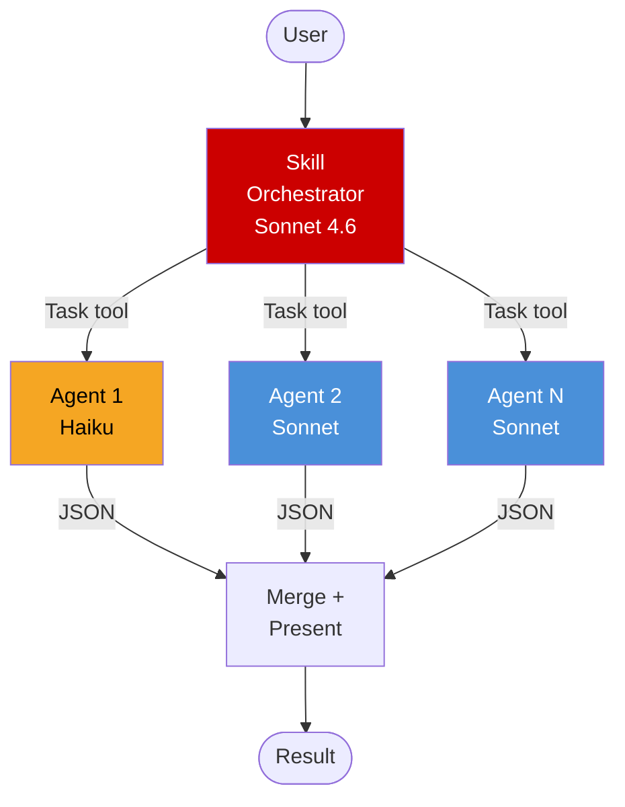
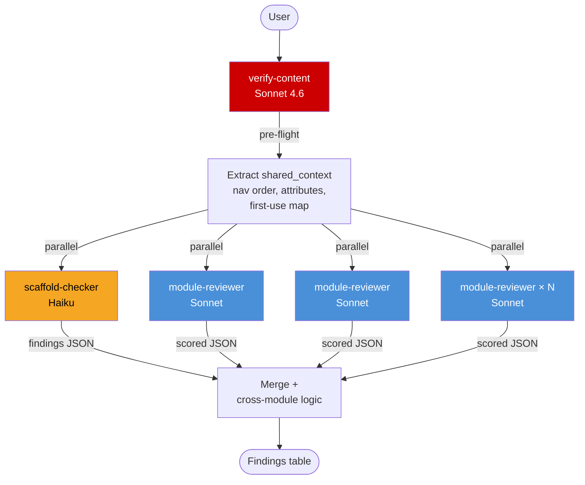
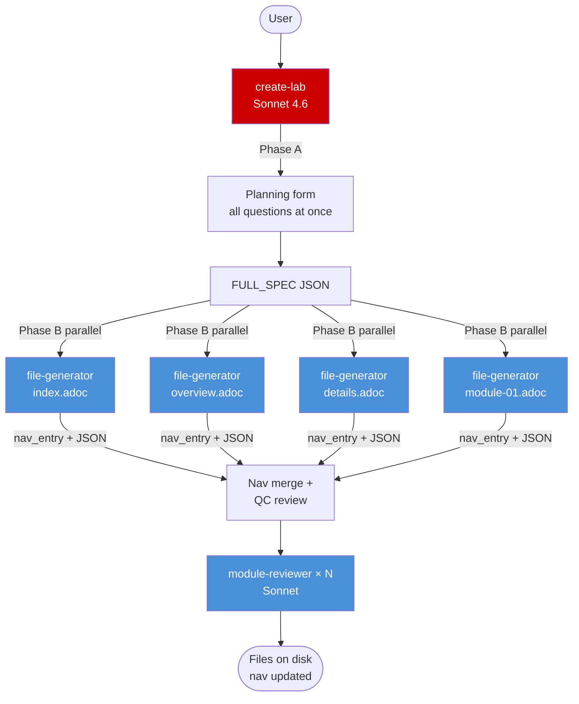

# Agent Architecture

The RHDP Skills Marketplace follows the **skill-as-orchestrator, agent-as-worker** pattern — the same design used by the FTL plugin.

---

## Core Principle

Skills handle user interaction and coordination. Agents do the actual work in parallel, each with a fresh context window.



**Why agents instead of inline checks?**

| Old approach | Agent approach |
|---|---|
| All checks in one context window | Each agent gets a fresh context — no saturation |
| Sequential — each check waits for the previous | Parallel — N modules reviewed simultaneously |
| 8 minutes for a 6-module lab | ~90 seconds (6× faster) |
| Model sees everything — can't score dimensions | Each agent returns structured JSON — eval-ready |

---

## All Agents

### Showroom Plugin

| Agent | Model | Purpose | Called by |
|---|---|---|---|
| `showroom:scaffold-checker` | Haiku | Checks site.yml, ui-config.yml, antora.yml, gh-pages.yml | verify-content |
| `showroom:module-reviewer` | Sonnet | Reviews one .adoc module — B/C/D/E/F checks + dimension scores | verify-content, create-lab, create-demo |
| `showroom:file-generator` | Sonnet | Generates one AsciiDoc file (or Markdown blog) from spec | create-lab, create-demo, blog-generate |
| `showroom:score-aggregator` | Haiku | Aggregates dimension scores, detects regressions vs baseline | showroom:eval (future) |
| `showroom:doc-writer` | Sonnet | Generates/updates GitHub Pages docs from SKILL.md | any skill after changes |

### FTL Plugin (reference pattern)

| Agent | Model | Purpose |
|---|---|---|
| `ftl:content-reader` | Sonnet | Reads .adoc, extracts tasks and classifies steps |
| `ftl:solve-writer` | Sonnet | Writes solve.yml from content-reader output |
| `ftl:validate-writer` | Sonnet | Writes validate.yml playbooks |
| `ftl:env-connector` | Sonnet | Pushes to live showroom, runs test cycle |

### AgnosticV Plugin

| Agent | Model | Purpose |
|---|---|---|
| `agnosticv:workflow-reviewer` | Sonnet | Checks builder/validator skill consistency |

---

## How Skills Spawn Agents

Skills use the **Task tool** with `subagent_type`:

```text
Task tool:
  subagent_type: showroom:module-reviewer
  prompt: |
    MODULE_FILE: /path/to/03-module-01.adoc
    CONTENT_TYPE: workshop
    LAB_TYPE: ocp
    SHARED_CONTEXT: {"module_order": [...], "defined_attributes": {...}}
    REPO_PATH: /path/to/repo
```

All agents return **structured JSON only** — no prose, no tables. The orchestrating skill handles presentation.

---

## verify-content Orchestration



## create-lab Orchestration



---

## Model Assignments

| Tier | Model | Used for |
|---|---|---|
| Orchestrators | Sonnet 4.6 | All skills — user interaction + coordination |
| Generation/review agents | Sonnet 4.6 | module-reviewer, file-generator, doc-writer, workflow-reviewer |
| Reading/computation agents | Haiku 4.5 | scaffold-checker, score-aggregator |
| FTL agents | Sonnet 4.6 | content-reader, solve-writer, validate-writer, env-connector |
