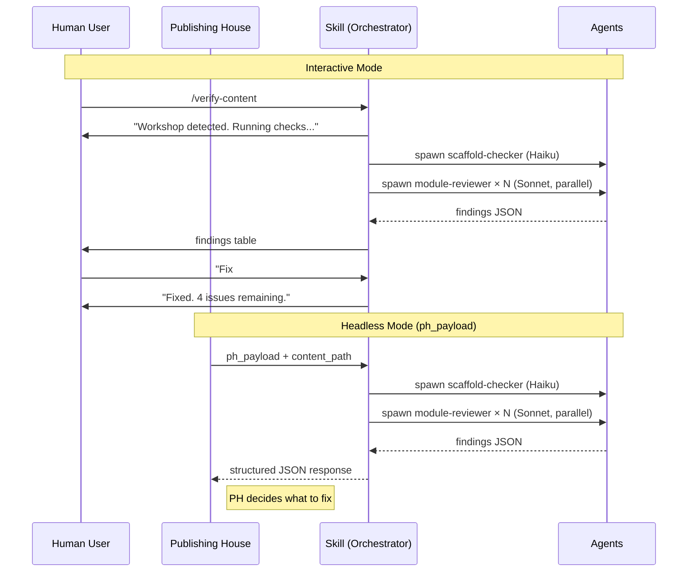
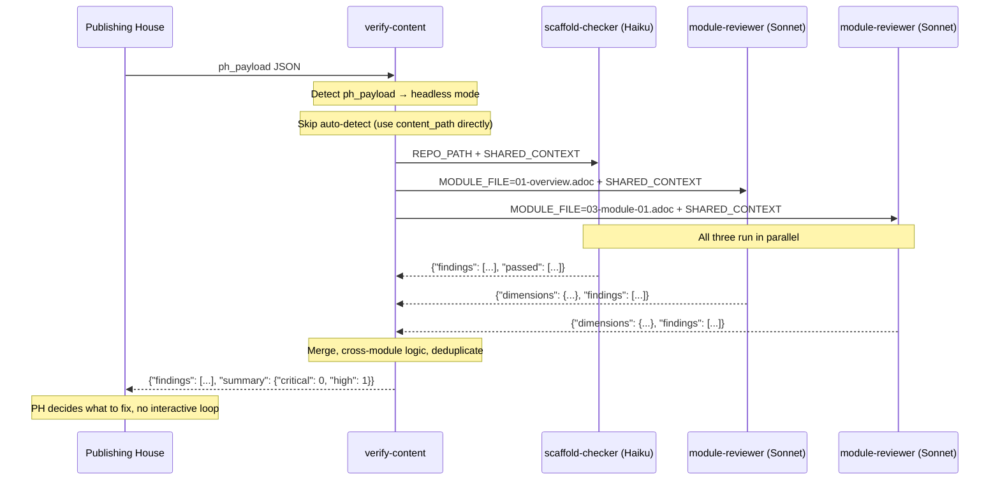
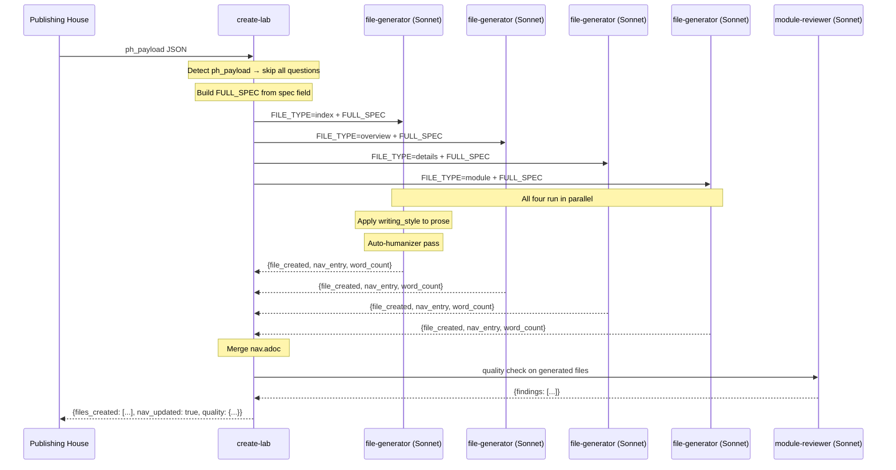
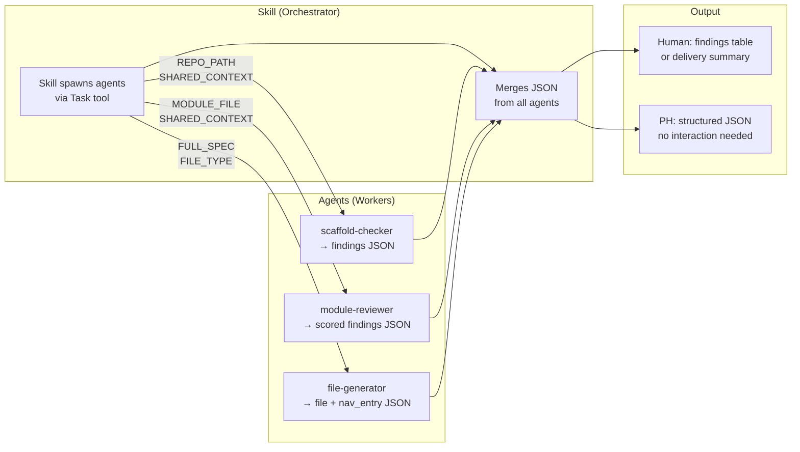

# Publishing House Integration

Skills support two modes: **interactive** (human at terminal) and **headless** (Publishing House via `ph_payload`). Zero changes to PH — the integration is entirely in the skills.

---

## How It Works



---

## verify-content — PH Headless

**PH sends:**

```yaml
ph_payload:
  content_path: content/modules/ROOT/pages/
  modules: []          # empty = all modules
  lab_type: workshop
  shared_context:
    defined_attributes: {ocp_version: "4.18", user: user1}
    nav_order: [index, 01-overview, 02-details, 03-module-01]
    first_use_map: {AAP: 01-overview.adoc}
```

**What happens inside:**



**PH receives:**

```json
{
  "findings": [
    {
      "id": "E.3a",
      "module": "03-module-01.adoc",
      "line": 47,
      "severity": "High",
      "message": "[source,bash] missing role=execute"
    }
  ],
  "summary": {"critical": 0, "high": 1, "medium": 0, "warnings": 3}
}
```

---

## create-lab — PH Headless

**PH sends:**

```yaml
ph_payload:
  target_dir: content/modules/ROOT/pages/
  mode: new
  spec:
    lab_name: OpenShift Pipelines Workshop
    audience: intermediate
    learning_objectives:
      - Deploy a Tekton pipeline
      - Configure event triggers
      - Monitor build results
    business_scenario: ACME Corp needs to modernize their CI/CD pipeline...
    duration: 90min
    module_outline: |
      Module 1: Pipeline setup (~30 min)
      Module 2: Triggers (~30 min)
      Module 3: Monitoring (~30 min)
    env:
      ocp_version: "4.18"
      attributes: {user: user1, password: openshift}
    writing_style: "conversational, short sentences, active voice"
```

**What happens inside:**



**PH receives:**

```json
{
  "files_created": [
    "index.adoc",
    "01-overview.adoc",
    "02-details.adoc",
    "03-module-01-pipeline-setup.adoc"
  ],
  "nav_updated": true,
  "quality": {"critical": 0, "high": 0, "warnings": 1},
  "warnings": ["Module has only 1 exercise — consider adding a second"]
}
```

---

## Agent Communication Flow

When any showroom skill runs — interactive or headless — agents communicate through their JSON outputs:



**Key design decisions:**
- Agents **never** talk to each other directly — all communication goes through the orchestrator
- Agents return **JSON only** — the orchestrator handles all human-facing output
- `SHARED_CONTEXT` is built once by the orchestrator and injected into every agent — agents don't read across files

---

## Skill Comparison: Interactive vs Headless

| | Human interactive | PH headless |
|---|---|---|
| **Trigger** | `/verify-content` | `ph_payload` JSON |
| **Questions asked** | Yes (if repo not found) | Never |
| **Output format** | Findings table + fix loop | Structured JSON |
| **Agents used** | Same agents, same models | Identical — no difference |
| **Performance** | Same | Same |
| **Fix loop** | Yes — user picks issues | No — PH handles fixes |

---

## Supported Skills

| Skill | ph_payload supported | Notes |
|---|---|---|
| `showroom:verify-content` | ✅ | Returns findings JSON |
| `showroom:create-lab` | ✅ | Returns files_created + quality JSON |
| `showroom:create-demo` | ✅ | Same as create-lab |
| `agnosticv:catalog-builder` | — | PH doesn't drive catalog creation |
| `ftl:rhdp-lab-validator` | — | Requires live cluster connection |
