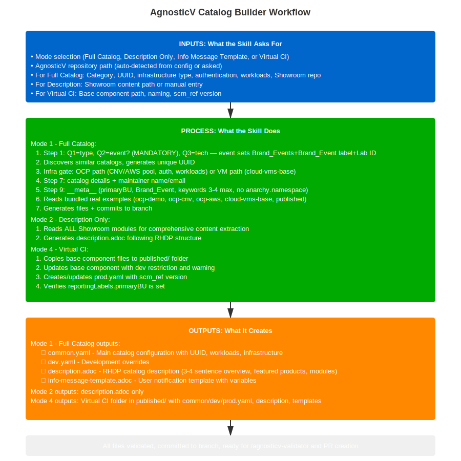

# /agnosticv:catalog-builder

🔧 Catalog Builder

Create or update AgnosticV catalog files for RHDP deployments (unified skill).

---

## 📋 What You'll Need Before Starting

  
  
Click to view full workflow diagram

### Prerequisites

  

    
📁

    <h4>Clone AgnosticV Repository</h4>
    <pre><code>cd ~/work/code
git clone git@github.com:rhpds/agnosticv.git
cd agnosticv</code></pre>
  

  

    
🔐

    <h4>Verify RHDP Access</h4>
    <ul>
      <li>Write access to AgnosticV repository</li>
      <li>Test: <code>gh repo view rhpds/agnosticv</code></li>
      <li>Ability to create pull requests</li>
    </ul>
  

  

    
📝

    <h4>Workshop Content Ready</h4>
    <ul>
      <li>Workshop lab content (from <code>/showroom:create-lab</code>)</li>
      <li>Infrastructure requirements (CNV, AWS, etc.)</li>
      <li>Workload list (OpenShift AI, AAP, etc.)</li>
    </ul>
  

### What You'll Need (By Mode)

  

    <h4>Mode 1: Full Catalog</h4>
    <ul>
      <li>Catalog name (e.g., "Agentic AI on OpenShift")</li>
      <li>Category (Workshops, Demos, or Sandboxes)</li>
      <li>Infrastructure type (CNV multi-node, AWS, SNO, etc.)</li>
      <li>Workloads to deploy</li>
      <li>Multi-user requirements (yes/no)</li>
    </ul>
  

  

    <h4>Mode 2: Description Only</h4>
    <ul>
      <li>Path to Showroom repository</li>
      <li>Brief overview (2-3 sentences starting with product name)</li>
    </ul>
  

  

    <h4>Mode 3: Info Template</h4>
    <ul>
      <li>Data keys from <code>agnosticd_user_info.data</code></li>
    </ul>
  

  

    <h4>Mode 4: Virtual CI (published/)</h4>
    <ul>
      <li>Base component path (e.g. <code>openshift_cnv/kafka-developer-workshop-cnv</code>)</li>
      <li>Handles uniqueness check, UUID, dev restriction, prod.yaml version pinning</li>
      <li>Supports bulk processing of multiple base components</li>
    </ul>
  

---

## 🚀 Quick Start

  

    
1

    

      <h4>Navigate to Repository</h4>
      
Open your AgnosticV repository directory

    

  

  

    
2

    

      <h4>Run Catalog Builder</h4>
      
<code>/agnosticv:catalog-builder</code>

    

  

  

    
3

    

      <h4>Choose Mode</h4>
      
Select: Full Catalog / Description Only / Info Template

    

  

  

    
4

    

      <h4>Answer Questions</h4>
      
Follow guided prompts

    

  

  

    
5

    

      <h4>Review & Commit</h4>
      
Files auto-committed to new branch

    

  

---

## 📁 What It Can Generate

  

    
Mode 1: Full Catalog

    
Creates complete catalog with all files:

    <pre><code>agd_v2/your-catalog-name/
├── common.yaml
├── dev.yaml
├── description.adoc
└── info-message-template.adoc</code></pre>
  

  

    
Mode 2: Description Only

    
Updates just the description:

    <pre><code>agd_v2/your-catalog-name/
└── description.adoc</code></pre>
  

  

    
Mode 3: Info Template

    
Creates user notification:

    <pre><code>agd_v2/your-catalog-name/
└── info-message-template.adoc</code></pre>
  

---

## 🔄 Common Workflows

  

    
1️⃣

    

      <h4>Workflow 1: Create Full Catalog from Scratch</h4>
      <pre><code>/agnosticv:catalog-builder
→ Mode: 1 (Full Catalog)
→ Step 0: AgV path auto-detected, branch created
→ Step 1: Q1=type (Workshop/Demo/Sandbox), Q2=event?, Q3=tech
→ Step 2: Discovery searches agd_v2/ + openshift_cnv/
→ Step 3: Infrastructure gate (OCP cluster or VMs)
→ Step 4: Auth (unified ocp4_workload_authentication)
→ Step 5: Workloads + LiteMaaS
→ Step 6: Showroom (recommended name shown)
→ Step 7: Catalog details (name, description, maintainer)
→ Step 9: __meta__, includes, event restrictions
→ Step 10: Path auto-generated (event) or asked (no-event)
→ Generate all 4 files, auto-commit to branch</code></pre>
    

  

  

    
2️⃣

    

      <h4>Workflow 2: Update Description After Content Changes</h4>
      <pre><code>/agnosticv:catalog-builder
→ Mode: 2 (Description Only)
→ Point to Showroom repo
→ Auto-extracts modules and technologies
→ Generates description.adoc
→ Auto-commits to branch</code></pre>
    

  

  

    
3️⃣

    

      <h4>Workflow 3: Add Info Template for User Data</h4>
      <pre><code>/agnosticv:catalog-builder
→ Mode: 3 (Info Template)
→ Specify data keys from workload
→ Generates template with placeholders
→ Shows how to use agnosticd_user_info</code></pre>
    

  

---

## 📝 Mode Details

<strong>Mode 1: Full Catalog - Detailed Workflow</strong>

  <h4>What it creates:</h4>
  <ul>
    <li><strong>common.yaml</strong> - Main configuration (infrastructure, auth, workloads, includes)</li>
    <li><strong>dev.yaml</strong> - Development environment overrides</li>
    <li><strong>description.adoc</strong> - UI description following RHDP structure</li>
    <li><strong>info-message-template.adoc</strong> - User notification template</li>
  </ul>

  <h4>Step-by-step process:</h4>
  <ol>
    <li><strong>Step 0 — Setup:</strong> AgV path auto-detected; branch created from main (no feature/ prefix)</li>
    <li><strong>Step 1 — Context:</strong> 3 questions: Q1=Workshop/Demo/Sandbox, Q2=Is this for an event? (Summit 2026 / RH One 2026 / Other), Q3=Technologies. Event selection overrides category to Brand_Events and asks for Lab ID.</li>
    <li><strong>Step 2 — Discovery:</strong> Searches <code>agd_v2/</code> and <code>openshift_cnv/</code>; shows reference catalogs with <code>[OCP cluster]</code> or <code>[RHEL/AAP VMs]</code> labels</li>
    <li><strong>Step 3 — Infrastructure gate:</strong> Asks OCP or RHEL/AAP VMs, then routes to a separate @reference file per infra type:
      <ul>
        <li><strong>OCP path (<code>ocp-catalog-questions.md</code>):</strong> SNO or multinode, OCP version (4.18/4.20/4.21), pool with <code>/prod</code> suffix, autoscale, AWS gate; auth (unified <code>ocp4_workload_authentication</code> + provider); OCP workloads + LiteMaaS; Showroom with <code>ocp4_workload_ocp_console_embed</code>; multi-user with worker scaling</li>
        <li><strong>VM path (<code>cloud-vms-base-catalog-questions.md</code>):</strong> CNV or AWS, RHEL image, sizing, ports; auth skipped (OS-level only); VM workloads; <code>vm_workload_showroom</code> with <code>showroom_git_repo</code>/<code>showroom_git_ref</code>; multi-user isolation warning</li>
      </ul>
    </li>
    <li><strong>Step 7 — Catalog details:</strong> Display name, short name, description (starts with product name), maintainer name and email</li>
    <li><strong>Step 9 — __meta__:</strong> Deployer actions (start/stop only); <code>remove_workloads</code> via <code>sandbox_api.actions.destroy.catch_all</code>; product label + family; keywords</li>
    <li><strong>Step 9.1 — Includes:</strong> Event restriction in <code>common.yaml</code> (summit-devs or rh1-2026-devs); AWS extras; LiteMaaS (<code>litemaas-master_api</code> + <code>litellm_metadata</code>); workload-specific TODO</li>
    <li><strong>Step 10 — Path:</strong> Event catalogs → auto-generated path (e.g. <code>summit-2026/lb2298-short-cnv</code>); no-event → asks subdirectory</li>
    <li>UUID auto-generated and validated for uniqueness; files committed to branch</li>
  </ol>

  <h4>Naming Standards (Developer Guidelines):</h4>
  <ul>
    <li>AgV config: <code>summit-2026/lbXXXX-short-name-cnv</code></li>
    <li>Showroom repo: <code>short-name-showroom</code></li>
    <li>OCP pool: <code>cnv-cluster-4.18/prod</code> (always <code>/prod</code> suffix)</li>
    <li>Collections: <code>tag: "{{ tag }}"</code> for standard; fixed tag <code>≥ v1.5.3</code> for showroom</li>
  </ul>

  <h4>Event branding (mandatory — Question 2 never skipped):</h4>
  <ul>
    <li>Event catalogs: <code>category: Brand_Events</code>, <code>Brand_Event: Red_Hat_Summit_2026</code> label, Lab ID keyword, event access restriction include</li>
    <li><code>anarchy.namespace</code> — NEVER define</li>
    <li><code>catalog.reportingLabels.primaryBU</code> — ALWAYS define</li>
  </ul>

  <h4>Bundled real examples (no network needed):</h4>
  <ul>
    <li><strong>ocp-demo/</strong> — OCP with CNV pool</li>
    <li><strong>ocp-aws/</strong> — OCP with AWS pool</li>
    <li><strong>ocp-cnv/</strong> — openshift_cnv pool</li>
    <li><strong>cloud-vms-base/</strong> — RHEL VMs on AWS</li>
    <li><strong>published-virtual-ci/</strong> — Virtual CI structure</li>
  </ul>

<strong>Mode 2: Description Only - RHDP Official Structure</strong>

  <h4>v1.8.0: Enhanced with full module analysis</h4>
  
  
<strong>With Showroom content:</strong>

  <ul>
    <li>Reads ALL modules (not just index.adoc)</li>
    <li>Extracts overview from index.adoc</li>
    <li>Detects Red Hat products across all modules</li>
    <li>Extracts version numbers</li>
    <li>Identifies technical topics</li>
    <li>Shows extracted data for review before generating</li>
  </ul>

  
<strong>Without Showroom content:</strong>

  <ul>
    <li>Guided questions for RHDP structure</li>
    <li>Brief overview (3-4 sentences)</li>
    <li>Warnings (optional)</li>
    <li>Guide link</li>
    <li>Featured products (max 3-4)</li>
    <li>Module details (title + 2-3 bullets per module)</li>
  </ul>

  <h4>Generated description.adoc follows RHDP structure:</h4>
  <ol>
    <li>Brief Overview (3-4 sentences max, starts with product name)</li>
    <li>Warnings (optional, after overview)</li>
    <li>Lab/Demo Guide (link to Showroom)</li>
    <li>Featured Technology and Products (max 3-4)</li>
    <li>Detailed Overview (each module + 2-3 bullets)</li>
    <li>Authors (from __meta__.owners)</li>
    <li>Support (Content + Environment)</li>
  </ol>

<strong>Mode 3: Info Template - User Data Sharing</strong>

  <h4>Documents how to share data with users:</h4>
  
  <pre><code># In your workload:
- name: Save user data
  agnosticd.core.agnosticd_user_info:
    data:
      api_url: "{{ my_api_url }}"
      api_key: "{{ my_api_key }}"</code></pre>

  
Template uses: <code>{api_url}</code> and <code>{api_key}</code>

  <h4>Steps:</h4>
  <ol>
    <li>Select Info Template mode</li>
    <li>Git workflow (automatic)</li>
    <li>Specify data keys from agnosticd_user_info.data</li>
    <li>Optional: add lab code (e.g., LB1234)</li>
    <li>Template generated with proper placeholders</li>
  </ol>

---

## 💡 Tips & Best Practices

  

    <h4>🏷️ Start with Product Name</h4>
    
Description overview must start with product, not "This workshop"

  

  

    <h4>📚 Use Real Examples</h4>
    
Reference existing catalogs for patterns

  

  

    <h4>✓ Validate Before PR</h4>
    
Always run <code>/agnosticv:validator</code>

  

  

    <h4>🧪 Test in Dev First</h4>
    
Use dev.yaml for testing

  

  

    <h4>🌿 No feature/ Prefix</h4>
    
Branch names should be descriptive without feature/

  

  

    <h4>📝 Convert Lists to Strings</h4>
    
For info templates: <code>{{ my_list | join(', ') }}</code>

  

---

## 🆘 Troubleshooting

<strong>Skill not found?</strong>

<ul>
  <li>Restart Claude Code or VS Code</li>
  <li>Verify installation: <code>ls ~/.claude/skills/agnosticv-catalog-builder</code></li>
  <li>Check the <a href="../reference/troubleshooting.html">Troubleshooting Guide</a></li>
</ul>

<strong>Branch already exists?</strong>

<pre><code>git branch -D old-branch
# Or use different name</code></pre>

<strong>UUID collision?</strong>

<ul>
  <li>Skill auto-regenerates unique UUID</li>
  <li>Check against existing catalogs automatically</li>
</ul>

<strong>Showroom content not found?</strong>

<pre><code># Verify structure
ls ~/path/to/showroom/content/modules/ROOT/pages/
# Should contain .adoc files</code></pre>

<strong>Description starts with "This workshop"?</strong>

  <h4>RHDP Requirement:</h4>
  
Description overview must start with the product name, not "This workshop teaches..."

  
<strong>Example:</strong> "OpenShift Pipelines enables..." NOT "This workshop teaches OpenShift Pipelines..."

---

## 📊 Git Workflow

  <h3>Always follows this pattern:</h3>
  
  

    <h4>1. Pull latest main</h4>
    <pre><code>git checkout main
git pull origin main</code></pre>
  

  

    <h4>2. Create descriptive branch (NO feature/ prefix)</h4>
    

      

        
✅ Good

        <code>add-ansible-ai-workshop</code> 
        <code>update-ocp-pipelines-description</code>
      

      

        
❌ Bad

        <code>feature/add-workshop</code>
      

    

  

  

    <h4>3. Auto-commit changes</h4>
    <pre><code>git add agd_v2/your-catalog/
git commit -m "Add your-catalog catalog"</code></pre>
  

  

    <h4>4. Push and create PR</h4>
    <pre><code>git push origin your-branch
# Open GitHub → create PR from your branch to main</code></pre>
  

---

## 🔗 Related Skills

  <a href="agnosticv-validator.html" class="related-skill-card">
    
✓

    

      <h4>/agnosticv:validator</h4>
      
Validate catalog before PR

    

  </a>

  <a href="create-lab.html" class="related-skill-card">
    
📝

    

      <h4>/showroom:create-lab</h4>
      
Create Showroom workshop first

    

  </a>

  <a href="deployment-health-checker.html" class="related-skill-card">
    
🏥

    

      <h4>/health:deployment-validator</h4>
      
Create automated health checks

    

  </a>

---

  <a href="index.html" class="nav-button">← Back to Skills</a>
  <a href="agnosticv-validator.html" class="nav-button">Next: /agnosticv:validator →</a>

