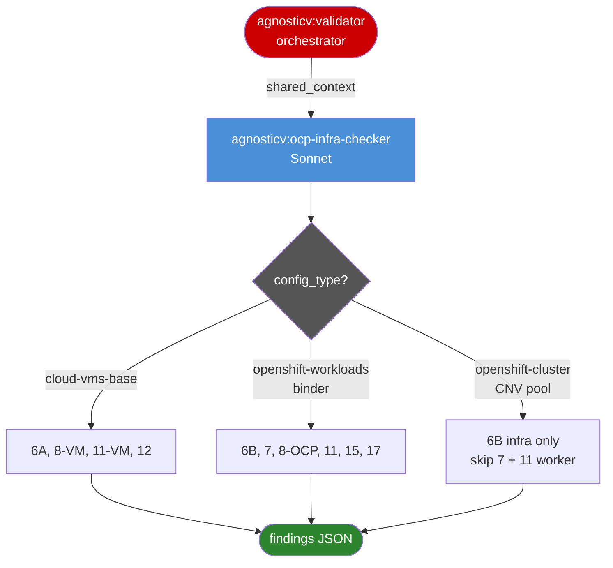

# agnosticv:ocp-infra-checker

<div class="reference-badge agnosticv">OCP and Cloud-VMs-Base Infra Validator</div>

Validates OCP and cloud-vms-base infrastructure configuration for an AgnosticV catalog item. Checks instance and bastion image definitions (cloud-vms-base), OCP version and SNO limits, authentication workload correctness, Showroom co-presence rules, multi-user configuration, bastion sizing, component propagation, and LiteMaaS workload configuration.

This is a subagent. It is not invoked directly by users. It is spawned by the `agnosticv:validator` orchestrator when the catalog's `ci_type` indicates it owns infrastructure checks.

---

## Called By

[`/agnosticv:validator`](agnosticv-validator.html) — spawned in parallel alongside `agnosticv:schema-checker` and `agnosticv:workload-checker`.

**Model:** `claude-sonnet-4-6`
**Tools:** Read, Glob, Grep, Bash

---

## When It Is Spawned

The orchestrator spawns `ocp-infra-checker` when `ci_type` is NOT `tenant_namespace` AND NOT `shared_pool_cluster`. This covers:

- `per_user_dedicated`
- `binder`
- `zero_touch`
- cloud-vms-base catalogs

For `ci_type == zero_touch`: the agent skips all checks and returns a single passed check note.

**Critical:** `ci_type` is resolved by the orchestrator and passed in `shared_context`. This agent never re-derives it from config fields. No WebFetch or web search — all reference material is in the local repository.

---

## Inputs: shared_context Fields Read

| Field | Type | Purpose |
|---|---|---|
| `catalog_path` | string | Absolute path to the catalog directory |
| `agv_path` | string | Absolute path to the agnosticv repo root |
| `ci_type` | string | Resolved CI type — not re-derived |
| `config_type` | string | `openshift-workloads`, `cloud-vms-base`, or `openshift-cluster` |
| `cloud_provider` | string | `none`, `aws`, or `openshift_cnv` |
| `num_users` | integer | User count from catalog |
| `validation_scope` | string | `quick` / `standard` / `full` |

The agent also loads reference files at runtime if they exist:
- `{agv_path}/agnosticv/docs/ocp-validator-checks.md` — authoritative logic for Checks 6B, 7, 8, 11, 15, 17
- `{agv_path}/agnosticv/docs/cloud-vms-base-validator-checks.md` — authoritative logic for Checks 6A, 8 (VM), 11 (VM), 12

---

## Routing by config_type

The agent routes to different check sets based on `config_type`:

| config_type | Checks run |
|---|---|
| `cloud-vms-base` | 6A, 8 (VM rules), 11 (isolation warning only), 12 |
| `openshift-workloads` | 6B, 7, 8 (OCP rules), 11, 15, 17 |
| `openshift-cluster` + `cloud_provider == openshift_cnv` | 6B (infra only), skip 7, skip 11 worker scaling |
| `openshift-cluster` + real cloud provider | 6B, 7, 8, 11, 12, 15, 17 |
| `binder` (ci_type == binder) | 6B, 7, 8, 11, 15, 17 — treated as per-user OCP |

---

## Check Ownership



---

## Checks

### Check 6A: Cloud-VMs-Base Instances and Bastion Image (check_id: 6)

**Only runs when `config_type == cloud-vms-base`.**

| Condition | Severity |
|---|---|
| `instances:` block missing from config | ERROR |
| `instances` list is empty | ERROR |
| No entry with `name: bastion` or `tags: bastion` | ERROR |
| Bastion `image:` missing | ERROR |
| Bastion image not matching `rhel-9.x`, `rhel-10.x`, or `RHEL-10.0-GOLD-latest` | WARNING |
| CNV: `network_type` or `rootfs_size` absent on instances | WARNING |
| AWS: `security_group` absent on instances | WARNING |

---

### Check 6B: OCP Version, SNO Limits, GPU (check_id: 6)

**Only runs when `config_type` is `openshift-workloads` or `openshift-cluster`.**

| Condition | Severity |
|---|---|
| `cloud_provider == aws` | WARNING — confirm RHDP team approval |
| No OpenShift cluster component in `__meta__.components` | WARNING |
| `host_ocp4_installer_version` not in `['4.18', '4.20', '4.21']` | WARNING |
| GPU workloads present AND `cloud_provider != aws` | WARNING |
| `cluster_size == sno` AND `multiuser: true` | ERROR |
| `cluster_size == sno` AND heavy workloads (openshift_ai, acs, service_mesh) | WARNING |

**CNV Pool CI special case (`openshift-cluster` + `cloud_provider == openshift_cnv`):** `worker_instance_count: 0` is correct for SNO/compact pools — do not warn.

---

### Check 7: Authentication Workload Validation (check_id: 7)

**Skipped entirely when:**
- `config_type == cloud-vms-base` (VMs use OS-level auth, no OCP cluster)
- `config_type == openshift-cluster` AND `cloud_provider == openshift_cnv` (CNV pool CI — auth handled at sandbox level)

For all other OCP catalogs:

| Condition | Severity |
|---|---|
| No authentication workload in `workloads` list | ERROR |
| Deprecated role `ocp4_workload_authentication_htpasswd` present | ERROR |
| Deprecated role `ocp4_workload_authentication_keycloak` present | ERROR |
| RHSSO/SSO workload present (`rhsso` or `sso` in workload name) | ERROR |
| `ocp4_workload_authentication` present but `ocp4_workload_authentication_provider` not set | WARNING |
| `ocp4_workload_authentication_provider` not in `['htpasswd', 'keycloak']` | ERROR |
| `multiuser: true` AND `provider == htpasswd` AND `ocp4_workload_authentication_htpasswd_user_password_randomized` not `true` | WARNING |

Fix for deprecated roles: replace with `agnosticd.core_workloads.ocp4_workload_authentication` and set `ocp4_workload_authentication_provider: htpasswd` or `keycloak`.

---

### Check 8: Showroom Workloads Co-Presence (check_id: 8)

**For OCP catalogs** (`openshift-workloads`, `openshift-cluster` non-CNV-pool, `binder`):

| Condition | Severity |
|---|---|
| `ocp4_workload_showroom` present but `ocp4_workload_ocp_console_embed` missing | WARNING |
| `ocp4_workload_showroom_antora_enable_dev_mode` missing from `common.yaml` | WARNING |
| `ocp4_workload_showroom_antora_enable_dev_mode` is `"true"` in `common.yaml` | ERROR |
| `dev.yaml` exists AND `ocp4_workload_showroom_antora_enable_dev_mode` not `"true"` there | WARNING |
| Showroom present but `ocp4_workload_showroom_content_git_repo` missing | ERROR |
| `ocp4_workload_showroom_content_git_repo` uses SSH format (`git@github.com:`) | WARNING |

**For cloud-vms-base catalogs:**

| Condition | Severity |
|---|---|
| `ocp4_workload_showroom` or `ocp4_workload_ocp_console_embed` present (OCP workloads in VM catalog) | ERROR |
| `vm_workload_showroom` present but `showroom_content_git_repo` or `showroom_git_repo` missing | ERROR |
| `vm_workload_showroom` present but using SSH URL format | WARNING |

---

### Check 11: Multi-User Configuration (check_id: 11)

**For cloud-vms-base:** Emit isolation warning only. No worker scaling or workshopLabUiRedirect check.

| Condition (cloud-vms-base) | Severity |
|---|---|
| `multiuser: true` | WARNING — users share one set of VMs, no per-user isolation |

**For CNV Pool CI (`openshift-cluster` + `cloud_provider == openshift_cnv`):** Skip entirely.

**For all other OCP catalogs:**

| Condition | Severity |
|---|---|
| `multiuser: true` AND `cluster_size == sno` | ERROR |
| `multiuser: true` AND no `num_users` entry in `__meta__.catalog.parameters` | ERROR |
| `multiuser: true` AND `num_users` param has no `openAPIV3Schema` | ERROR |
| `worker_instance_count` defined AND does not reference `num_users` in formula | WARNING |
| Category `Workshops` or `Brand_Events` AND `multiuser: true` AND `workshopLabUiRedirect` not `true` | WARNING |

Note: `workshopLabUiRedirect: true` with `multiuser: false` is VALID for per-user dedicated clusters — do not flag it.

---

### Check 12: Bastion Configuration for OCP Catalogs (check_id: 12)

**Skipped when `config_type == cloud-vms-base`** — bastion is validated in Check 6A.

**Skipped when `cloud_provider` not in `['openshift_cnv', 'aws', 'none']`.**

| Condition | Severity |
|---|---|
| `bastion_instance_image` or `default_instance_image` set to non-RHEL-9/10 image | WARNING |
| `bastion_cores` < 2 | WARNING |
| `bastion_memory` < 4 (Gi) | WARNING |

Valid bastion images: `rhel-9.4`, `rhel-9.5`, `rhel-9.6`, `rhel-10.0`, `RHEL-10.0-GOLD-latest`

---

### Check 15: Component Propagation for OCP (check_id: 15)

**Only runs when `__meta__.components` is non-empty.**

**Does not apply to cloud-vms-base** (no cluster component pattern).

| Condition | Severity |
|---|---|
| A component has no `propagate_provision_data` | WARNING |
| OpenShift component missing `openshift_api_url` in `propagate_provision_data` | WARNING |
| OpenShift component missing `openshift_cluster_admin_token` in `propagate_provision_data` | WARNING |
| OpenShift component missing `bastion_public_hostname` in `propagate_provision_data` | WARNING |

---

### Check 17-OCP: LiteMaaS Workload, Model, and Duration (check_id: 17)

**Only runs when `ocp4_workload_litellm_virtual_keys` is in `workloads`.**

**Does not apply to cloud-vms-base** — LiteMaaS is an OCP-only workload.

Note: The LiteMaaS includes check (`litemaas-master_api`, `litellm_metadata`) is owned by the validator orchestrator and `agnosticv:workload-checker` (Check 17). This check covers the OCP-specific model and duration configuration.

| Condition | Severity |
|---|---|
| `ocp4_workload_litellm_virtual_keys_models` missing or empty | ERROR |
| `ocp4_workload_litellm_virtual_keys_duration` missing or empty | WARNING |

---

## Output Contract

The agent returns only JSON — no prose, no tables, no explanations.

```json
{
  "agent": "ocp-infra-checker",
  "errors": [
    {
      "check": "authentication",
      "check_id": 7,
      "severity": "ERROR",
      "message": "Deprecated authentication role found: ocp4_workload_authentication_htpasswd",
      "location": "common.yaml:workloads",
      "fix": "Replace with agnosticd.core_workloads.ocp4_workload_authentication and set ocp4_workload_authentication_provider: htpasswd",
      "current": "ocp4_workload_authentication_htpasswd",
      "example": "agnosticd.core_workloads.ocp4_workload_authentication"
    }
  ],
  "warnings": [
    {
      "check": "showroom",
      "check_id": 8,
      "severity": "WARNING",
      "message": "ocp4_workload_showroom present but ocp4_workload_ocp_console_embed missing",
      "location": "common.yaml:workloads",
      "recommendation": "Add agnosticd.core_workloads.ocp4_workload_ocp_console_embed — both workloads are required together for OCP Showroom"
    }
  ],
  "suggestions": [],
  "passed_checks": [
    "✓ OCP infrastructure: multinode on openshift_cnv",
    "✓ OCP version 4.18 has available pool",
    "✓ Authentication: unified role, provider=htpasswd",
    "✓ Multiuser htpasswd: per-user randomized passwords enabled",
    "✓ Both OCP showroom workloads present together",
    "✓ Showroom dev mode: \"false\" in common.yaml (dev.yaml \"true\" is expected)",
    "✓ Multi-user configuration present (max 20 users)",
    "✓ Worker scaling formula includes num_users"
  ]
}
```

**Contract rules:**
- `errors`: all ERROR-severity findings — each includes `check`, `check_id`, `severity`, `message`, `location`, `fix`, `current`, `example`
- `warnings`: all WARNING-severity findings — each includes `check`, `check_id`, `severity`, `message`, `location`, `recommendation`
- `suggestions`: always `[]`
- `passed_checks`: one string per passing check, formatted `"✓ {description}"`
- `agent`: always `"ocp-infra-checker"`
- Every finding must include `check_id` matching the check number (6, 7, 8, 11, 12, 15, 17)
- Do not emit findings for checks that were skipped
- No extra fields. No prose before or after the JSON.

---

## zero_touch Early-Exit

For `ci_type == zero_touch`, the agent returns immediately:

```json
{
  "agent": "ocp-infra-checker",
  "errors": [],
  "warnings": [],
  "suggestions": [],
  "passed_checks": ["✓ zero_touch CI — infra checks skipped"]
}
```

---

## Related

- [`/agnosticv:validator`](agnosticv-validator.html) — orchestrator that spawns this agent
- [`agnosticv:schema-checker`](agnosticv-schema-checker.html) — sibling agent: structural and metadata validation
- [`agnosticv:workload-checker`](agnosticv-workload-checker.html) — sibling agent: workload and collection validation

---

<div class="navigation-footer">
  <a href="agnosticv-workload-checker.html" class="nav-button">← agnosticv:workload-checker</a>
  <a href="agnosticv-validator.html" class="nav-button">Back to agnosticv:validator →</a>
</div>
