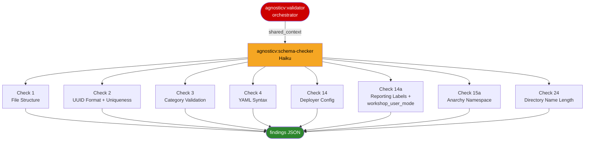

# agnosticv:schema-checker

<div class="reference-badge agnosticv">Schema and Metadata Validator</div>

Validates the structural and metadata integrity of an AgnosticV catalog item. Checks file presence, UUID format and uniqueness, category rules, YAML syntax, deployer configuration, reporting labels, anarchy namespace, and catalog directory name length.

This is a subagent. It is not invoked directly by users. It is spawned by the `agnosticv:validator` orchestrator as part of every validation run.

---

## Called By

[`/agnosticv:validator`](agnosticv-validator.html) — spawned in parallel alongside `agnosticv:workload-checker` and `agnosticv:ocp-infra-checker`.

**Model:** `claude-haiku-4-5-20251001`
**Tools:** Read, Glob, Grep, Bash

---

## When It Is Spawned

The validator orchestrator always spawns `schema-checker` regardless of `ci_type` or `config_type`. It runs on every validation scope (`quick`, `standard`, `full`).

The one exception: if `has_yaml_parse_error` is `true` in the shared context (orchestrator detected that `common.yaml` cannot be parsed), the agent exits immediately with an empty findings object and a single skipped-check note.

---

## Inputs: shared_context Fields Read

| Field | Type | Purpose |
|---|---|---|
| `catalog_path` | string | Absolute path to the catalog directory |
| `agv_path` | string | Absolute path to the agnosticv repo root |
| `ci_type` | string | Resolved CI type from orchestrator — not re-derived |
| `has_yaml_parse_error` | boolean | If true, agent exits immediately |
| `catalog_slug` | string | Basename of `catalog_path` (used for name-length check) |
| `validation_scope` | string | `quick` / `standard` / `full` |

---

## Check Ownership



---

## Checks

### Check 1: File Structure (check_id: 1)

Verifies file presence against `ls` output — not path construction.

| File | Rule | Severity |
|---|---|---|
| `common.yaml` | Required | ERROR if absent — all remaining checks are skipped |
| `description.adoc` | Recommended | WARNING if absent |
| `dev.yaml` | Recommended | WARNING if absent |

If `common.yaml` is missing, the agent returns immediately after appending the error.

---

### Check 2: UUID Format and Uniqueness (check_id: 2)

Validates `__meta__.asset_uuid` in `common.yaml`.

| Condition | Severity |
|---|---|
| `__meta__` section absent | ERROR |
| `asset_uuid` key absent | ERROR |
| UUID does not match RFC 4122 lowercase regex | ERROR |
| UUID found in another catalog's `common.yaml` via grep | ERROR |

UUID pattern: `^[0-9a-f]{8}-[0-9a-f]{4}-[0-9a-f]{4}-[0-9a-f]{4}-[0-9a-f]{12}$`

Correct path is `__meta__.asset_uuid` — a direct child of `__meta__`.

---

### Check 3: Category Validation (check_id: 3)

Validates `__meta__.catalog.category` against the babylon schema.

**Valid categories:** `Workshops`, `Labs`, `Demos`, `Open_Environments`, `Brand_Events`

Note: `Sandboxes` is NOT a valid category in the babylon schema.

| Condition | Severity |
|---|---|
| `__meta__.catalog` absent | ERROR |
| `category` key absent | ERROR |
| Value not in valid list | ERROR |
| `category == Demos` AND `multiuser: true` | ERROR (additional) |
| `category == Demos` AND `workshopLabUiRedirect: true` | ERROR (additional) |

---

### Check 4: YAML Syntax (check_id: 4)

Validates `dev.yaml` (if present). `common.yaml` parse errors are caught upstream by the orchestrator and signal the early-exit via `has_yaml_parse_error`. This check covers any additional stage files.

Parses using:
```bash
python3 -c "import yaml, sys; yaml.safe_load(open('{catalog_path}/dev.yaml'))"
```

---

### Check 14: Deployer Configuration (check_id: 14)

Validates `__meta__.deployer` completeness.

**Skipped for `ci_type == zero_touch`.**

Required fields: `scm_url`, `scm_ref`, `execution_environment.image`

| Condition | Severity |
|---|---|
| `__meta__.deployer` absent | ERROR |
| `deployer.scm_url` absent | ERROR |
| `deployer.scm_ref` absent | ERROR |
| `deployer.execution_environment.image` absent | ERROR |
| EE image does not start with `quay.io/agnosticd/ee-multicloud:` | WARNING |

---

### Check 14a: Reporting Labels and workshop_user_mode (check_id: 14)

Two sub-checks sharing check_id 14.

**Part A — reportingLabels:**

| Condition | Severity |
|---|---|
| `reportingLabels` section absent | WARNING |
| `reportingLabels.primaryBU` absent | ERROR |
| `primaryBU` not in known valid values | WARNING |

Known valid `primaryBU` values: `Hybrid_Platforms`, `Artificial_Intelligence`, `Automation`, `Application_Developer`, `RHEL`, `Edge`, `RHDP`

**Part B — workshop_user_mode:**

If `__meta__.catalog.workshop_user_mode` is present, it must be one of: `multi`, `single`, `none`.

---

### Check 15a: Anarchy Namespace (check_id: 15)

**Skipped for `ci_type == zero_touch`.**

`__meta__.anarchy.namespace` must NEVER be defined in a catalog file. If absent or null: pass. If set to any non-null value: ERROR.

Defining it overrides the platform setting and causes routing failures.

---

### Check 24: Catalog Directory Name Length (check_id: 24)

Catalog directory name must be 50 characters or fewer. The platform enforces 52 (`babylon_checks.py`); this agent enforces 50 to catch violations before CI.

Uses `catalog_slug` from shared context — already the basename.

| Condition | Severity |
|---|---|
| `len(catalog_slug) > 50` | ERROR |

---

## Output Contract

The agent returns only JSON — no prose, no tables, no explanations.

```json
{
  "agent": "schema-checker",
  "errors": [
    {
      "check": "uuid",
      "check_id": 2,
      "severity": "ERROR",
      "message": "Invalid UUID format: A1B2C3D4-E5F6-...",
      "location": "common.yaml:__meta__.asset_uuid",
      "fix": "Generate a valid UUID: uuidgen | tr '[:upper:]' '[:lower:]'",
      "current": "A1B2C3D4-E5F6-...",
      "example": "5ac92190-6f0d-4c0e-a9bd-3b20dd3c816f"
    }
  ],
  "warnings": [
    {
      "check": "reporting_labels",
      "check_id": 14,
      "severity": "WARNING",
      "message": "Missing reportingLabels section",
      "location": "common.yaml:__meta__.catalog",
      "recommendation": "Add reportingLabels with primaryBU for business unit tracking"
    }
  ],
  "suggestions": [],
  "passed_checks": [
    "✓ Required file present: common.yaml",
    "✓ UUID format valid: 5ac92190-6f0d-4c0e-a9bd-3b20dd3c816f",
    "✓ UUID is unique",
    "✓ Category valid: Workshops",
    "✓ dev.yaml syntax valid",
    "✓ Deployer configuration present",
    "✓ Execution environment image valid",
    "✓ Reporting labels configured: primaryBU=Hybrid_Platforms",
    "✓ anarchy.namespace not defined (correct)",
    "✓ Catalog directory name length OK (28/50 chars): lb2298-my-workshop-aws"
  ]
}
```

**Contract rules:**
- `errors`: all ERROR-severity findings — each includes `check`, `check_id`, `severity`, `message`, `location`, `fix`, `current`, `example`
- `warnings`: all WARNING-severity findings — each includes `check`, `check_id`, `severity`, `message`, `location`, `recommendation`
- `suggestions`: always `[]` — this agent has no suggestion-level findings
- `passed_checks`: one string per passing check, formatted `"✓ {description}"`
- `agent`: always `"schema-checker"`
- No extra fields. No prose before or after the JSON.

---

## Early-Exit Behavior

If `has_yaml_parse_error == true`, the agent returns immediately:

```json
{
  "agent": "schema-checker",
  "errors": [],
  "warnings": [],
  "suggestions": [],
  "passed_checks": ["⚠ YAML parse error detected by orchestrator — schema checks skipped"]
}
```

---

## Related

- [`/agnosticv:validator`](agnosticv-validator.html) — orchestrator that spawns this agent
- [`agnosticv:workload-checker`](agnosticv-workload-checker.html) — sibling agent: workload and collection validation
- [`agnosticv:ocp-infra-checker`](agnosticv-ocp-infra-checker.html) — sibling agent: OCP and cloud-vms-base infra validation

---

<div class="navigation-footer">
  <a href="agnosticv-validator.html" class="nav-button">← Back to agnosticv:validator</a>
  <a href="agnosticv-workload-checker.html" class="nav-button">Next: agnosticv:workload-checker →</a>
</div>
