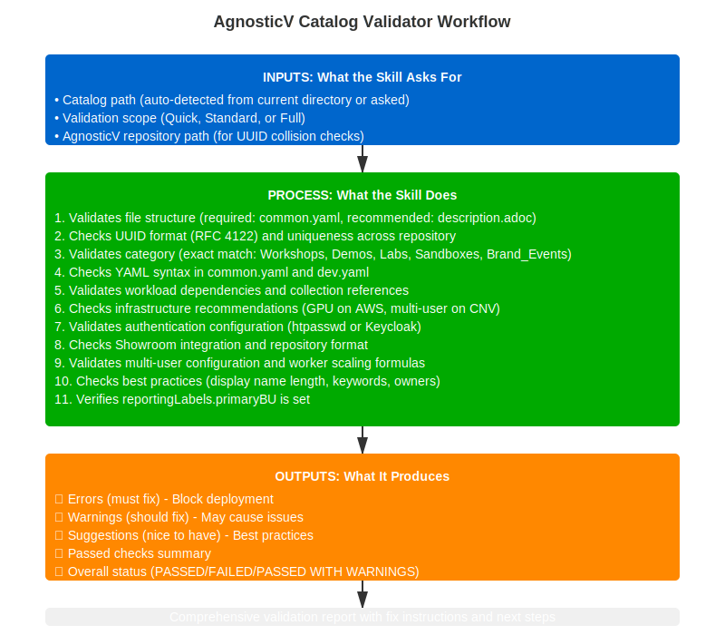

# /agnosticv:validator

✓ Catalog Validation

Validate AgnosticV catalog configurations and best practices before creating pull request.

---

## What You'll Need Before Starting

  
  
Click to view full workflow diagram

### Prerequisites

  

    
📁

    <h4>AgnosticV Repository</h4>
    <pre><code>cd ~/work/code/agnosticv</code></pre>
  

  

    
📄

    <h4>Catalog Files Created</h4>
    <pre><code>agd_v2/your-catalog-name/
├── common.yaml
├── dev.yaml
└── description.adoc</code></pre>
  

  

    
🔄

    <h4>Repository Up to Date</h4>
    <pre><code>git checkout main
git pull origin main</code></pre>
  

### What You'll Need

- Catalog files generated (typically from `/agnosticv:catalog-builder`)
- Current directory set to agnosticv repository
- Git branch for your changes

---

## Quick Start

<ol class="steps">
  <li>
<h4>Navigate to Repo</h4>
AgnosticV repository

</li>
  <li>
<h4>Run Validator</h4>
<code>/agnosticv:validator</code>

</li>
  <li>
<h4>Review Results</h4>
Check validation report

</li>
  <li>
<h4>Fix Issues</h4>
Address errors and warnings

</li>
  <li>
<h4>Create PR</h4>
When validation is clean

</li>
</ol>

---

## What It Validates

ℹ️
<h3>Comprehensive Validation Checks</h3>
The validator performs extensive checks across your catalog configuration, including new checks aligned to the v2.6.0 catalog-builder standards:

<strong>Check 1: File Structure</strong>

<ul>
  <li><strong>Required files:</strong> common.yaml must exist</li>
  <li><strong>Recommended files:</strong> dev.yaml, description.adoc, info-message-template.adoc</li>
  <li><strong>File paths:</strong> Correct directory structure</li>
  <li><strong>Naming:</strong> Follows catalog naming convention</li>
</ul>

<strong>Check 2: UUID Compliance</strong>

<ul>
  <li><strong>Format:</strong> RFC 4122 compliant UUID</li>
  <li><strong>Case:</strong> Lowercase only (no uppercase)</li>
  <li><strong>Uniqueness:</strong> Not used by other catalogs</li>
  <li><strong>Structure:</strong> Proper hyphenation (8-4-4-4-12)</li>
</ul>

<strong>Check 3: Category Validation</strong>

  <h4>Valid values (must be exactly one):</h4>
  <ul>
    <li><code>Workshops</code> - Multi-user hands-on learning</li>
    <li><code>Demos</code> - Single-user presenter-led (MUST NOT be multi-user)</li>
    <li><code>Labs</code> - General learning environments</li>
    <li><code>Sandboxes</code> - Self-service playgrounds</li>
    <li><code>Brand_Events</code> - Events like Red Hat Summit, Red Hat One</li>
  </ul>

  <h4>Important Rules:</h4>
  <ul>
    <li><strong>Case-sensitive:</strong> Must match exactly (plural)</li>
    <li><strong>Required:</strong> Cannot be empty</li>
    <li><strong>Demo rules:</strong>
      <ul>
        <li>Demos MUST be single-user (ERROR if multiuser: true)</li>
        <li>Demos MUST NOT have workshopLabUiRedirect enabled (ERROR)</li>
      </ul>
    </li>
  </ul>

<strong>Checks 4-5: Workloads and YAML</strong>

<ul>
  <li><strong>Check 4: Workloads</strong> - Collection format, existence, dependencies, naming (full <code>namespace.collection.role</code> format required)</li>
  <li><strong>Check 5: YAML Syntax</strong> - Valid YAML, required fields, data types</li>
</ul>

<strong>Check 6: Infrastructure (UPDATED)</strong>

  
Check 6 detects <code>config:</code> type and routes to the appropriate check file. Four paths:

  <h4>cloud-vms-base → <code>cloud-vms-base-validator-checks.md</code>:</h4>
  <ul>
    <li>Instances block defined with bastion VM and correct tags</li>
    <li>Bastion image is supported RHEL version (9.4+)</li>
    <li>CNV: <code>services:/routes:</code> present; AWS: <code>security_groups:</code> present</li>
    <li>Multi-user isolation warning (no per-user namespace on VMs)</li>
  </ul>

  <h4>config: namespace (Sandbox API Tenant CI) → <code>sandbox-validator-checks.md</code>:</h4>
  <ul>
    <li><strong>Check 6C:</strong> ERROR if <code>__meta__.sandboxes</code> missing, <code>kind</code> ≠ OcpSandbox, <code>cloud_selector.cloud</code> not valid, or <code>cloud_selector.lab</code> missing</li>
    <li><strong>Check 6D:</strong> ERROR if <code>sandbox_api.actions.destroy.catch_all</code> not explicitly <code>false</code></li>
    <li><strong>Check 6E:</strong> ERROR if <code>namespaced_workloads</code> collection missing, or tenant workloads (<code>tenant_keycloak_user</code>, <code>tenant_namespace</code>) absent</li>
    <li><strong>Check 6F:</strong> WARNING if <code>remove_workloads</code> missing or incomplete</li>
    <li><strong>Check 6G:</strong> WARNING if <code>deployer.actions.status</code> or <code>update</code> not disabled</li>
  </ul>

  <h4>config: openshift-workloads + cloud_provider: none + num_users: 0 (Sandbox API Cluster CI) → <code>sandbox-validator-checks.md</code>:</h4>
  <ul>
    <li><strong>Check 6H:</strong> ERROR if <code>#include /includes/sandbox-api.yaml</code> or <code>access-restriction-admins-only.yaml</code> missing</li>
    <li><strong>Check 6I:</strong> WARNING if <code>propagate_provision_data</code> missing or incomplete (must pass api_url, token, sandbox vars to tenants)</li>
    <li><strong>Check 6J:</strong> WARNING if <code>deployer.actions.status</code> or <code>update</code> not disabled</li>
  </ul>

  <h4>config: openshift-workloads (standard OCP lab) → <code>ocp-validator-checks.md</code>:</h4>
  <ul>
    <li><strong>Pool suffix:</strong> ERROR if pool does not end in <code>/prod</code></li>
    <li><strong>OCP version:</strong> Must be 4.18, 4.20, or 4.21 (known pool versions)</li>
    <li><strong>AWS OCP:</strong> WARNING — confirm RHDP team approval</li>
    <li><strong>SNO + multiuser:</strong> ERROR — SNO cannot support concurrent users</li>
  </ul>

<strong>Check 7: Authentication (UPDATED)</strong>

  <ul>
    <li><strong>cloud-vms-base:</strong> Auth check skipped — VM catalogs use OS-level auth, no OCP cluster. Warns if <code>ocp4_workload_authentication</code> accidentally added.</li>
    <li><strong>OCP:</strong> ERROR if deprecated <code>ocp4_workload_authentication_htpasswd</code> or <code>ocp4_workload_authentication_keycloak</code> roles found</li>
    <li><strong>OCP:</strong> ERROR if RHSSO detected (use Keycloak/RHBK instead)</li>
    <li><strong>OCP:</strong> PASS requires unified <code>ocp4_workload_authentication</code> with valid <code>ocp4_workload_authentication_provider</code> value (<code>htpasswd</code> or <code>keycloak</code>)</li>
  </ul>

<strong>Check 8: Showroom (UPDATED)</strong>

  <ul>
    <li><strong>OCP:</strong> Both <code>ocp4_workload_ocp_console_embed</code> AND <code>ocp4_workload_showroom</code> required together. ERROR if <code>ocp_console_embed</code> missing.</li>
    <li><strong>OCP:</strong> <code>ocp4_workload_showroom_antora_enable_dev_mode: "false"</code> in common.yaml; <code>"true"</code> in dev.yaml</li>
    <li><strong>cloud-vms-base:</strong> Uses <code>vm_workload_showroom</code> with <code>showroom_git_repo</code> and <code>showroom_git_ref</code>. ERROR if <code>ocp_console_embed</code> present (requires OCP cluster).</li>
    <li><strong>cloud-vms-base:</strong> No dev mode variable — <code>vm_workload_showroom</code> does not have Antora dev mode.</li>
  </ul>

<strong>Check 9: Best Practices</strong>

<ul>
  <li>Naming conventions followed</li>
  <li>Documentation completeness</li>
  <li>dev.yaml has <code>purpose: development</code></li>
</ul>

<strong>Check 10: Stage Files Validation</strong>

<ul>
  <li><strong>dev.yaml:</strong> Must have <code>purpose: development</code></li>
  <li><strong>event.yaml:</strong> Should have <code>purpose: events</code> (if exists)</li>
  <li><strong>prod.yaml:</strong> Should have <code>purpose: production</code> (if exists)</li>
  <li><strong>scm_ref:</strong> Validates deployment repository references</li>
</ul>

<strong>Check 11: Multi-User Configuration (CRITICAL)</strong>

<ul>
  <li><strong>num_users parameter:</strong> Required for multi-user catalogs</li>
  <li><strong>worker_instance_count:</strong> Must scale with num_users</li>
  <li><strong>workshopLabUiRedirect:</strong>
    <ul>
      <li><strong>WARNING</strong> if not enabled for multi-user workshops</li>
      <li>Multi-user workshops SHOULD enable this for per-user lab UI routing</li>
    </ul>
  </li>
  <li><strong>Category compliance:</strong> Workshops/Brand_Events must be multi-user</li>
</ul>

<strong>Check 12: Bastion Configuration</strong>

<ul>
  <li><strong>Image version:</strong> RHEL 9.4-10.0 recommended</li>
  <li><strong>Resources:</strong> Minimum 2 cores, 4Gi memory</li>
  <li><strong>Configuration:</strong> Proper bastion setup for CNV pools</li>
</ul>

<strong>Check 13: Collection Versions (UPDATED)</strong>

  <ul>
    <li><strong>tag: defined:</strong> ERROR if <code>tag:</code> variable is not set in <code>common.yaml</code></li>
    <li><strong>Standard collections:</strong> Should use <code>{{ tag }}</code> — WARNING if hardcoded version found on standard collections</li>
    <li><strong>Showroom collection:</strong> Must use a fixed version (not <code>{{ tag }}</code>) pinned to <code>≥ v1.6.6</code> — ERROR if version is older or missing</li>
    <li><strong>Galaxy collections:</strong> Version validation</li>
    <li><strong>Format:</strong> Proper requirements_content structure</li>
  </ul>

<strong>Check 14: Deployer Configuration</strong>

<ul>
  <li><strong>scm_url:</strong> Must point to agnosticd-v2 repository</li>
  <li><strong>scm_ref:</strong> Deployment reference (main, tag, branch)</li>
  <li><strong>execution_environment:</strong> Container image for deployment</li>
</ul>

<strong>Check 14a: Reporting Labels (CRITICAL - ERROR if missing)</strong>

⚠️
<h4>primaryBU: REQUIRED for business unit tracking</h4>
  
Examples: <code>Hybrid_Platforms</code>, <code>Application_Services</code>, <code>Ansible</code>, <code>RHEL</code>

  
Used for tracking and reporting across RHDP

  
<strong>ERROR severity</strong> if missing

<strong>Check 15: Component Propagation</strong>

<ul>
  <li><strong>Multi-stage catalogs:</strong> Validates data flow between stages</li>
  <li><strong>propagate_provision_data:</strong> Ensures proper variable passing</li>
  <li><strong>Component structure:</strong> Validates __meta__.components configuration</li>
</ul>

<strong>Check 15a: Anarchy Namespace</strong>

  <ul>
    <li><strong>ERROR</strong> if <code>anarchy.namespace</code> is defined anywhere in the catalog item</li>
    <li>The <code>anarchy.namespace</code> field is managed by the platform and must never be set by catalog items</li>
  </ul>

<strong>Check 16: AsciiDoc Templates</strong>

<ul>
  <li><strong>description.adoc:</strong> Required catalog description</li>
  <li><strong>info-message-template.adoc:</strong> Required user notification template</li>
  <li><strong>Variable substitutions:</strong> Validates {variable} syntax usage</li>
  <li><strong>Content quality:</strong> Checks for proper structure</li>
</ul>

<strong>Check 16a: Event Catalog Validation</strong>

  <ul>
    <li><strong>Category:</strong> Event catalogs must use <code>Brand_Events</code> category</li>
    <li><strong>Keywords:</strong> Event-specific keywords required (e.g. <code>summit-2026</code>)</li>
    <li><strong>Directory naming:</strong> Must follow <code>summit-2026/lb####-short-name-cloud_provider</code> convention. WARNING if directory doesn't start with the lab ID. WARNING if directory doesn't end with <code>-aws</code> (AWS pools) or <code>-cnv</code> (CNV/OpenStack pools)</li>
    <li><strong>Showroom naming:</strong> Showroom repo name must match lab ID pattern</li>
    <li><strong>Console embed:</strong> <code>ocp_console_embed</code> workload presence validated for OCP-based event labs</li>
  </ul>

<strong>Check 17: LiteMaaS Validation</strong>

  <ul>
    <li>Triggered when <code>ocp4_workload_litellm_virtual_keys</code> workload is present, OR any <code>litellm</code>/<code>litemaas</code> variable is set, OR either include is already present</li>
    <li><strong>Models list (OCP only):</strong> ERROR if <code>ocp4_workload_litellm_virtual_keys_models</code> is empty</li>
    <li><strong>Duration (OCP only):</strong> WARNING if <code>ocp4_workload_litellm_virtual_keys_duration</code> is not set</li>
    <li><strong>Includes (OCP and cloud-vms-base):</strong> ERROR if <code>#include /includes/secrets/litemaas-master_api.yaml</code> is missing</li>
    <li><strong>Includes (OCP and cloud-vms-base):</strong> ERROR if <code>#include /includes/parameters/litellm_metadata.yaml</code> is missing</li>
  </ul>

<strong>Check 17a: Event Restriction Include</strong>

  <ul>
    <li>Triggered when catalog is in an event directory (e.g. <code>summit-2026/</code> or <code>rh1-2026/</code>)</li>
    <li><strong>WARNING</strong> if event restriction include is missing from <code>common.yaml</code></li>
    <li>Expected includes: <code>summit-devs.yaml</code> (for Summit) or <code>rh1-2026-devs.yaml</code> (for RH1)</li>
    <li>These restrict catalog access to event participants until the event <code>event.yaml</code> file is created</li>
  </ul>

<strong>Check 18: Duplicate Includes</strong>

  <ul>
    <li><strong>ERROR</strong> if the same <code>#include</code> line appears in multiple files loaded together (<code>account.yaml</code>, <code>common.yaml</code>, <code>dev.yaml</code>)</li>
    <li>Prevents <em>"included more than once / include loop"</em> errors at deploy time</li>
    <li>Common case: event directory <code>account.yaml</code> already includes the restriction file, and <code>common.yaml</code> adds it again</li>
  </ul>

<strong>Check 19: Credential Pattern (UPDATED v2.10.8)</strong>

  
Applies to <strong>all credential-like variables</strong> — any key containing <code>password</code>, <code>passwd</code>, <code>secret</code>, <code>token</code>, <code>access_key</code>, <code>api_key</code>, or <code>credential</code> (excluding benign suffixes like <code>_length</code>, <code>_policy</code>, <code>_type</code>, <code>_format</code>, <code>_expires</code>).

  <ul>
    <li><strong>Rule 1 — No hash/GUID generation:</strong> ERROR if any credential variable uses <code>hash()</code>, <code>sha</code>, <code>md5</code>, or GUID-derived values</li>
    <li><strong>Rule 2 — No plain static strings:</strong> ERROR if a credential is a hardcoded string — must use <code>lookup('password')</code>, reference <code>{{ common_password }}</code>, or be empty (<code>""</code> for workload auto-generation)</li>
    <li><strong>Rule 3 — Unique lookup paths:</strong> ERROR if two credential variables use the same <code>output_dir ~</code> path (generates identical values)</li>
    <li><strong>Rule 4 — No clear text in dev.yaml / test.yaml:</strong> ERROR if plain-text credentials appear in <code>dev.yaml</code> or <code>test.yaml</code> — these files are committed to git</li>
  </ul>

  
Correct pattern: <code>lookup('password', output_dir ~ '/common_password', length=12, chars=['ascii_letters', 'digits'])</code>

<strong>Check 20: Showroom Namespace in Tenant Catalogs</strong>

  <ul>
    <li>Applies to Sandbox API Tenant CI catalogs only (<code>config: namespace</code>)</li>
    <li><strong>WARNING</strong> if <code>ocp4_workload_showroom_namespace</code> is set — Showroom manages its own namespace</li>
    <li><strong>WARNING</strong> if a <code>showroom</code> suffix entry exists in <code>ocp4_workload_tenant_namespace_namespaces</code></li>
  </ul>

<strong>Check 21: EE Image Date</strong>

  <ul>
    <li><strong>WARNING</strong> if <code>execution_environment.image</code> uses a <code>chained-YYYY-MM-DD</code> tag that is more than 90 days old</li>
    <li>Recommended current image: <code>quay.io/agnosticd/ee-multicloud:chained-2026-02-23</code></li>
  </ul>

<strong>Check 22: requirements_content Position</strong>

  <ul>
    <li><strong>WARNING</strong> if <code>requirements_content:</code> appears after line 200 in <code>common.yaml</code></li>
    <li>Collections must be visible near the top for fast troubleshooting — reviewers look there first</li>
    <li>Per Nate Stencell's review standard</li>
  </ul>

<strong>Check 23: Untagged Images</strong>

  <ul>
    <li>Applies to <strong>prod and event stage catalogs only</strong></li>
    <li><strong>ERROR</strong> if any container image reference uses <code>:latest</code>, <code>:main</code>, <code>:master</code>, or has no tag at all</li>
    <li>Mutable tags cause non-reproducible deployments — all images must be pinned</li>
    <li>Per Nate Stencell's review standard</li>
  </ul>

<strong>Check 24: Catalog Directory Name Length</strong>

  <ul>
    <li><strong>ERROR</strong> if the catalog directory name exceeds 50 characters</li>
    <li>Platform limit is 52 chars (<code>babylon_checks.py</code>); skill enforces 50 to catch violations before CI</li>
    <li>Per JK's request</li>
  </ul>

<strong>Check 25: E2E Runtime Automation</strong>

  
All checks in this group are <strong>WARNING</strong> severity — E2E failures are student-retryable and do not block provisioning.

  <ul>
    <li><strong>Missing runtime automation workload:</strong> WARNING if <code>ocp4_workload_runtime_automation_k8s</code> is absent from an OCP tenant or dedicated catalog item that is expected to run E2E tests</li>
    <li><strong>Missing zt-runner image:</strong> WARNING if the zt-runner container image reference is not present in the catalog when runtime automation is otherwise configured</li>
  </ul>

  
ℹ️

E2E checks are all WARNING (not ERROR) because failures affect individual student sessions and can be retried — they are not provisioning blockers.

<strong>Check 26: LiteLLM Virtual Keys Placement</strong>

  <ul>
    <li><strong>Rule:</strong> <code>ocp4_workload_litellm_k8s</code> must NOT appear in a cluster CI catalog item</li>
    <li><strong>Cluster CI detection:</strong> <code>__meta__.components</code> includes <code>sandbox_api</code>, OR the catalog display name contains <code>cluster</code></li>
    <li><strong>ERROR</strong> if <code>ocp4_workload_litellm_k8s</code> is found in a cluster CI — same placement rule as Showroom (per-student workloads belong on the tenant/user deployer, not the shared cluster provisioner)</li>
  </ul>

  
⚠️

LiteLLM virtual-key provisioning is per-student. It must live on the tenant/user deployer catalog item, not on the shared cluster CI. Placing it on the cluster CI results in a single shared key for all students.

<strong>Check 27: Showroom in Cluster CI</strong>

  <ul>
    <li><strong>Rule:</strong> <code>ocp4_workload_showroom</code> must NOT appear in a cluster CI catalog item</li>
    <li><strong>Cluster CI detection:</strong> <code>__meta__.components</code> includes <code>sandbox_api</code>, OR the catalog display name contains <code>cluster</code></li>
    <li><strong>ERROR</strong> if <code>ocp4_workload_showroom</code> is found in a cluster CI</li>
  </ul>

  
⚠️

Showroom is per-student. It must only appear on the tenant/user deployer catalog item. Adding it to a cluster CI causes a single shared Showroom instance for all students instead of individual per-user lab UIs.

<strong>CNV Pool CI — false-positive suppression</strong>

  <ul>
    <li>Catalogs with <code>config: openshift-cluster</code> + <code>cloud_provider: openshift_cnv</code> are pool CIs — they provision shared OCP clusters for sandbox allocation, not user-facing labs</li>
    <li>Check 7 (authentication workload) is <strong>skipped</strong> — pool clusters handle auth at the sandbox level</li>
    <li>Check 11 (worker scaling) is <strong>skipped</strong> — <code>worker_instance_count: 0</code> is correct for SNO/compact pools</li>
  </ul>

---

## Common Workflow

<ol class="steps">
  <li>
    

      <h4>Generate Catalog</h4>
      <pre><code>/agnosticv:catalog-builder
→ Create catalog files</code></pre>
    

  </li>

  <li>
    

      <h4>Validate Configuration</h4>
      <pre><code>/agnosticv:validator
→ Check for issues
→ Get validation report</code></pre>
    

  </li>

  <li>
    

      <h4>Fix Issues</h4>
      
Fix reported issues in:

      <ul style="margin: 0.5rem 0 0 0; padding-left: 1.25rem;">
        <li>common.yaml</li>
        <li>dev.yaml</li>
        <li>description.adoc</li>
      </ul>
    

  </li>

  <li>
    

      <h4>Re-validate</h4>
      <pre><code>/agnosticv:validator
→ Confirm all issues resolved</code></pre>
    

  </li>

  <li>
    

      <h4>Create Pull Request</h4>
      <pre><code>git checkout -b add-your-catalog
git add agd_v2/your-catalog-name/
git commit -m "Add your-catalog catalog"
git push origin add-your-catalog
gh pr create --fill</code></pre>
    

  </li>
</ol>

---

## Example Validation Report

### Sample Validation Output

✅
<strong>UUID:</strong> Valid and unique (a1b2c3d4-e5f6-7890-abcd-ef1234567890)

✅
<strong>Category:</strong> Valid value (Workshops)

✅
<strong>Workloads:</strong> All collections found

⚠️
<strong>Description:</strong> Missing estimated time

❌
<strong>common.yaml:</strong> Invalid cloud_provider value

---

## Common Issues and Fixes

  

    <h3>UUID Issues</h3>
    <h4>Wrong:</h4>
    <pre><code>asset_uuid: A1B2C3D4-E5F6-7890-ABCD-EF1234567890</code></pre>
    
UUID contains uppercase letters

    <h4>Correct:</h4>
    <pre><code>asset_uuid: a1b2c3d4-e5f6-7890-abcd-ef1234567890</code></pre>
    
Convert to lowercase

  

  

    <h3>Category Issues</h3>
    <h4>Wrong:</h4>
    <pre><code>category: Workshop  # Singular or wrong case</code></pre>
    
Wrong category name

    <h4>Correct:</h4>
    <pre><code>category: Workshops  # Must be: Workshops, Demos, or Sandboxes</code></pre>
    
Use exact plural form

  

  

    <h3>Workload Issues</h3>
    <h4>Wrong:</h4>
    <pre><code>workloads:
  - showroom  # Missing collection namespace</code></pre>
    
Incorrect workload format

    <h4>Correct:</h4>
    <pre><code>workloads:
  - rhpds.showroom.ocp4_workload_showroom</code></pre>
    
Use full collection path

  

---

## Tips & Best Practices

  

    <h4>✓ Always Validate</h4>
    
Before creating PR

  

  

    <h4>Fix Critical First</h4>
    
Errors before warnings

  

  

    <h4>🔄 Run Multiple Times</h4>
    
As you fix issues

  

  

    <h4>📋 Check Examples</h4>
    
Similar catalogs for patterns

  

  

    <h4>Keep in Sync</h4>
    
common.yaml and dev.yaml

  

---

## Troubleshooting

<strong>Skill not found?</strong>

<ul>
  <li>Restart Claude Code or VS Code</li>
  <li>Verify installation: <code>ls ~/.claude/skills/agnosticv-validator</code> (Claude Code) or <code>ls ~/.cursor/skills/agnosticv-validator</code> (Cursor)</li>
  <li>Check the <a href="../reference/troubleshooting.html">Troubleshooting Guide</a></li>
</ul>

<strong>Validation fails but looks correct?</strong>

<ul>
  <li>Check for hidden characters or extra spaces</li>
  <li>Verify YAML indentation (use spaces, not tabs)</li>
  <li>Compare with working catalog examples</li>
</ul>

<strong>Workload not found error?</strong>

<ul>
  <li>Check <code>~/.claude/docs/workload-mappings.md</code></li>
  <li>Verify collection is published</li>
  <li>Ensure namespace.collection.role format</li>
</ul>

---

## Related Skills

  <a href="agnosticv-catalog-builder.html" class="link-card">
    <h4>/agnosticv:catalog-builder</h4>
    
Create/update catalog (unified skill)

  </a>

  <a href="create-lab.html" class="link-card">
    <h4>/showroom:create-lab</h4>
    
Create workshop content

  </a>

---

  <a href="index.html" class="nav-button">← Back to Skills</a>
  <a href="agnosticv-catalog-builder.html" class="nav-button">Next: /agnosticv:catalog-builder →</a>

