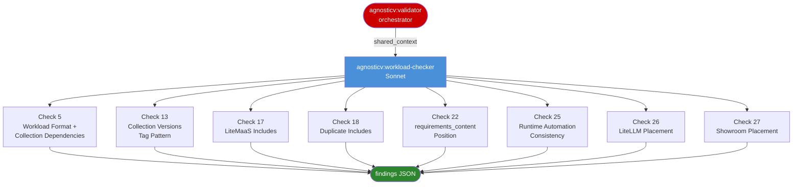

# agnosticv:workload-checker

<div class="reference-badge agnosticv">Workload and Collection Validator</div>

Validates workload structure, collection versions, include integrity, and workload placement rules for an AgnosticV catalog item. Checks workload format, the `tag:` variable, collection version patterns, LiteMaaS include presence, duplicate includes, `requirements_content` position, runtime automation configuration, and per-user workload placement.

This is a subagent. It is not invoked directly by users. It is spawned by the `agnosticv:validator` orchestrator as part of every validation run.

---

## Called By

[`/agnosticv:validator`](agnosticv-validator.html) — spawned in parallel alongside `agnosticv:schema-checker` and `agnosticv:ocp-infra-checker`.

**Model:** `claude-sonnet-4-6`
**Tools:** Read, Glob, Grep, Bash

---

## When It Is Spawned

The validator orchestrator always spawns `workload-checker` regardless of `ci_type` or `config_type`. It runs on every validation scope (`quick`, `standard`, `full`).

Several individual checks have skip conditions based on `ci_type` (see per-check details below). The agent respects `has_yaml_parse_error`: if the orchestrator reports a YAML parse failure, the agent exits immediately.

**Critical:** `ci_type` is resolved and provided by the orchestrator. This agent never re-derives it from config fields.

---

## Inputs: shared_context Fields Read

| Field | Type | Purpose |
|---|---|---|
| `catalog_path` | string | Absolute path to the catalog directory |
| `agv_path` | string | Absolute path to the agnosticv repo root |
| `ci_type` | string | Resolved CI type — used for routing, not re-derived |
| `has_yaml_parse_error` | boolean | If true, agent exits immediately |
| `catalog_slug` | string | Basename of `catalog_path` |
| `validation_scope` | string | `quick` / `standard` / `full` |

---

## Check Ownership



---

## Checks

### Check 5: Workload Dependencies (check_id: 5)

**Skipped for `ci_type == zero_touch`** — workloads are in component `parameter_values`, not the top-level list.

Each workload must use fully-qualified `namespace.collection.role` format. Each non-showroom collection referenced must appear in `requirements_content.collections`.

| Condition | Severity |
|---|---|
| Workloads list empty AND `ci_type` is not `binder` or `zero_touch` | ERROR |
| Workload has fewer than 3 dot-separated parts | ERROR |
| Collection segment not found in `requirements_content.collections` AND not `showroom` | WARNING |

`binder` CIs may have no top-level workloads — they reference components, so an empty list is valid.

---

### Check 13: Collection Versions / Tag Pattern (check_id: 13)

**Skipped for `ci_type == zero_touch`** — no top-level `requirements_content` or `tag` variable expected.

Three sub-checks:

**Sub-check: `tag:` variable**

A top-level `tag:` variable must be defined in `common.yaml`.

| Condition | Severity |
|---|---|
| `tag:` key absent | ERROR |

**Sub-check: no collections defined**

| Condition | Severity |
|---|---|
| `requirements_content.collections` absent or empty | WARNING |

**Sub-check: per-collection version rules**

| Collection | Condition | Severity |
|---|---|---|
| Showroom (`agnosticd/showroom` in URL) | Uses `{{ tag }}` | ERROR — showroom must use a fixed pinned version |
| Showroom | Version below v1.6.8 | WARNING |
| Standard git collection | Version is `{{ tag }}` | Pass |
| Standard git collection | Version is `"main"` | WARNING |
| Standard git collection | Version is `"HEAD"` | ERROR |
| Standard git collection | Version absent | ERROR |

Showroom must use a fixed semver pin (`v1.6.8` or above) so it does not change with the `tag` override in `prod.yaml`. Standard collections must use `{{ tag }}` so `prod.yaml` can pin a release tag.

---

### Check 17: LiteMaaS Includes (check_id: 17)

Triggers when any of the following is true:
- `ocp4_workload_litellm_virtual_keys` appears in any workload string
- Any top-level key starts with `ocp4_workload_litellm` or contains `litemaas` (case-insensitive)
- Either LiteMaaS include (`litemaas-master_api` or `litellm_metadata`) is already present

When triggered, both includes are required in `common.yaml`:

| Missing include | Severity |
|---|---|
| `#include /includes/secrets/litemaas-master_api.yaml` | ERROR |
| `#include /includes/parameters/litellm_metadata.yaml` | ERROR |

When none of the three trigger conditions match: passes silently.

---

### Check 18: Duplicate Includes (check_id: 18)

Checks four files for `#include` line collisions:
1. `{catalog_path}/common.yaml`
2. `{catalog_path}/dev.yaml` (if present)
3. `{parent_of_catalog_path}/account.yaml` (if exists)
4. `{agv_path}/account.yaml` (if exists)

**Sub-check A:** duplicates within `common.yaml` itself.

**Sub-check B:** the same `#include` path appearing in 2+ different files.

| Condition | Severity |
|---|---|
| Same include line appears more than once in `common.yaml` | ERROR |
| Same include path found across 2+ different files | ERROR |

Duplicate includes cause AgnosticV to raise `"included more than once / include loop"` at deploy time. The most common case is an event directory `account.yaml` that already loads a restriction include, and `common.yaml` adding the same one again.

---

### Check 22: requirements_content Position (check_id: 22)

**Skipped for `ci_type == zero_touch`.**

`requirements_content:` must appear within the first 200 lines of `common.yaml`. Per Nate Stencell's review standard: collections must be immediately visible near the top for troubleshooting.

Detected via:
```bash
grep -n "^requirements_content:" {catalog_path}/common.yaml | head -1
```

| Condition | Severity |
|---|---|
| `requirements_content:` at line > 200 | WARNING |

If `requirements_content:` is not found at all: this check passes silently (Check 13 handles the absence of collections).

---

### Check 25: Runtime Automation Consistency (check_id: 25)

Routes by `ci_type`:

| ci_type | Behavior |
|---|---|
| `shared_pool_cluster` | ERROR if `ocp4_workload_showroom_runtime_automation_enable: true` found (wrong CI) |
| `tenant_namespace`, `per_user_dedicated`, `binder` | Run Check 25a |
| `zero_touch` | Skip |

**Check 25a (tenant/dedicated/binder):**

Also skips if the catalog is detected as a cluster provisioner (`__meta__.components` is non-empty OR display name contains "cluster").

| Condition | Severity |
|---|---|
| `runtime_automation_enable` not set or false | WARNING — recommends setup |
| `runtime_automation_enable: true` but image not set | WARNING |
| Image set but tag != `v2.4.2` | WARNING |
| `rhpds.ftl.ocp4_workload_runtime_automation_k8s` not in workloads | WARNING |

Expected runtime automation image: `quay.io/rhpds/zt-runner:v2.4.2`

All findings at WARNING severity — E2E failures are student-retryable, not provisioning blockers.

---

### Check 26: LiteLLM Placement (check_id: 26)

`ocp4_workload_litellm_virtual_keys` is a per-user workload and must not appear in shared pool cluster CIs.

If the workload is not present in `workloads` or `remove_workloads`: skip.

| ci_type | Severity |
|---|---|
| `shared_pool_cluster` | ERROR |
| `tenant_namespace`, `per_user_dedicated`, `binder` | Pass |
| `zero_touch` | Skip |

Placing LiteLLM virtual-key provisioning on the cluster CI results in a single shared key for all students instead of individual per-user keys.

---

### Check 27: Showroom Placement (check_id: 27)

`ocp4_workload_showroom` and `vm_workload_showroom` are per-user workloads and must not appear in shared pool cluster CIs.

Checks both `workloads` and `remove_workloads` lists for entries containing `ocp4_workload_showroom` or `vm_workload_showroom`.

If neither is present in either list: skip.

| ci_type | Severity |
|---|---|
| `shared_pool_cluster` | ERROR |
| `tenant_namespace`, `per_user_dedicated`, `binder` | Pass |

Adding Showroom to a cluster CI causes a single shared Showroom instance for all students instead of individual per-user lab UIs.

---

## Output Contract

The agent returns only JSON — no prose, no tables, no explanations.

```json
{
  "agent": "workload-checker",
  "errors": [
    {
      "check": "collections",
      "check_id": 13,
      "severity": "ERROR",
      "message": "Showroom collection must use a fixed pinned version, not {{ tag }}",
      "location": "common.yaml:requirements_content.collections",
      "fix": "Set version: v1.6.8 (or the highest version currently in use across AgV)",
      "current": "{{ tag }}",
      "example": "version: v1.6.8"
    }
  ],
  "warnings": [
    {
      "check": "runtime_automation",
      "check_id": 25,
      "severity": "WARNING",
      "message": "E2E testing (solve/validate buttons) not configured",
      "location": "common.yaml",
      "recommendation": "Add ocp4_workload_showroom_runtime_automation_enable: true and ocp4_workload_showroom_runtime_automation_image: \"quay.io/rhpds/zt-runner:v2.4.2\""
    }
  ],
  "suggestions": [],
  "passed_checks": [
    "✓ Workload format correct (5 workloads)",
    "✓ tag variable defined: main",
    "✓ Showroom collection version: v1.6.8 (≥ v1.6.8)",
    "✓ Collections defined (3 collections)",
    "✓ LiteMaaS not in use (no includes required)",
    "✓ No duplicate includes across files",
    "✓ No duplicate includes within common.yaml",
    "✓ requirements_content at line 18 (within first 200 lines)",
    "✓ ocp4_workload_litellm_virtual_keys not present (no placement check needed)",
    "✓ Showroom workload in correct CI type (tenant/dedicated/VM)"
  ]
}
```

**Contract rules:**
- `errors`: all ERROR-severity findings — each includes `check`, `check_id`, `severity`, `message`, `location`, `fix`, `current`, `example`
- `warnings`: all WARNING-severity findings — each includes `check`, `check_id`, `severity`, `message`, `location`, `recommendation`
- `suggestions`: always `[]` — this agent has no suggestion-level findings
- `passed_checks`: one string per passing check, formatted `"✓ {description}"`
- `agent`: always `"workload-checker"`
- No extra fields. No prose before or after the JSON.

---

## Early-Exit Behavior

If `has_yaml_parse_error == true`, the agent returns immediately:

```json
{
  "agent": "workload-checker",
  "errors": [],
  "warnings": [],
  "suggestions": [],
  "passed_checks": ["⚠ YAML parse error detected by orchestrator — workload checks skipped"]
}
```

---

## Related

- [`/agnosticv:validator`](agnosticv-validator.html) — orchestrator that spawns this agent
- [`agnosticv:schema-checker`](agnosticv-schema-checker.html) — sibling agent: structural and metadata validation
- [`agnosticv:ocp-infra-checker`](agnosticv-ocp-infra-checker.html) — sibling agent: OCP and cloud-vms-base infra validation

---

<div class="navigation-footer">
  <a href="agnosticv-schema-checker.html" class="nav-button">← agnosticv:schema-checker</a>
  <a href="agnosticv-ocp-infra-checker.html" class="nav-button">Next: agnosticv:ocp-infra-checker →</a>
</div>
