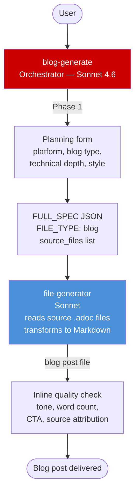

# /showroom:blog-generate

<div class="reference-badge">✍️ Blog Post Creation</div>

Transform completed Red Hat Showroom lab or demo content into blog posts for Red Hat Developer, internal blogs, or marketing platforms.

---

## Quick Start

```text
/showroom:blog-generate
```

---

## Architecture



The `file-generator` agent reads all source .adoc files, extracts key content, and transforms it to Markdown blog format. The auto-humanizer pass removes AI writing patterns before delivery.

---

## Transformation Patterns

| Source | Blog type | What changes |
|---|---|---|
| Workshop exercises | Tutorial | Exercises → narrative how-to flow, keep code |
| Workshop (condensed) | Quick start | First module only, condensed |
| Demo Know sections | Announcement | Business value extraction |
| Demo Show sections | Case study | Capability walkthrough |
| Any | Thought leadership | Patterns and trends, minimal code |

---

## Personal Writing Style

```text
Writing style: "storytelling-first, relatable analogies, humor where appropriate"
  OR paste 1-3 paragraphs from a blog post you wrote
  OR URL to a published post you authored
  Saved profile: ~/.claude/context/my-writing-style.md
```

See [Writing Style Guide](../reference/writing-style.html).

---

## Related Skills

- [`/showroom:create-lab`](create-lab.html) — create the lab the blog is based on
- [`/showroom:create-demo`](create-demo.html) — create the demo the blog is based on
- [Agent Architecture](../reference/agent-architecture.html)
