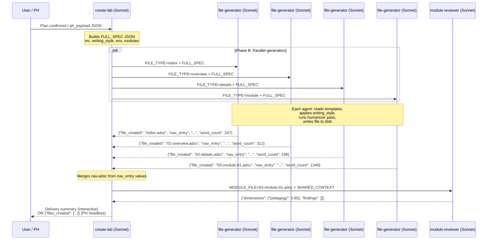

# /showroom:create-lab

<div class="reference-badge">📝 Workshop Lab Creation</div>

Create hands-on Red Hat Showroom workshop content. Runs a grouped planning form then generates all files in parallel using specialized agents. Supports headless mode for Publishing House.

---

## Quick Start

```text
/showroom:create-lab
/showroom:create-lab content/modules/ROOT/pages/ --new
/showroom:create-lab content/modules/ROOT/pages/ --continue 03-module-01.adoc
```

---

## Architecture



**New lab:** 4 file-generator agents run simultaneously — index, overview, details, module-01 all generated in parallel.

**Continue mode:** single file-generator seeded with previous module content (sequential by design for story continuity).

---

## How It Works

<ol class="steps">
<li>
<div class="step-content">
<h4>Parse arguments</h4>
<p>Reads <code>--new</code> or <code>--continue</code> flags. If target directory is empty, prompts to clone the nookbag template first.</p>
</div>
</li>
<li>
<div class="step-content">
<h4>Grouped planning form (Phase A)</h4>
<p>Asks all questions at once — lab name, audience, business scenario, duration, module breakdown, environment details, reference materials, and optional writing style. No sequential blocking. User fills what they know and confirms the plan.</p>
</div>
</li>
<li>
<div class="step-content">
<h4>Showroom setup (new labs)</h4>
<p>Q0–Q3: catalog type, tabs/consoles, Red Hat theme, E2E automation. Creates <code>site.yml</code> and <code>ui-config.yml</code>. If E2E: copies <code>buttons.js</code> from the nookbag e2e-template branch and creates <code>runtime-automation/</code> skeleton with canonical Ansible stubs.</p>
</div>
</li>
<li>
<div class="step-content">
<h4>Parallel file generation (Phase B)</h4>
<p>Spawns 4 <code>showroom:file-generator</code> agents simultaneously. Each gets the full FULL_SPEC JSON including writing style profile. All apply the auto-humanizer pass before writing to disk.</p>
</div>
</li>
<li>
<div class="step-content">
<h4>Quality check and delivery</h4>
<p>Spawns <code>showroom:module-reviewer</code> on generated files. Merges nav.adoc from agent nav_entry outputs. Presents delivery summary with file list, word counts, and any quality warnings.</p>
</div>
</li>
</ol>

---

## Personal Writing Style

Provide your style in the planning form:

```text
Writing style: "conversational, short sentences, active voice, no jargon"
  OR paste 1-3 paragraphs of your writing as an example
  OR path to a module you wrote: ~/my-showroom/content/modules/ROOT/pages/03-module-01.adoc
  Saved profile: ~/.claude/context/my-writing-style.md
```

See [Writing Style Guide](../reference/writing-style.html) for how to create a persistent profile.

---

## Publishing House Integration

```yaml
ph_payload:
  target_dir: content/modules/ROOT/pages/
  mode: new
  spec:
    lab_name: OpenShift Pipelines Workshop
    audience: intermediate
    learning_objectives: [Deploy a pipeline, Configure triggers, Monitor builds]
    business_scenario: ACME Corp needs to modernize their CI/CD pipeline...
    duration: 90min
    env:
      ocp_version: "4.18"
      attributes: {user: user1, password: openshift}
    writing_style: "conversational, short sentences"
```

Returns:

```json
{
  "files_created": ["index.adoc", "01-overview.adoc", "02-details.adoc", "03-module-01-pipeline-setup.adoc"],
  "nav_updated": true,
  "quality": {"critical": 0, "high": 0, "warnings": 1}
}
```

See [PH Integration Guide](../reference/ph-integration.html) for full sequence diagrams.

---

## Related Skills

- [`/showroom:verify-content`](verify-content.html) — quality review after content is created
- [`/showroom:create-demo`](create-demo.html) — presenter-led demo content
- [`/ftl:rhdp-lab-validator`](rhdp-lab-validator.html) — E2E automation
- [Agent Architecture](../reference/agent-architecture.html)
