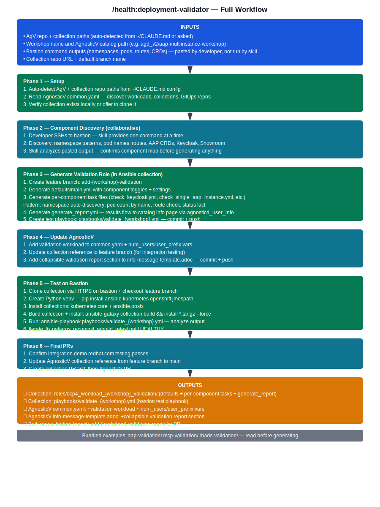

# /health:deployment-validator

🏥 Deployment Health Validation

Create Ansible validation roles for post-deployment health checks and verification.

---

## 📋 What You'll Need Before Starting

  
  
Click to view full workflow diagram

### Prerequisites

  

    
✓

    <h4>Know What to Validate</h4>
    <ul>
      <li>List of packages to verify</li>
      <li>Services that should be running</li>
      <li>Configuration files to check</li>
      <li>Expected OpenShift resources</li>
      <li>API endpoints to test</li>
    </ul>
  

  

    
🚀

    <h4>Have Workload Deployed</h4>
    <pre><code># Know your deployment details:
- OpenShift namespace
- Deployed applications
- Required resources</code></pre>
  

  

    
📁

    <h4>AgnosticD Repository Access</h4>
    <pre><code>cd ~/work/code/agnosticd</code></pre>
  

### What You'll Need

  

    
🏷️

    <h4>Workload Name</h4>
    
Matches your deployment workload

  

  

    
📋

    <h4>Validation Checks</h4>
    
List of checks to perform

  

  

    
✅

    <h4>Expected State</h4>
    
Expected state for each check

  

  

    
❌

    <h4>Failure Conditions</h4>
    
Failure conditions and error messages

  

---

## 🚀 Quick Start

  

    
1

    

      <h4>Navigate to Repository</h4>
      
Open your AgnosticD repository directory

    

  

  

    
2

    

      <h4>Run Validator</h4>
      
<code>/health:deployment-validator</code>

    

  

  

    
3

    

      <h4>Answer Questions</h4>
      
Provide validation requirements

    

  

  

    
4

    

      <h4>Review & Test</h4>
      
Review generated role and test it

    

  

---

## 📁 What It Creates

  <h4>Generated Directory Structure:</h4>
  <pre><code>~/work/code/agnosticd/roles/ocp4_workload_<name>_validation/
├── defaults/main.yml          # Default variables
├── tasks/
│   ├── main.yml              # Main validation tasks
│   ├── pre_workload.yml      # Pre-checks
│   ├── workload.yml          # Core validation
│   └── post_workload.yml     # Post-checks
└── README.md                  # Documentation</code></pre>

---

## 🔍 Common Validation Types

  

    <h3>📦 Package Validation</h3>
    
Verify RPM packages are installed:

    <pre><code>- name: Verify package is installed
  package:
    name: "{{ package_name }}"
    state: present
  check_mode: yes</code></pre>
  

  

    <h3>⚙️ Service Validation</h3>
    
Check systemd services are running:

    <pre><code>- name: Verify service is running
  systemd:
    name: "{{ service_name }}"
    state: started
    enabled: yes</code></pre>
  

  

    <h3>☸️ OpenShift Resource Validation</h3>
    
Verify pods, deployments, routes:

    <pre><code>- name: Verify deployment is ready
  kubernetes.core.k8s_info:
    kind: Deployment
    name: "{{ deployment_name }}"
    namespace: "{{ namespace }}"</code></pre>
  

---

## 💡 Tips & Best Practices

  

    <h4>🎯 Start Simple</h4>
    
Begin with basic checks first

  

  

    <h4>💬 Clear Messages</h4>
    
Use clear error messages

  

  

    <h4>🧪 Test Thoroughly</h4>
    
Test on clean deployment

  

  

    <h4>📝 Document Checks</h4>
    
Document what each check verifies

  

  

    <h4>🔒 Read-Only</h4>
    
Validation should not modify state

  

  

    <h4>⏱️ Add Retries</h4>
    
Resources take time to be ready

  

---

## 🆘 Troubleshooting

<strong>Skill not found?</strong>

<ul>
  <li>Restart Claude Code or VS Code</li>
  <li>Verify installation: <code>ls ~/.claude/skills/deployment-health-checker</code></li>
  <li>Check the <a href="../reference/troubleshooting.html">Troubleshooting Guide</a></li>
</ul>

<strong>Validation fails on working deployment?</strong>

<ul>
  <li>Check timing - resources take time to be ready</li>
  <li>Add retries with delays</li>
  <li>Verify variable values are correct</li>
  <li>Use debug mode to inspect actual vs expected state</li>
</ul>

---

## 🔗 Related Skills

  <a href="agnosticv-catalog-builder.html" class="related-skill-card">
    
🔧

    

      <h4>/agnosticv:catalog-builder</h4>
      
Create catalog with validation enabled

    

  </a>

  <a href="agnosticv-validator.html" class="related-skill-card">
    
✓

    

      <h4>/agnosticv:validator</h4>
      
Validate catalog configuration

    

  </a>

  <a href="ftl.html" class="related-skill-card">
    
🎯

    

      <h4>/ftl</h4>
      
Generate automated graders

    

  </a>

---

  <a href="index.html" class="nav-button">← Back to Skills</a>
  <a href="ftl.html" class="nav-button">Next: /ftl →</a>

