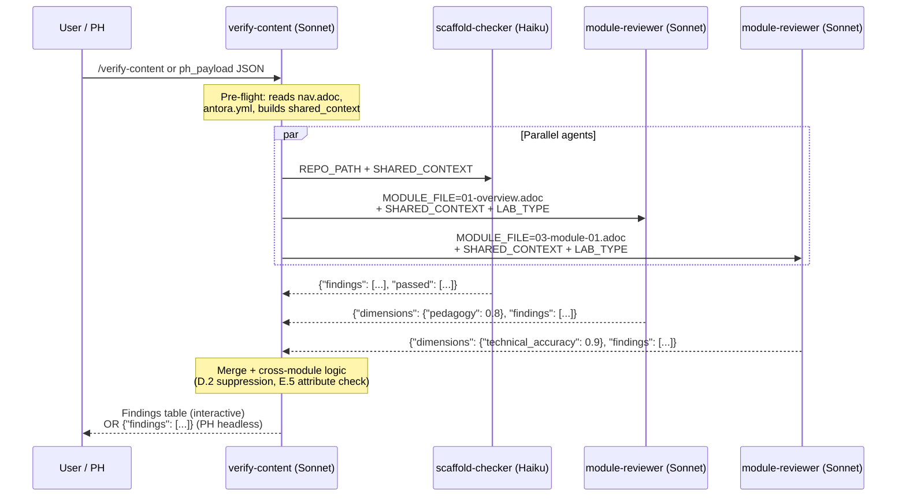

# /showroom:verify-content

<div class="reference-badge">✅ Content Quality Validation</div>

Verify workshop or demo content against Red Hat quality standards. Runs parallel agents per module — fast, thorough, dimension-scored. Works interactively or headless via Publishing House.

---

## Quick Start

```text
/showroom:verify-content
```

Run from inside your Showroom repo. Auto-detects content type and lab type.

---

## Architecture

This skill is an **orchestrator**. All checks are delegated to specialized agents running in parallel — one `scaffold-checker` for root config files and one `module-reviewer` per .adoc file simultaneously.



**Expected speedup:** ~6× faster than sequential checks (8 min → ~90 sec for a 6-module lab).

---

## How It Works

<ol class="steps">
<li>
<div class="step-content">
<h4>Auto-detect</h4>
<p>Detects <code>content/modules/ROOT/pages/</code> in the current directory. Infers content type (workshop vs demo) from file structure, and lab type (ocp, rhel, vm, ai) from <code>ui-config.yml</code>. If nothing found, asks for a local path or GitHub URL.</p>
</div>
</li>
<li>
<div class="step-content">
<h4>Pre-flight (orchestrator, inline)</h4>
<p>Reads <code>nav.adoc</code> for module order, <code>antora.yml</code> for defined attributes, and scans all .adoc files to build the first-use acronym map. Runs B.1–B.7 cross-module structure checks (index.adoc, nav completeness, module presence). Produces <code>SHARED_CONTEXT</code> JSON shared with all agents.</p>
</div>
</li>
<li>
<div class="step-content">
<h4>Parallel agent review</h4>
<p>Spawns <code>showroom:scaffold-checker</code> (Haiku) and one <code>showroom:module-reviewer</code> (Sonnet) per module — all run simultaneously. Each agent gets its own fresh context window with <code>SHARED_CONTEXT</code> so it doesn't need to read across files.</p>
</div>
</li>
<li>
<div class="step-content">
<h4>Merge and cross-module logic</h4>
<p>Flattens all agent findings. Applies cross-module suppression: D.2 acronym warnings only fire on the first occurrence across all modules; E.5 attribute warnings are suppressed for attributes defined in <code>antora.yml</code>. Deduplicates, sorts by severity.</p>
</div>
</li>
<li>
<div class="step-content">
<h4>Present and fix</h4>
<p>Outputs one consolidated findings table. User picks issues to fix one at a time (or "all critical" / "all high"). Fix loop applies changes interactively. In PH headless mode, returns structured JSON and skips the fix loop.</p>
</div>
</li>
</ol>

---

## Check Coverage

### Scaffold Checks (S) — `showroom:scaffold-checker`

| Check | What it catches |
|---|---|
| S.1 | `site.yml` missing, stale title, missing `start_page` |
| S.2 | `ui-config.yml` missing, split view not enabled |
| S.3 | `antora.yml` missing, stale `name` or `start_page` |
| S.4 | `gh-pages.yml` missing or referencing wrong playbook |
| S.5 | `supplemental-ui/` files missing |
| S.5c | `buttons.js` missing when button roles are used |
| S.5d | **Recommendation only** — solve/validate buttons are optional |
| S.5f | `runtime-automation/` missing when button placeholders used |

### Content Checks (B/C/D/E/F) — `showroom:module-reviewer`

| Pass | Checks |
|---|---|
| B — Structure | Learning objectives, exercises, Verify sections, conclusion, nav completeness |
| C — Formatting | Image syntax, code blocks, heading levels, include references, list spacing |
| D — Style | Red Hat terminology, acronym expansion, inclusive language, version attributes |
| E — Technical | `oc` command casing, YAML indent, `role="execute"` on shell blocks, attribute placeholders, hardcoded URLs |
| F — Demo | Know/Show structure, business value, presenter notes (demo content only) |

### Security Checks — new in this release

The following security issues were identified from real production labs and are now automatically detected:

| Security Check | What it catches | Severity |
|---|---|---|
| **Multiuser htpasswd — shared passwords** | When `multiuser: true` and htpasswd auth is used, all users share the same password unless `ocp4_workload_authentication_htpasswd_user_password_randomized: true` is set | High |
| **VS Code without authentication** | `ocp4_workload_vscode` with `auth-type: none` exposes an unauthenticated IDE to anyone with the Showroom URL | High |

Both detected in: `agnosticv:validator`

---

## Dimension Scoring

Each `module-reviewer` agent returns dimension scores (0.0–1.0) alongside findings. These enable regression detection when skill changes are evaluated against known-good content.

| Dimension | Checks covered |
|---|---|
| `structure` | B.8–B.15, E.7 |
| `pedagogy` | B.8, B.9, B.12 |
| `style` | C.9, D.1, D.3–D.5, D.8, D.9 |
| `technical_accuracy` | D.10, E.1–E.9 |
| `demo_structure` | F.1–F.5 (demo content only) |
| `formatting` | C.1, C.2, C.5, C.10 |
| `intro_quality` | B structure + D.1/D.2 (first module only) |

---

## Publishing House Integration

`verify-content` supports headless mode for Publishing House. PH passes `ph_payload` JSON — the skill skips all interactive prompts and returns structured findings JSON. No PH code changes needed.

**PH sends:**

```yaml
ph_payload:
  content_path: content/modules/ROOT/pages/
  modules: []
  lab_type: workshop
  shared_context:
    defined_attributes: {ocp_version: "4.18"}
    nav_order: [index, 01-overview, 03-module-01]
    first_use_map: {}
```

**PH receives:**

```json
{
  "findings": [
    {"id": "E.3a", "module": "03-module-01.adoc", "line": 47, "severity": "High", "message": "..."}
  ],
  "summary": {"critical": 0, "high": 1, "medium": 0, "warnings": 3}
}
```

See [PH Integration Guide](../reference/ph-integration.html) for full details and sequence diagrams.

---

## Template Priority

The skill checks the repo's own templates and prompt files before falling back to marketplace bundled versions:

```text
1. {REPO_PATH}/showroom/prompts/*.txt  →  project-specific rules (partner content, custom terminology)
2. @showroom/prompts/*.txt             →  marketplace defaults
```

---

## Related Skills

- [`/showroom:create-lab`](create-lab.html) — create workshop content
- [`/showroom:create-demo`](create-demo.html) — create presenter demo content
- [`/ftl:rhdp-lab-validator`](rhdp-lab-validator.html) — write E2E automation
- [Agent Architecture](../reference/agent-architecture.html) — how orchestration works
- [PH Integration](../reference/ph-integration.html) — headless mode details
