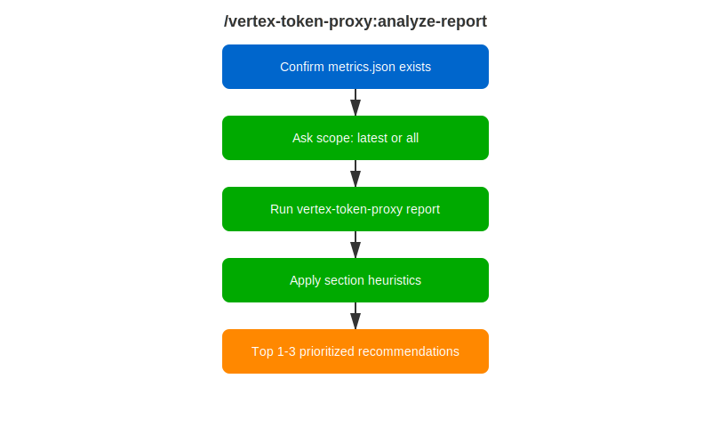

# /vertex-token-proxy:analyze-report

<div class="reference-badge">📊 Token Spend Analysis</div>

Run a vertex-token-proxy session report and get judgment, not just numbers: which costs dominate, what is healthy versus wasteful, and the 2–3 highest-impact changes to cut token spend.

<div style="margin: 1rem 0;">
  <a href="vertex-analyze-report-workflow.svg" target="_blank">
    
  </a>
</div>

---

## Quick Start

```text
/vertex-token-proxy:analyze-report
```

Requires at least one measured session — run [`/vertex-token-proxy:setup`](vertex-setup.html) first.

---

## What It Checks

| Report section | Heuristics applied |
|---|---|
| TOKEN USAGE | Cache hit rate below 70% and cache breaks above 2 per session get flagged with the wasted dollars |
| INPUT BREAKDOWN | `tool_schemas` above 15% (MCP bloat), `tool_results` above 40% (verbose output), `system_prompt` above 20% (oversized instructions) |
| REPETITION ANALYSIS | Distinguishes repetition absorbed by caching (fine) from re-billed repetition (expensive) |
| DRY-RUN COMPRESSION | Reports projected savings as an upper bound and identifies the dominant compressor |
| LATENCY | Flags proxy overhead only if it exceeds 5% of total latency |

Output ends with at most three recommendations, each tied to a number from the report and ordered by estimated savings. A healthy session gets told it is healthy — no invented recommendations.

See the [worked example](https://github.com/rhpds/rhdp-skills-marketplace/blob/main/vertex-token-proxy/examples/analyze-report-example.md) with sample report output and the conclusions drawn from it.

---

## Related Skills

- [`/vertex-token-proxy:setup`](vertex-setup.html) — install and start the proxy
- [`/vertex-token-proxy:compare`](vertex-compare.html) — verify a change helped

---

## Feedback

Found a problem or have a suggestion? [Open a skill-feedback issue](https://github.com/rhpds/rhdp-skills-marketplace/issues/new?template=skill-feedback.yml&labels=vertex-token-proxy).
