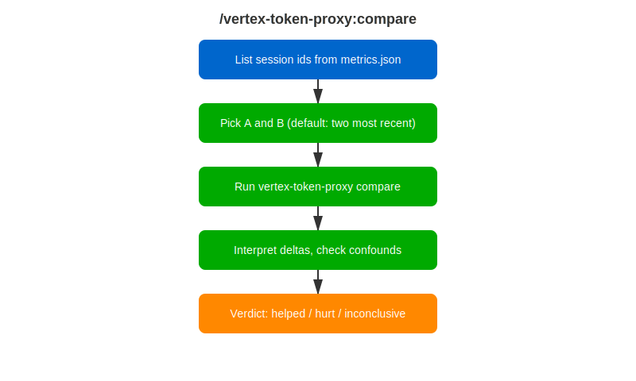

# /vertex-token-proxy:compare

<div class="reference-badge">⚖️ A/B Session Comparison</div>

Did disabling that MCP server actually save tokens? Run a baseline session, change one thing, run another session, and this skill explains the delta — cost first, confounds called out honestly.

<div style="margin: 1rem 0;">
  <a href="vertex-compare-workflow.svg" target="_blank">
    
  </a>
</div>

---

## Quick Start

```text
/vertex-token-proxy:compare
```

Defaults to the two most recent sessions; you can also pick any two by session id.

---

## How It Works

1. **Lists sessions** from `~/.vertex-token-proxy/metrics.json`.
2. **Asks what changed** between A and B if you have not said.
3. **Runs `vertex-token-proxy compare`** — a side-by-side table of turns, input/output tokens, cache hit rate, cache breaks, repeated tokens, compressible tokens, cost, and latency with deltas.
4. **Interprets honestly** — normalizes by turn count when sessions differ in length, ties the delta to your specific change, and checks that caching did not silently regress.
5. **Delivers one of three verdicts** — helped, hurt, or inconclusive (with the confound named).

---

## Related Skills

- [`/vertex-token-proxy:analyze-report`](vertex-analyze-report.html) — single-session deep dive
- [`/vertex-token-proxy:setup`](vertex-setup.html) — install and start the proxy

---

## Feedback

Found a problem or have a suggestion? [Open a skill-feedback issue](https://github.com/rhpds/rhdp-skills-marketplace/issues/new?template=skill-feedback.yml&labels=vertex-token-proxy).
