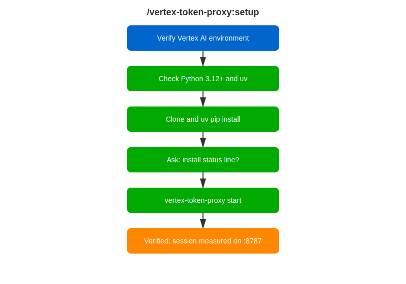

# /vertex-token-proxy:setup

<div class="reference-badge">📡 Token Measurement Setup</div>

Install and start [vertex-token-proxy](https://github.com/rhpds/vertex-token-proxy) so your Claude Code sessions on Google Vertex AI are measured: token counts by category, repetition detection, projected compression savings, and live cost in your status line. No requests are ever modified.

<div style="margin: 1rem 0;">
  <a href="vertex-setup-workflow.svg" target="_blank">
    
  </a>
</div>

---

## Quick Start

```text
/vertex-token-proxy:setup
```

---

## How It Works

1. **Verifies you are on Vertex AI** — the proxy only applies to `CLAUDE_CODE_USE_VERTEX` sessions.
2. **Checks prerequisites** — Python 3.12+ and uv.
3. **Installs the proxy** — clones the repo and runs `uv pip install -e .`.
4. **Asks about the status line** — live token counts and cost in your terminal; wraps any existing status line rather than replacing it.
5. **Starts a measured session** — `vertex-token-proxy start` launches Claude Code routed through `localhost:8787` and verifies with `vertex-token-proxy status`.

The proxy binds to 127.0.0.1 only, never logs request content, and stores only aggregated numbers and SHA-256 hashes in `~/.vertex-token-proxy/metrics.json`.

---

## Bundled SessionStart Hook

The plugin includes a hook that stays silent unless you are on Vertex, the proxy is installed, and the current session is not being measured — in which case it prints one reminder to relaunch via `vertex-token-proxy start`. Measurement cannot start mid-session because the routing variable must be set before Claude Code launches.

---

## Related Skills

- [`/vertex-token-proxy:analyze-report`](vertex-analyze-report.html) — interpret your metrics
- [`/vertex-token-proxy:compare`](vertex-compare.html) — A/B test config changes

---

## Feedback

Found a problem or have a suggestion? [Open a skill-feedback issue](https://github.com/rhpds/rhdp-skills-marketplace/issues/new?template=skill-feedback.yml&labels=vertex-token-proxy).
