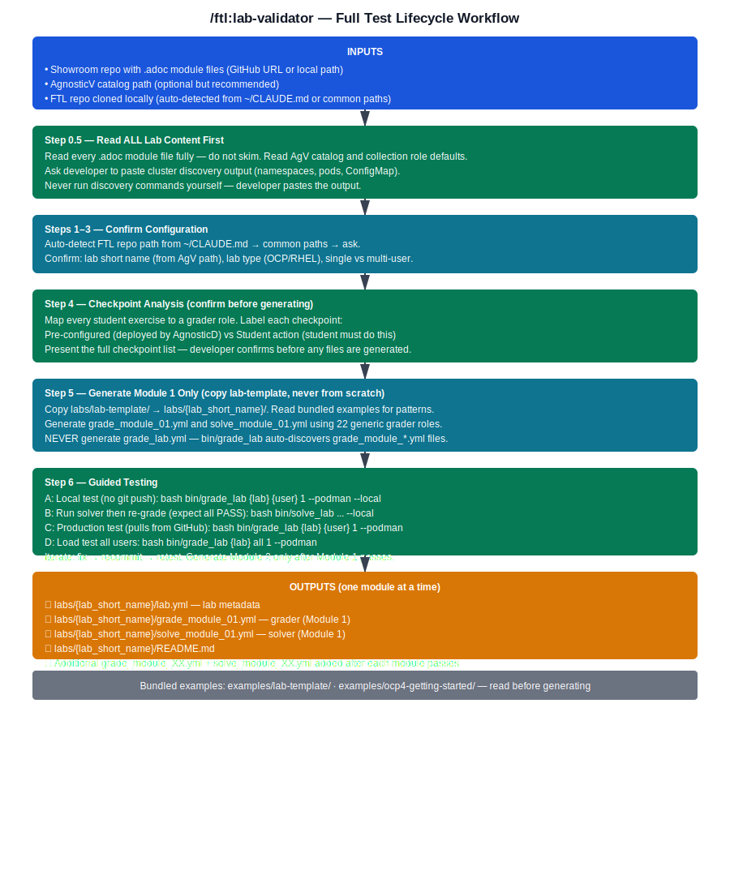

---
context: main
model: claude-opus-4-6
---

# FTL Lab Validator

Generate production-quality FTL (Full Test Lifecycle) grader and solver playbooks for a Showroom workshop by reading existing module content. The skill analyzes your `.adoc` module files, identifies student exercises and checkpoints, and generates complete Ansible playbooks following all FTL framework conventions.

## Workflow Diagram



## What You'll Need Before Starting

**Required:**
- **FTL repository** cloned locally (ask for path at runtime)
- **Showroom workshop content** with `.adoc` module files containing student exercises
- **SSH access to bastion host** for testing generated playbooks

**Helpful to have:**
- Access to a deployed environment for testing
- Knowledge of which resources students create (pods, routes, secrets, etc.)
- Required environment variables for the lab (cluster domain, passwords, etc.)

**Access needed:**
- Write permissions to FTL repository
- Git configured for commits

## FTL Patterns Reference

See @health/docs/FTL-PATTERNS.md for:
- Three-play pattern (CRITICAL - grader_student_report_file in every play)
- Complete grader role catalog (17 roles with variables)
- Multi-user vs single-user patterns
- Environment variable validation patterns
- AAP 2.6 API reference
- Common pitfalls and fixes
- Solver conventions

## When to Use

**Use this skill when you want to:**
- Add grading and solving capabilities to a Showroom workshop
- Create automated lab validation for student exercises
- Generate test infrastructure for workshop content

**Don't use this for:**
- Creating Showroom workshop content -> use `/showroom:create-lab`
- Validating deployment health checks -> use `/health:deployment-validator`
- Validating workshop content quality -> use `/showroom:verify-content`

## Workflow

**CRITICAL RULES**

### 1. Ask Questions SEQUENTIALLY
- Ask ONE question at a time
- WAIT for user's answer before proceeding
- Do NOT ask questions from multiple steps together

### 2. Read FTL Patterns Before Generating
- Read @health/docs/FTL-PATTERNS.md BEFORE generating any playbooks
- Follow the three-play pattern exactly
- Use the correct grader role for each checkpoint type

### 3. Manage Output Tokens
- Use Write tool to create files -- do NOT output full playbook content
- Show brief confirmations: "Created: grade_module_01.yml (120 lines, 8 checkpoints)"
- Keep total output under 5000 tokens

### **4. ALWAYS USE `grade_lab` AND `solve_lab` — NEVER CREATE YOUR OWN WRAPPERS**

**`grade_lab` and `solve_lab` in `bin/` are the ONLY execution wrappers. Do not create shell scripts, Makefiles, or any other wrapper around ansible-playbook.**

They already handle:
- `--podman` (container) and `--ansible` (bastion) execution modes
- Smart argument parsing (`user`, `module`, `all` user discovery)
- Auto-discovery of modules from `grade_module_*.yml` files
- Load testing (`all` user parallel execution)
- Report collection and display

If a developer asks how to run the grader, always answer with `grade_lab <lab> <user> [module] --podman` or `--ansible`. Never suggest `ansible-playbook main.yml ...` or a custom script.

**NEVER generate `grade_lab.yml`.** The `bin/grade_lab` wrapper auto-discovers all `grade_module_*.yml` files in the lab directory — there is no need for an orchestrator playbook. Only generate `grade_module_XX.yml` files (one per module) and `solve_module_XX.yml` files.

---

### **5. ADMIN IS ONLY FOR READING THE CONFIGMAP — EVERYTHING ELSE RUNS AS THE STUDENT USER**

**This is a core design principle of FTL, not just a preference.**

Admin credentials serve ONE purpose: reading the Showroom `showroom-userdata` ConfigMap to discover the student's password. After that, every check and every solver action runs as the student user.

| What | Who runs it |
|---|---|
| Read Showroom ConfigMap | Admin (only to get student's password) |
| OCP resource checks (`kubernetes.core.k8s_info`) | UserX kubeconfig |
| OCP resource creation in solvers (`kubernetes.core.k8s`) | UserX kubeconfig |
| Gitea API — check user's own repos | UserX password |
| Gitea API — check repo existence before user has logged in | Gitea admin token (from ConfigMap) |
| AAP API calls | lab-user credentials |

**Why this matters:**
- Tests that the student's namespace RBAC is correctly set up
- Catches permission issues that admin access would silently bypass
- Validates the lab from the actual student perspective
- **If a check passes with admin but fails with userX → it is a lab environment bug, not a grader bug.** The grader should expose that failure, not hide it.

**Important nuance — some labs mix admin-provisioned and user-scoped resources:**

Some labs pre-deploy resources as admin (via AgnosticD) but the student interacts with them as userX. Read the AgV catalog and Showroom modules to determine who owns what:

| Resource type | Check with |
|---|---|
| Cluster-wide resources student never touches (operators, CRDs) | admin |
| Pre-deployed resources in user namespace (Showroom, RHDH) | userX — validates RBAC is correct |
| Resources student explicitly creates during exercises | userX |
| External services before student initialises them (Gitea repos) | admin/service token |

**Real example — build-secured-dev-workflows (RHADS lab):**
- Modules 1-3: student acts as platform engineer applying CRs in fixed admin namespaces (`tssc-tpa`, `tssc-tas`, `backstage`) → check with admin kubeconfig
- Module 4: student role switches to `user1` — logs into RHDH, Dev Spaces, runs pipelines, signs commits → check those interactions with user1 kubeconfig
- Single-user lab: namespaces are fixed, NOT derived from `LAB_USER`
- RHDH and Showroom are pre-deployed by AgnosticD but accessed as `user1` — validate with user1 to confirm RBAC is correct

The `grade_lab`/`solve_lab` wrappers handle this automatically: they `oc login -u userX -p PASSWORD` and pass the userX kubeconfig to the container. Lab playbooks receive the user kubeconfig for all `kubernetes.core` calls.

---

### **6. ONE MODULE AT A TIME — DO NOT DEVIATE FROM THE MODULE CONTENT**

**THIS IS A STRICT RULE. NO EXCEPTIONS.**

- **Generate graders ONLY for what is explicitly written in that module's `.adoc` files.** No more, no less.
- **Do NOT add checks because they "seem logical" or "would be good to verify".** If a student action is not in the module content, it does not get a grader.
- **Do NOT invent resource names, namespace names, or workflow steps.** Every graded item must have a direct source in the module text — a command the student runs, a resource they create, an action they take.
- **Do NOT carry over checks from other modules.** Module 1 graders only check Module 1 exercises. Module 2 graders only check Module 2 exercises.
- **If you are unsure whether a resource is created in this module, ASK the developer.** Do not assume.
- **Generate Module 1 only. Stop. Let the developer test it. Only proceed to Module 2 after the developer confirms Module 1 passes.**

The reason this rule exists: invented checks are hard to debug (grader always FAILS for something the student never did), and scope creep across modules causes confusion about what test belongs where. Strict module fidelity is non-negotiable.

---

### Step 0.5: Read Lab Content and Catalog — Then Confirm Deployed Environment

**Ask the developer immediately (ONE question only):**

```
Before we start, where are the lab instructions?

  Example A (GitHub URL):  https://github.com/rhpds/my-lab-showroom
  Example B (local path):  ~/work/showroom-content/my-lab/

Showroom repo or local path:
```

WAIT for answer.

**Question 1 — Read Showroom content:**

**If GitHub URL:** clone it:
```bash
git clone <url> /tmp/ftl-showroom-content/
```

**If local path:** read directly from there.

Read **every** `.adoc` file under `content/modules/ROOT/pages/` — do not skip any. Read each module fully, including all exercises, commands, and notes. From them, extract:
- Lab type (OCP cluster? RHEL/AAP VMs? Both?)
- All services students interact with (Gitea, AAP, LibreChat, RHDH, etc.)
- All namespaces/projects in student commands (`oc new-project`, `-n <ns>`, `oc project`)
- Which resources are pre-deployed vs student-created
- All student actions per module that could become checkpoints

**Do not summarise or skim.** If a module is long, read the whole thing. Missing an exercise means a missing grader.

---

**Then ask (second sequential question — AgV catalog):**

```
Do you have the AgnosticV catalog for this lab?

Providing it lets me read deployed workloads, collection roles, and
agnosticd_user_info keys directly — no guesswork about namespace
patterns or credentials.

If yes, provide the catalog path(s) relative to your AgV repo root.
Example (standard lab):    summit-2026/lb2298-mcp-with-openshift-cnv
Example (Sandbox API CI):  summit-2026/lb2645-agentic-devops-cluster
                           summit-2026/lb2645-agentic-devops-tenant

⚠️  Sandbox API CI labs always come in pairs (Cluster CI + Tenant CI).
    If your lab uses this pattern, share the AgnosticV directory so I
    can find both catalogs — or provide both paths above.

AgV catalog path(s) (or 'n' to skip):
```

WAIT for answer.

**If provided — read common.yaml for each path, then ask about collections before cloning:**

From each `common.yaml`:
- `config:` field → OCP or cloud-vms-base
- `workloads:` list → every role deployed
- `num_users` parameter → multi-user or single-user
- `requirements_content.collections` → GitHub URLs for each collection

For FTL purposes, **the Tenant CI catalog drives grader logic** (per-user workloads, namespace patterns, credentials). The Cluster CI catalog provides shared cluster context (storage, cert-manager, auth).

Before looking for collections anywhere, read `~/CLAUDE.md` to find the developer's declared repository locations (the `### Repository Locations` section). Then **tell the developer what you found and ask:**

```
📖 I read your ~/CLAUDE.md to find your local work directories.

From it I can see:
  - ~/work/code/agnosticd/     (AgnosticD v2)
  - ~/work/code/agnosticv/     (AgnosticV)
  (etc. — list exactly what CLAUDE.md says)

I need to read these collections to extract namespace patterns and credentials:

  - <collection-name-1>  (github.com/...)
  - <collection-name-2>  (github.com/...)

Should I look for them in your work directories above?
Or do you have them cloned elsewhere?
If none are available locally, I'll clone what I need to /tmp/
```

WAIT for answer. Only read paths the developer confirms. Never silently browse the filesystem.

**Do not skip any collection.** Each one may define namespace patterns or credentials that affect grader logic.

**If not provided:** continue — namespace patterns and services will be extracted from `.adoc` files only. Verify carefully with the developer.

---

**After reading Showroom content and AgV catalog — present what was detected and confirm:**

```
Based on what I read:

  Lab type:    [OCP cluster / RHEL+AAP VMs / AAP deployed on OCP]
  User model:  [Multi-user — namespace pattern: wksp-{user} / Single-user]
  Pre-deployed components found:
    - [component 1 — namespace if OCP]
    - [component 2 — namespace if OCP]
    - ...
  Student creates: [list of things students do per module]

Does this look correct? [Y/n]
```

WAIT for confirmation. Adjust if the developer corrects anything.

---

**Ask the developer (Question 3 — deployed environment):**

```
Do you have a deployed lab environment running?

I need to discover real values from it — exact namespace names, what is
actually running, service URLs — before I can generate anything accurate.
Without this, graders will be full of wrong assumptions.

Do you have a running lab from RHDP right now? [Y/n]
```

**If NO — stop:**
```
Come back once you have a running environment.

To get one:
  1. Go to demo.redhat.com (or integration.demo.redhat.com)
  2. Order this lab and wait for provisioning (~15-60 min)
  3. Re-run this skill when you have access

Without real cluster data this skill cannot generate accurate graders.
```

← Skill ends here. Do not continue.

---

**If YES — first ask how they access the cluster (OCP labs only):**

**For OCP-based labs**, ask:
```
How do you have access to the cluster right now?

  A) Laptop — I have oc / kubeconfig set in my local terminal
  B) Bastion — I have a separate terminal with SSH to the bastion host
```

WAIT for answer. (For RHEL/AAP labs with no OCP: skip this question — bastion only.)

---

**Then give the developer the exact commands to run. Do NOT run them yourself.**

**For OCP labs — laptop (Option A):**
```
Run these in your laptop terminal and paste the output back here:

# 1. What namespaces exist matching the lab pattern?
oc get namespaces --no-headers | awk '{print $1}' \
  | grep -E "<pattern detected from .adoc — e.g. wksp|mcp|librechat|gitea>"

# 2. What is running in the user namespace?
oc get pods -n <namespace-pattern with user1> --no-headers

# 3. Showroom ConfigMap — credentials and URLs
SHOW_NS=$(oc get ns --no-headers -o name | grep showroom | grep user1 \
  | head -1 | cut -d/ -f2)
oc get configmap showroom-userdata -n "$SHOW_NS" \
  -o jsonpath='{.data.user_data\.yml}'
```

**For OCP labs — bastion (Option B):**
```
Run these on your bastion (same commands — bastion already has kubeconfig):

# 1. What namespaces exist?
oc get namespaces --no-headers | awk '{print $1}' \
  | grep -E "<pattern>"

# 2. What is running in the user namespace?
oc get pods -n <namespace-pattern with user1> --no-headers

# 3. Showroom ConfigMap
SHOW_NS=$(oc get ns --no-headers -o name | grep showroom | grep user1 \
  | head -1 | cut -d/ -f2)
oc get configmap showroom-userdata -n "$SHOW_NS" \
  -o jsonpath='{.data.user_data\.yml}'
```

**For AAP labs (bastion only):**
```
Run these on your bastion and paste the output back:

# Job templates — match names EXACTLY including any typos from CaC
curl -sk -u lab-user:${AAP_PASSWORD} \
  ${AAP_HOSTNAME}/api/controller/v2/job_templates/ \
  | python3 -c "import sys,json; \
    [print(t['name']) for t in json.load(sys.stdin)['results']]" | sort

# Workflow templates
curl -sk -u lab-user:${AAP_PASSWORD} \
  ${AAP_HOSTNAME}/api/controller/v2/workflow_job_templates/ \
  | python3 -c "import sys,json; \
    [print(t['name']) for t in json.load(sys.stdin)['results']]"
```

**For AAP-on-OCP labs:** run OCP commands first (laptop or bastion), then AAP curl commands from the bastion.

**For unknown APIs (RHDH, LibreChat, MCP, custom):**
```
I am not familiar with the [service] API.
Can you run these and paste the response?

oc get routes -n <namespace> --no-headers
curl -sk https://<service-url>/api/ | python3 -m json.tool | head -50
```

WAIT for the developer to paste all output before proceeding.

Use the discovery output — combined with Showroom content and AgV catalog already read — to fill in Step 1.5 and Step 2 with real data, not guesses.

---

### Step 1: Locate FTL Repository

**Find the FTL repo using this discovery chain (stop at first hit):**

**1. Check CLAUDE.md and config files:**
```bash
grep -r "ftl\|FTL\|experiment" ~/CLAUDE.md ~/claude/*.md ~/.claude/*.md 2>/dev/null | grep -iE 'ftl|experiment' | grep -oE '~[^ ]+|/[^ ]+'
```

**2. Check common local paths** (silently):
```bash
for candidate in ~/work/code/experiment/ftl ~/work/code/ftl ~/devel/ftl ~/ftl; do
  [ -d "$candidate/labs" ] && [ -d "$candidate/roles" ] && [ -d "$candidate/bin" ] && echo "$candidate" && break
done
```

**3. Ask if not found:**
```
Where is your FTL repository cloned?

Example: ~/work/code/experiment/ftl

FTL repo path:
```

WAIT for answer.

**Validate** the path has `roles/`, `labs/`, and `bin/` directories.

Read the available grader roles from `roles/` directory to know what validation types are available.

**Bundled examples for reference** (always available — no network needed):
- `@ftl/skills/lab-validator/examples/lab-template/` — Canonical template (always copy this, never generate from scratch)
- `@ftl/skills/lab-validator/examples/ocp4-getting-started/` — Real working lab with grader/solver patterns across 3 modules

Read these before generating any playbooks.

---

### Step 1.5: Process AgnosticV Catalog (if provided in Step 0.5)

The AgV catalog question was already asked in Step 0.5. Do NOT ask again. If the developer provided a catalog path, process it now. If they skipped it, continue to Step 2.

**If provided — read `common.yaml` and extract:**

**A. Determine lab infrastructure type from `config:` field:**

```yaml
config: openshift-workloads    # → OCP cluster lab
config: cloud-vms-base         # → RHEL/VM lab (AAP, RHEL upgrades, etc.)
```

This tells you immediately whether you're dealing with OCP resources or RHEL/AAP resources — which determines what grader roles apply.

**B. Workloads deployed:**
Read the `workloads:` list. Each workload is `namespace.collection.role_name`.

*OCP lab examples:*
```yaml
workloads:
- agnosticd.showroom.ocp4_workload_showroom        # → Showroom on OCP
- rhpds.mcp.ocp4_workload_mcp_servers              # → MCP servers, per-user namespaces
- agnosticd.core_workloads.ocp4_workload_gitea     # → Gitea (shared or per-user?)
```

*RHEL/VM lab examples:*
```yaml
workloads:
- rhpds.ripu.configure_aap                         # → AAP configured on controller
- agnosticd.showroom.vm_workload_showroom           # → Showroom on bastion VM
```

**C. Multi-user detection — check for `num_users` parameter:**

Look in `__meta__.catalog.parameters` for a parameter named `num_users`:

```yaml
__meta__:
  catalog:
    parameters:
      - name: num_users        # ← present = multi-user lab
        openAPIV3Schema:
          type: integer
          minimum: 3
          maximum: 60
```

- `num_users` parameter **present** → multi-user lab. Students share one cluster, each gets their own namespaced resources derived from `LAB_USER`.
- `num_users` parameter **absent** → single-user lab. One environment per student, no namespace isolation, `LAB_USER` not needed.

**D. Collections — read CLAUDE.md, then ask (skip if already answered in Step 0.5):**

If the developer already answered the collections location question in Step 0.5, use those confirmed paths. **Do NOT ask again.**

If not yet answered: read `~/CLAUDE.md` to find the developer's declared work directories (`### Repository Locations` section). Then ask the developer which of the required collections they have locally and where, referencing those known paths. Only read paths the developer confirms — never silently browse. Clone to `/tmp/ftl-collection-<name>/` only for collections the developer says aren't available locally.

Then read each workload role's `defaults/main.yml`:
```bash
cat <path>/roles/<role_name>/defaults/main.yml
```

From `defaults/main.yml`, extract per lab type:

*OCP labs:*
- Namespace patterns — look for vars containing `namespace` or `project` with `{{ user }}` → per-user; without → shared
- Service URLs — `{{ user }}` or `{{ LAB_USER }}` in hostname → per-user; domain-only → shared

*RHEL/VM labs:*
- AAP controller URL var (e.g., `aap_controller_url`) — maps to env var `AAP_HOSTNAME`
- Job template names created by the workload — match these exactly in graders
- Node inventory patterns (e.g., `node1`, `node2`, `node3` for RHEL upgrade labs)
- Service endpoints on the bastion (ports, paths)

**E. agnosticd_user_info — what's available in Showroom ConfigMap:**
Search each role's tasks for `agnosticd_user_info`:

```bash
grep -r "agnosticd_user_info" /tmp/ftl-collection-<name>/roles/<role_name>/tasks/
```

Keys found here map directly to what's available in `showroom-userdata` ConfigMap (e.g., `password`, `gitea_admin_username`, `aap_hostname`, `controller_password`).

**F. Showroom repo (if applicable):**
- OCP: `ocp4_workload_showroom_content_git_repo:`
- VM: `showroom_git_repo:`

**Present findings to developer — adapted to lab type:**

*OCP multi-user example:*
```
📋 AgV Catalog Analysis: summit-2026/lb2298-mcp-with-openshift-cnv

Infrastructure: OCP cluster (num_users parameter present → multi-user)

Workloads + resources:
  ✓ ocp4_workload_mcp_servers  → namespace: mcp-openshift-{{ user }} (PER-USER)
  ✓ ocp4_workload_gitea        → hostname: gitea.{{ domain }} (SHARED)
  ✓ ocp4_workload_showroom     → Showroom: github.com/rhpds/mcp-showroom

agnosticd_user_info keys: password, gitea_admin_username, gitea_admin_password

Credential approach:
  Shared Gitea  → GITEA_ADMIN_USER / GITEA_ADMIN_PASSWORD
  OCP resources → admin kubeconfig + kubernetes.core.k8s_info scoped to namespace
```

*OCP single-user example:*
```
📋 AgV Catalog Analysis: agd_v2/my-single-user-demo-cnv

Infrastructure: OCP cluster (no num_users parameter → single-user)

Workloads: ocp4_workload_myapp
  → fixed namespace: my-demo (no per-user isolation)

Credential approach:
  Single student per cluster → admin kubeconfig, namespace fixed
  No LAB_USER namespace derivation needed
```

*RHEL/VM lab example:*
```
📋 AgV Catalog Analysis: agd_v2/automating-ripu-with-ansible

Infrastructure: cloud-vms-base (RHEL VMs, single-user)

Workloads + resources:
  ✓ configure_aap  → AAP controller at: https://controller.{{ ingress_domain }}
                     Job templates: "AUTO / 01 Analysis", "AUTO / 02 Upgrade"
                     Node inventory: node1, node2, node3

agnosticd_user_info keys: controller_url, controller_password, lab-user

Credential approach:
  AAP graders → AAP_HOSTNAME, AAP_PASSWORD env vars
  Remote node checks → SSH via bastion inventory
```

Does this look correct? [Y/n]

This output feeds directly into Step 2 (Showroom content analysis) and Step 3 (configuration). Namespace patterns, service classification, and credential approach are now fact-based from role source code, not guessed.

**If NO (AgV not available):**
Continue to Step 2. Namespace patterns and service types will be extracted from Showroom `.adoc` files only — verify carefully with the developer.

---

### Step 2: Analyze Workshop Content

The Showroom content was already read in Step 0.5. **Do NOT ask for the path again.**

Use the `.adoc` files already read. Now perform the deeper analysis needed for checkpoint extraction — namespace names, shared vs per-user services, and student action scope per module.

Read ALL module `.adoc` files if any were skipped (files matching `*module*.adoc` or numbered like `03-*.adoc`, `04-*.adoc`, etc.).

**CRITICAL — extract exact project/namespace names from the module content itself.**

Read every module `.adoc` file and look for:
- `oc new-project <name>` or `oc project <name>` — tells you the exact project name
- `-n <namespace>` in commands — tells you the namespace pattern
- Lines like `project mcp-openshift-{user}` or `namespace wksp-{user}` in instructions

Also check if vars/attributes files exist (`vars.adoc`, `_attributes.adoc`) — they may define aliases like `:ocp4_starter_project: wksp-{user}`. But these files don't always exist — always read the modules too.

**⚠️ NEVER assume or invent namespace names.** Real examples of how easy it is to get wrong:
- ocp4-getting-started uses `wksp-{{ LAB_USER }}` NOT `workshop-{{ LAB_USER }}`
- Wrong namespace = grader checks wrong place and always passes OR always fails silently

**Always verify by finding the actual `oc new-project` or `-n <ns>` commands in the .adoc files. If you cannot find the namespace in the module content, ask the developer.**

Also note: if the module says "A project has already been created for you" — it is **pre-deployed**. Error messages for pre-deployed resources must NOT say "create it".

For each module file, extract:
- Module title (from `= Title` heading)
- Exercise sections (numbered steps, code blocks with commands)
- Student actions (commands they run: `oc`, `kubectl`, `curl`, `ansible-playbook`, etc.)
- Resources created (deployments, services, routes, secrets, configmaps, pipelines, etc.)
- Technology indicators (OpenShift, AAP, RHEL, Tekton, database, etc.)
- Whether resources are **pre-deployed** or **created by student** — error messages for pre-deployed resources must NOT say "create it"

**CRITICAL — Identify shared vs per-user services from the URLs and namespaces in module content:**

For every external service students access (Gitea, LibreChat, AAP, dashboards, etc.), determine whether it is shared or per-user by reading how the URL is constructed:

| URL pattern in module | Conclusion |
|---|---|
| `https://gitea.apps.{domain}` — no user in hostname | **Shared service** — one instance for all users |
| `https://gitea-{user}.apps.{domain}` or `https://gitea-mcp-gitea-{user}.apps.{domain}` | **Per-user service** — each user has their own instance |
| `-n gitea` or `namespace: gitea` — single namespace | **Shared service** |
| `-n gitea-{user}` or `namespace: "gitea-{{ LAB_USER }}"` | **Per-user service** |

**Why this matters for credential handling:**

- **Shared service**: Student may not have logged in / initialized yet. Use **admin credentials** (from `showroom-userdata` ConfigMap: `gitea_admin_username`, `gitea_admin_password`). Student credentials will fail until they first log in.
- **Per-user service**: Each user has their own isolated instance. Use the student's own credentials or a per-user admin/service token. The common `PASSWORD` env var may work if the service was provisioned with it.

**Ask the developer — confirm service analysis before proceeding to Step 3:**

```
📋 Service Analysis

Shared services found (use admin credentials in grader):
  ✓ Gitea — URL: https://gitea.apps.{domain} (single instance, all users)
  ✓ AAP   — URL: https://controller.apps.{domain}

Per-user services found (student credentials or per-user token):
  ✓ LibreChat — https://librechat-librechat-{user}.apps.{domain} (per-user namespace)
  ✓ MCP server — namespace: mcp-openshift-{user}

Does this look correct? [Y/n]
```

WAIT for confirmation. Adjust based on developer feedback.

This analysis directly determines which env vars the grader needs (Step 3) and which credential approach to use per service (Step 5).

---

### Step 3: Determine Lab Configuration

**Auto-detect lab short name — confirm, do not ask cold:**

Derive the short name from what you already have:
- **If AgV catalog provided:** use the last path segment of the catalog directory (e.g., `summit-2026/lb2298-mcp-with-openshift-cnv` → `mcp-with-openshift-cnv`, or strip the `lb####-` prefix if present → `mcp-with-openshift-cnv`)
- **If only Showroom repo:** use the repo name (e.g., `rhpds/lb1726-mcp-showroom` → `mcp-showroom`)

**Ask the developer to confirm:**

```
Lab short name detected: [derived-name]

This becomes the directory under labs/ and the argument to grade_lab/solve_lab.
Is this correct, or do you want a different name? [Y / enter preferred name]
```

WAIT for answer.

**Lab type and user model were confirmed by the developer in Step 0.5.** Do NOT re-confirm. Use those already-confirmed values to select the correct branch below.

---

**BRANCH 1: OpenShift-based lab**

**If multi-user — ask the developer (Question 4 — namespace pattern):**
```
What namespace pattern do per-user namespaces follow?

⚠️  Get this from the module .adoc files — look for 'oc new-project <name>'
    or '-n <namespace>' in student commands. Never assume or invent it.

Examples found in real labs:
- wksp-{{ LAB_USER }}              (ocp4-getting-started — NOT workshop-!)
- mcp-openshift-{{ LAB_USER }}     (mcp-with-openshift)
- librechat-{{ LAB_USER }}         (mcp-with-openshift, second namespace)

Your namespace pattern (from the .adoc files):
```

WAIT for answer.

**Auto-set from lab type + service analysis from Step 2:**
- OCP multi-user → use admin kubeconfig + `kubernetes.core.k8s_info` scoped to student namespace
- Standard vars always needed: `OPENSHIFT_CLUSTER_INGRESS_DOMAIN`, `PASSWORD`
- **Shared services** identified in Step 2 → add their admin credential env vars:
  - Shared Gitea → `GITEA_ADMIN_USER`, `GITEA_ADMIN_PASSWORD`
  - Shared AAP → `AAP_HOSTNAME`, `AAP_PASSWORD`, `AAP_USERNAME`
  - Other shared services → ask developer for admin credentials
- **Per-user services** → student `PASSWORD` or per-user token (determined case by case)

**If single-user OCP:**
- No namespace isolation — grader uses whatever namespace the lab creates
- `LAB_USER` falls back to `$USER`

---

**BRANCH 2: RHEL / AAP-based lab**

**Auto-set:** Single-user only. No multi-user question needed — RHEL/AAP labs provision one environment per student, no shared cluster.

**Required env vars for AAP labs:**
- `AAP_HOSTNAME` — AAP Controller URL (maps to Showroom `{controller_url}`)
- `AAP_PASSWORD` — AAP password (maps to Showroom `{controller_password}`)
- `AAP_USERNAME` — AAP username (default: `lab-user`)

**Note:** Match job/workflow template names EXACTLY as they appear in AAP — including any typos created by CaC playbooks. Always verify against the live cluster:
```bash
curl -sk -u lab-user:$AAP_PASSWORD $AAP_HOSTNAME/api/controller/v2/job_templates/ \
  | python3 -c "import sys,json; [print(t['name']) for t in json.load(sys.stdin)['results']]"
```

---

**Ask the developer (Question 5 — Additional environment variables):**
```
Any additional environment variables beyond what's standard for this lab type?

Standard for --podman mode (set these before running grade_lab/solve_lab):
  OCP_API_URL                    — OCP API server URL (wrapper auto-logins as admin)
  OCP_ADMIN_PASSWORD             — OCP admin password (auto-discovers user credentials)
  OCP_ADMIN_USER                 — defaults to "admin", usually don't need to set
  OPENSHIFT_CLUSTER_INGRESS_DOMAIN — auto-derived from OCP_API_URL if not set
  PASSWORD                       — auto-discovered from ConfigMap if OCP_API_URL set

OCP labs with Gitea: auto-discovered in 'all' mode; set manually for single user:
  GITEA_ADMIN_USER, GITEA_ADMIN_PASSWORD

AAP labs:
  AAP_HOSTNAME, AAP_PASSWORD, AAP_USERNAME (default: lab-user)

RHEL labs with remote nodes:
  BASTION_HOST, BASTION_USER — passed into container for SSH to remote nodes

Additional lab-specific vars (or type 'none' to skip):
```

WAIT for answer.

---

### Step 4: Analyze Modules and Identify Checkpoints

Based on the workshop content read in Step 0.5/Step 2, analyze each module and present the checkpoint analysis.

For every checkpoint, explicitly mark whether it is **pre-configured** (deployed by AgnosticD — student does nothing, a FAIL means broken environment) or a **student action** (student must do this as per lab instructions — a FAIL means not done yet).

```
Module Analysis
===============

Module 1: [Module Title]
  Checkpoints identified: X

  1.1: [Description]
       Source:        Pre-configured (deployed by AgnosticD, not a student task)
       Grader role:   grader_check_ocp_pod_running
       Solver action: NONE (pre-deployed; AgnosticD handles it)

  1.2: [Description]
       Source:        Student action — Module 1, Exercise 2 ("Upload the SBOM")
       Grader role:   grader_check_http_json_response
       Solver action: POST /api/upload with correct token

  ...

Module 2: [Module Title]
  Checkpoints identified: Y

  2.1: [Description]
       Source:        Student action — Module 2, Exercise 1 ("Configure the realm")
       Grader role:   grader_check_http_json_response
       Solver action: curl -X POST https://... (exact automation steps)

  ...

Total: Z checkpoints across N modules
  Pre-configured: A  (FAIL = environment broken, not student fault — no solver needed)
  Student actions: B (FAIL = student hasn't done this step yet — solver automates each one)

```

**Classify Module 1 before confirming:**

After listing all checkpoints, explicitly classify Module 1 into one of three types and include it in the summary:

```
Module 1 type: [one of the three below]

  SETUP/INTRO — all checkpoints are Pre-configured.
    Students verify the environment, log in, explore — no resources created.
    Examples: "Verify your environment", "Access the console", "Review the services"
    → grade_module_01.yml: SKIP (grade_e2e_readiness.yml already covers this)
    → solve_module_01.yml: SKIP (no student actions to automate)

  MIXED — some Pre-configured + some Student actions.
    Module 1 starts with environment orientation then moves into real exercises.
    → grade_module_01.yml: Generate — Student action checkpoints only
    → solve_module_01.yml: Generate — Automates only the Student action steps

  EXERCISE — all checkpoints are Student actions.
    Module 1 is a full hands-on exercise with resources the student must create.
    → grade_module_01.yml: Generate — all checkpoints
    → solve_module_01.yml: Generate — automates all student actions
```

**Ask the developer:**

Does this analysis look correct? Are the pre-configured vs student action labels right? Is the Module 1 classification correct?

WAIT for confirmation before generating any files.

**Checkpoint-to-Role Mapping Guide:**

*OCP labs:*

| Student Action | Grader Role |
|---------------|-------------|
| Create/deploy pod | `grader_check_ocp_pod_running` |
| Create deployment | `grader_check_ocp_deployment` |
| Create route | `grader_check_ocp_route_exists` |
| Create service | `grader_check_ocp_service_exists` |
| Create secret | `grader_check_ocp_secret_exists` |
| Create configmap | `grader_check_ocp_configmap_exists` |
| Create PVC | `grader_check_ocp_pvc_exists` |
| Run S2I build | `grader_check_ocp_build_completed` |
| Create/run Tekton pipeline | `grader_check_ocp_pipeline_run` |
| Generic K8s resource check | `grader_check_ocp_resource` |

*RHEL / VM labs:*

| Student Action | Grader Role |
|---------------|-------------|
| Start / enable systemd service | `grader_check_service_running` |
| Install package | `grader_check_package_installed` |
| Create user | `grader_check_user_exists` |
| Create file | `grader_check_file_exists` |
| File contains specific content | `grader_check_file_contains` |
| Run command with expected output (via SSH) | `grader_check_command_output` |
| Run AAP job template | `grader_check_aap_job_completed` |
| Run AAP workflow | `grader_check_aap_workflow_completed` |
| AAP licensed and ready | `grader_check_aap_licensed` |
| Register host to Satellite / subscription-manager | `grader_check_command_output` (run `subscription-manager status` via SSH) |
| Satellite repo file present on node | `grader_check_file_exists` (e.g. `/etc/yum.repos.d/rhel8-for-ripu.repo`) |
| Entitlement cert present on node | `grader_check_command_output` (`ls /etc/pki/entitlement/*.pem`) |
| Satellite API reachable | `grader_check_http_endpoint` (`GET /api/v2/status`) |
| Host registered in Satellite DB | `grader_check_http_json_response` (`GET /api/v2/hosts?search=name=<hostname>`, check `total` > 0) |
| Run container | `grader_check_container_running` |

*Both lab types:*

| Student Action | Grader Role |
|---------------|-------------|
| Endpoint accessible via HTTP/HTTPS | `grader_check_http_endpoint` |
| JSON API response validation | `grader_check_http_json_response` |
| Custom multi-step validation | Direct tasks + `ftl_run_log_grade_to_log` |

---

### Step 5: Generate Lab Files

After user confirms the checkpoint analysis, generate files for **Module 1 only** (Rule 4).

**ALWAYS generate both grader and solver together.** For every module with student actions, the output is a pair:
- `grade_module_XX.yml` — checks what the student did
- `solve_module_XX.yml` — automates what the student should have done

Never generate a grader without its solver (unless the module classification is SETUP/INTRO — see Step 4).

**Step 1 — Copy the lab template:**

```bash
cp -r {ftl_repo}/labs/lab-template {ftl_repo}/labs/{lab_short_name}
```

Use this as the starting point. Do NOT create files from scratch. The template already has:
- Correct three-play pattern with `grader_student_report_file` in all three plays
- Environment variable validation block
- Solver pattern with idempotency, `until`/`retries`, no `pause` prompts
- All notes and conventions pre-filled

**Step 2 — Read FTL patterns reference:**
Read @health/docs/FTL-PATTERNS.md before modifying the template.

**Rule: Always use generic grader roles. Custom tasks are the last resort.**

Before writing any custom `kubernetes.core.k8s_info` + `set_fact` logic, check whether a generic grader role already covers the checkpoint:

| Need to check | Use this role first |
|---|---|
| Pod is running | `grader_check_ocp_pod_running` |
| Deployment exists | `grader_check_ocp_deployment` |
| Route exists / has HTTPS | `grader_check_ocp_route_exists` |
| Service exists | `grader_check_ocp_service_exists` |
| Secret with keys | `grader_check_ocp_secret_exists` |
| ConfigMap with keys | `grader_check_ocp_configmap_exists` |
| PVC bound | `grader_check_ocp_pvc_exists` |
| S2I build succeeded | `grader_check_ocp_build_completed` |
| Tekton pipeline ran | `grader_check_ocp_pipeline_run` |
| Any K8s resource | `grader_check_ocp_resource` |
| Command output | `grader_check_command_output` |
| HTTP endpoint | `grader_check_http_endpoint` |
| JSON response | `grader_check_http_json_response` |
| AAP job ran | `grader_check_aap_job_completed` |
| AAP workflow ran | `grader_check_aap_workflow_completed` |
| File exists | `grader_check_file_exists` |
| File contains content | `grader_check_file_contains` |
| systemd service | `grader_check_service_running` |
| Package installed | `grader_check_package_installed` |
| Container running | `grader_check_container_running` |

**Only write custom `kubernetes.core.k8s_info` + `set_fact` logic when:**
- The check requires inspecting a specific field value (e.g., a label value, env var value, replica count, probe configuration) that no generic role covers
- The check requires cross-referencing two resources (e.g., "route label matches service name")
- The check requires complex conditional logic across multiple resources

**Generate files in this order:**

#### 5.0: grade_e2e_readiness.yml (Pre-deployed Infrastructure Check)

Generate this file **before any module grader**. It validates that all pre-deployed components the lab depends on are healthy. Use the namespaces, components, and env vars discovered in Step 0.5 — no new questions needed.

**What goes in it:**
- Only HC entries tagged `Source: Pre-configured` from Step 4
- Student-action checkpoints are excluded — those belong in `grade_module_*.yml`
- Three-play pattern (Init → Grade → Finalize) with `grader_student_report_file`:
  `grading_report_{{ lookup('env', 'LAB_USER') | default(lookup('env', 'USER')) | default('student') }}_e2e_readiness.txt`

**Branch by lab type detected in Step 0.5:**

**OCP lab** (based on `labs/mcp-with-openshift/grade_e2e_readiness.yml`):
- Play 2 tasks:
  1. Validate env vars: `OPENSHIFT_CLUSTER_INGRESS_DOMAIN`, `LAB_USER` (exact list from Step 3)
  2. Set namespace vars from env with defaults matching the pattern from Step 0.5 discovery
  3. Discover Showroom namespace dynamically (`kubernetes.core.k8s_info` list all ns, match pattern)
  4. Read `showroom-userdata` ConfigMap for credentials/URLs if Showroom is present
  5. HC-N per pre-deployed component using `grader_check_ocp_pod_running`, `grader_check_ocp_route_exists`, `grader_check_http_endpoint`, etc.

**RHEL / VM lab** (`config: cloud-vms-base`, no OCP cluster):

**Do NOT assume what's deployed.** A RHEL lab might have AAP, Cockpit, Satellite, and 4 upgrade nodes — or it might just have RHEL nodes with httpd and postgresql and nothing else. The checklist must come entirely from what was already discovered in Steps 0.5 and 1.5, not from assumptions.

Derive the readiness checks as follows:

**1. From the AgV catalog (`common.yaml` — already read in Step 1.5):**

For each role in `software_workloads: bastions:` and `software_workloads: nodes:` — that role created or configured something. Use the role defaults already read to determine what to check:

| If a role like this was in software_workloads | Then check | Grader role to use |
|---|---|---|
| `deploy_automationcontroller` / `configure_aap` | AAP Controller URL responds on HTTPS | `grader_check_http_endpoint` |
| `automation_platform_loader` / CaC loader | AAP inventory populated, project synced, EE present | `grader_check_aap_licensed` + `grader_check_command_output` (check via API) |
| `cockpit` / `rhpds.ripu.cockpit` | Port 9090 reachable | `grader_check_http_endpoint` |
| `vscode-server` / `code_server` | /editor/ or port 8080 responds | `grader_check_http_endpoint` |
| `enable_upgrade_repos` / Satellite repo roles | Repo file exists on node (per RHEL version: `rhel8-for-ripu.repo`, `rhel9-for-ripu.repo`) | `grader_check_file_exists` on each node |
| `enable_upgrade_repos` / Satellite repo roles | Entitlement cert present on node | `grader_check_command_output` (`ls /etc/pki/entitlement/*.pem`) |
| Any role registering hosts to Satellite | Host registered in Satellite DB | `grader_check_http_json_response` (`GET /api/v2/hosts?search=name=<node>`, check `total > 0`) |
| `bastion-lite` / SSH setup roles | Bastion can SSH to each node | `grader_check_command_output` (`ssh node1 hostname`) |
| Workshop setup roles | Workshop directory cloned, student user exists | `grader_check_file_exists` + `grader_check_user_exists` |
| Any HTTP service | Service port/path responds | `grader_check_http_endpoint` |

If a role is NOT in the catalog — do not generate a check for it.

**2. From the Showroom content (already read in Step 0.5):**

Every service students interact with in the lab instructions is pre-deployed and must be reachable:
- If students log into a URL → `grader_check_http_endpoint` on that URL
- If students SSH to a node → `grader_check_command_output` to verify SSH works
- If students run a command expecting a specific output → verify the pre-condition exists

**3. Env vars:**

Only include env vars that are actually needed for the checks you've derived:
- `BASTION_HOST`, `BASTION_USER` — if any SSH-based checks
- `AAP_HOSTNAME`, `AAP_PASSWORD` — only if AAP is in the catalog
- Lab-specific vars (e.g. `SATELLITE_URL`) — only if Satellite checks are needed

**Play 2 structure:**
1. Validate only the env vars the checks actually need
2. HC-N per component found — one health check per discoverable pre-deployed service

**AAP-on-OCP lab** (AAP workload running inside OCP cluster):
- Combine both: `kubernetes.core.k8s_info` for OCP resources + `grader_check_aap_*` for AAP templates

**After generating**, tell the user:
```
Created: grade_e2e_readiness.yml (pre-deployed infrastructure — X health checks)
Run it standalone to verify environment before student starts:
  bash bin/grade_lab {lab_short_name} {user} e2e_readiness --podman --local
```

Write to: `{ftl_repo}/labs/{lab_short_name}/grade_e2e_readiness.yml`

#### 5.1: lab.yml (Lab Metadata)

Use the template pattern from `labs/lab-template/lab.yml` in the FTL repo. Populate with:
- Lab name and short name from Step 3
- Technology stack detected from module analysis
- Module structure with checkpoint counts
- Environment variables from Step 3
- Multi-user support settings

Write to: `{ftl_repo}/labs/{lab_short_name}/lab.yml`
Confirm: "Created: lab.yml (X lines)"

#### 5.2: Grader Playbook — Module 1 (or skip if Setup/Intro)

**First — check the Module 1 classification from Step 4:**

**If SETUP/INTRO:**
```
Module 1 is an environment orientation module — students verify services,
log in, and get credentials. grade_e2e_readiness.yml already covers all
of this. Generating a duplicate grade_module_01.yml would just re-check
the same things.

Skipping grade_module_01.yml. Starting with grade_module_02.yml.
```
→ Delete the `grade_module_01.yml` copied from template. Proceed to 5.3 for Module 2.

**If MIXED:**
Generate `grade_module_01.yml` but include **only Student action checkpoints** from Step 4.
Do not include Pre-configured checkpoints — those are already in `grade_e2e_readiness.yml`.
Add a comment at the top of the file:
```yaml
# Note: Pre-configured infrastructure checks for this lab are in grade_e2e_readiness.yml.
# This grader covers only student actions from Module 1.
```

**If EXERCISE:**
Generate normally — all checkpoints from Module 1 go here.

---

Edit `{ftl_repo}/labs/{lab_short_name}/grade_module_01.yml` (already copied from template). Replace the `[Lab Name]`, `[Module Name]`, placeholder variables, and placeholder exercises with real content.

**CRITICAL requirements:**
- `grader_student_report_file` defined in ALL THREE plays
- Environment variable validation at start of Play 2
- Each checkpoint uses the mapped grader role from Step 4
- Helpful `student_error_message` for each checkpoint (what failed, why, how to fix)
- Multi-user namespace derivation if Pattern A

**⚠️ Never use `oc` CLI in graders.** The `oc` binary (amd64) crashes silently on arm64 Mac running the linux/amd64 container. Always use `kubernetes.core.k8s_info` instead — it uses the Python kubernetes client which works on all platforms.

**Credential handling — based on Step 3 choice:**

**Choice 1 — Admin kubeconfig + namespace scoping (recommended for all labs):**
No login needed. The container/bastion uses admin kubeconfig. All resource checks are scoped to the student's namespace via `LAB_USER`. This works regardless of whether students use htpasswd or SSO.

```yaml
- name: "Exercise 1.1: Verify pod running"
  kubernetes.core.k8s_info:
    kind: Pod
    namespace: "{{ student_namespace }}"
    label_selectors:
      - "app=myapp"
  register: r_pods

- name: Evaluate pod check
  ansible.builtin.set_fact:
    grader_output_message: >-
      {{ 'PASS: ' if r_pods.resources | selectattr('status.phase', 'equalto', 'Running') | list | length > 0
         else 'FAIL: ' }}{{ task_description_message }}
```

**Choice 2 — common password login (only if lab uses a known fixed password):**
Only use when AgV sets `ocp4_workload_authentication_user_password: "redhat"` (or similar known value). Even then, prefer `kubernetes.core.k8s_info` with admin kubeconfig over `oc login`.

**Choice 3 — External service credentials:**

Use the service analysis from Step 2 to determine the right approach per service:

**Shared service** (e.g., shared Gitea, shared AAP) — use admin credentials from `showroom-userdata` ConfigMap. Student credentials will fail if student hasn't logged into the service yet.

```yaml
# Shared Gitea — admin token from ConfigMap
- name: "Exercise 1.5: Verify student Gitea repo exists"
  ansible.builtin.include_role:
    name: grader_check_command_output
  vars:
    task_description_message: "Exercise 1.5: Student Gitea repo exists"
    command: >
      curl -s
      -u "{{ lookup('env', 'GITEA_ADMIN_USER') | default('mcpadmin', true) }}:{{ lookup('env', 'GITEA_ADMIN_PASSWORD') | default(lookup('env', 'PASSWORD'), true) }}"
      https://gitea.{{ ingress_domain }}/api/v1/repos/{{ lab_user }}/myrepo | jq -r '.name'
    expected_output: "myrepo"
```

**Per-user service** (e.g., per-user Gitea instance, per-user LibreChat) — student's `PASSWORD` or a service-account token provisioned per-user. The service was provisioned specifically for that student, so their credentials work from the start.

```yaml
# Per-user service — student credentials work
- name: "Exercise 2.1: Verify per-user service accessible"
  ansible.builtin.include_role:
    name: grader_check_http_endpoint
  vars:
    task_description_message: "Exercise 2.1: LibreChat accessible for {{ lab_user }}"
    endpoint_url: "https://librechat-librechat-{{ lab_user }}.{{ ingress_domain }}"
    expected_status_code: 200
```

Note: `default('value', true)` — the `true` argument is required. Without it, Jinja2 `default()` only triggers on `undefined`, not empty string.

**Exercise numbering:** X.Y format (module.checkpoint), e.g., 1.1, 1.2, 2.1, 2.2

Write to: `{ftl_repo}/labs/{lab_short_name}/grade_module_XX.yml`
Confirm: "Created: grade_module_01.yml (X lines, Y checkpoints)"

#### 5.3: Solver Playbook — Module 1 Only

Edit `{ftl_repo}/labs/{lab_short_name}/solve_module_01.yml` (already copied from template). Replace placeholder tasks with real automation for Module 1 student exercises.

**CRITICAL requirements:**
- NO `ansible.builtin.pause` prompts (fully automated)
- Idempotent (safe to run multiple times)
- Use `until`/`retries`/`delay` for async resources
- Multi-user namespace handling if Pattern A

**Environment variable validation in solvers — only check what can't be auto-discovered:**

```yaml
# CORRECT — only OPENSHIFT_CLUSTER_INGRESS_DOMAIN is truly required
- assert:
    that: lookup('env', 'OPENSHIFT_CLUSTER_INGRESS_DOMAIN') | length > 0
    msg: "export OPENSHIFT_CLUSTER_INGRESS_DOMAIN=apps.cluster-xxx..."

# WRONG — passwords, tokens, URLs from ConfigMap must NOT be in env var validation
# tpa_cli_client_secret, keycloak_admin_password, etc. come from the Showroom ConfigMap
# Read them inside the playbook with kubernetes.core.k8s_info, not from env vars
```

Credentials from the Showroom ConfigMap (`tpa_cli_client_secret`, `keycloak_admin_password`, service URLs, etc.) must be read inside the playbook using `kubernetes.core.k8s_info` on the `showroom-userdata` ConfigMap — never required as env vars.

**User arg — always derive from the Showroom ConfigMap output the developer pasted:**

The `user` field in the pasted Showroom ConfigMap output is the correct user arg. Use that exact value — do not assume `user1`, `student`, or any other default.

```
"user": "user1"      ← use this as the user arg
```

If the developer hasn't pasted ConfigMap output yet, ask them to run the discovery commands from Step 0.5 before proceeding.

Write to: `{ftl_repo}/labs/{lab_short_name}/solve_module_XX.yml`
Confirm: "Created: solve_module_01.yml (X lines)"

**Note:** If a module only validates pre-deployed resources (like Module 1 in MCP lab), skip solver generation and note:
```
Skipped: solve_module_01.yml (environment validation only, no student actions to solve)
```

#### 5.4: README.md

Generate a comprehensive README with:
- Lab overview and modules
- Checkpoint list per module (noting pre-configured vs student action)
- Environment setup instructions
- Usage examples using `bash bin/grade_lab` and `bash bin/solve_lab` (always run from FTL repo root)
- Multi-user testing examples if applicable
- Expected results on fresh vs completed environment

**Check first:** if the FTL repo root already has a `README.adoc` or `README.md` with `bin/grade_lab` usage docs, do NOT overwrite it. Only generate the per-lab README at `labs/{lab_short_name}/README.md`.

Write to: `{ftl_repo}/labs/{lab_short_name}/README.md`
Confirm: "Created: README.md (X lines)"

---

### Step 6: Deliver — Module 1 First

**IMPORTANT: Do NOT generate all modules at once. Generate Module 1 only, then ask the developer to test before proceeding.**

This is because:
- Wrong namespace prefix (e.g., `wksp-` vs `workshop-`) will cause all checks to silently pass or fail
- Wrong resource names discovered during testing are cheaper to fix before generating 4 modules
- The developer may want to adjust checkpoint scope after seeing Module 1 output

```
✅ Module 1 Generated

Lab: {lab_name}
Location: {ftl_repo}/labs/{lab_short_name}/

Files created:
  lab.yml
  grade_module_01.yml  ({X} checkpoints)
  solve_module_01.yml  (or skipped if module is environment-validation only)
  README.md
```

**Now walk the developer through testing step by step. Do not leave them to figure it out.**

---

**Step A — Test locally without pushing (podman, local mount)**

No git push needed. Mount the local FTL repo directly into the container:

```bash
cd {ftl_repo}  # must run from FTL repo root

# Set environment (from Showroom User tab + cluster credentials)
export OCP_API_URL="https://api.cluster-xxx.dynamic.redhatworkshops.io:6443"
export OCP_ADMIN_PASSWORD="<admin-password>"
export OPENSHIFT_CLUSTER_INGRESS_DOMAIN="apps.cluster-xxx.dynamic.redhatworkshops.io"
# Lab-specific vars if any (e.g., AAP_HOSTNAME, GITEA_ADMIN_USER)

# Grade Module 1 — mounts local repo into container, no push needed
bash bin/grade_lab {lab_short_name} {user_arg} 1 --podman --local
```

The `--local` flag mounts the FTL repo over `/ftl` inside the container — entrypoint skips GitHub clone, uses local files directly. **Edit a playbook, run again immediately — no commit needed.**

**⚠️ User arg:** Use the actual OCP username from the Showroom ConfigMap (`user` field), not `student`. For single-user labs this is typically `user1`. The `student` default only works if a `showroom-*-student` namespace exists, which it usually doesn't.

**⚠️ Must use `export`:** Variables set without `export` are not passed into the container. Never use inline `VAR=value command` style — it breaks with `bash bin/grade_lab`.

**Expected on a fresh environment:**
- Pre-configured checkpoints → PASS
- Student action checkpoints → FAIL (student hasn't done exercises yet)

If you see unexpected results (everything PASS, everything FAIL, 401 errors), tell me before proceeding.

---

**Step B — Run the solver, then grade again**

```bash
# Solve Module 1 (automates all student exercises)
bash bin/solve_lab {lab_short_name} {user_arg} 1 --podman --local

# Grade again — expect all PASS
bash bin/grade_lab {lab_short_name} {user_arg} 1 --podman --local
# Expected: SUCCESS 0 Errors for Module 1
```

If any checkpoint still FAILs after the solver — tell me. That means either the solver missed a step or the grader is checking the wrong thing.

---

**Step C — Push and test from GitHub (when Module 1 is solid)**

```bash
cd {ftl_repo}  # must run from FTL repo root
git add labs/{lab_short_name}/
git commit -m "Add FTL module 1 for {lab_short_name} (WIP)"
git push

# Now run without --local (pulls from GitHub, same as production)
bash bin/grade_lab {lab_short_name} {user_arg} 1 --podman
```

---

**Step D — Load test (all users in parallel)**

```bash
# After single-user passes, test all users at once
bash bin/grade_lab {lab_short_name} all 1 --podman
```

Users are auto-discovered from `showroom-*-userN` namespaces. All run in parallel.

---

**Report back with the grade output. Once Module 1 passes cleanly I'll generate Module 2.**

---

## Related Skills

- `/showroom:create-lab` -- Create Showroom workshop content (run this first, then use this skill)
- `/health:deployment-validator` -- Create deployment health check validation roles
- `/showroom:verify-content` -- Validate workshop content quality
