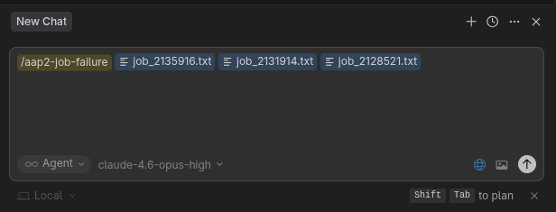
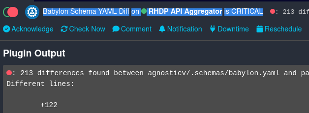
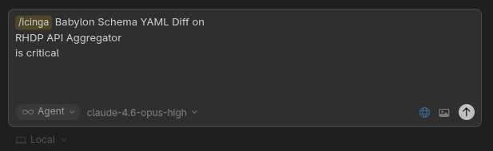

# RHDP Operations Commands

Manual setup for Cursor commands that provide AAP2 job failure analysis and Icinga alert debugging via AI-assisted triage.

> These will be packaged as proper skills/commands in a future release. For now, follow the manual setup below.

---

## Prerequisites

- **Cursor 2.4+**
- **Podman** (for the Icinga MCP server container)
- Access to the RHDP Icinga instance
- A GitHub token with repo read access to `rhpds/*` repositories

---

## 1. Configure MCP Servers

Open the Command Palette (`Ctrl+Shift+P` or `Cmd+Shift+P`) → select **"View: Open MCP Settings"**, and add the following two servers:

### Icinga MCP Server

The Icinga MCP server runs as a container via Podman and provides tools to query hosts, services, problems, downtimes, and comments from the Icinga2 API.

```json
{
  "mcpServers": {
    "mcp-icinga": {
      "command": "podman",
      "args": [
        "run",
        "-i",
        "--rm",
        "-e",
        "ICINGA_API_URL",
        "-e",
        "ICINGA_USER",
        "-e",
        "ICINGA_PASSWORD",
        "-e",
        "ICINGA_VERIFY_SSL",
        "quay.io/rhpds/monitoring-mcp:latest",
        "--transport",
        "stdio"
      ],
      "env": {
        "ICINGA_API_URL": "https://your-icinga-api.example.com",
        "ICINGA_USER": "your-icinga-username",
        "ICINGA_PASSWORD": "your-icinga-password",
        "ICINGA_VERIFY_SSL": "false"
      }
    }
  }
}
```

| Variable | Description |
|----------|-------------|
| `ICINGA_API_URL` | Base URL of the Icinga2 API (e.g., `https://icinga-api.apps.example.com`) |
| `ICINGA_USER` | Icinga2 API username |
| `ICINGA_PASSWORD` | Icinga2 API password |
| `ICINGA_VERIFY_SSL` | Set to `"false"` to skip TLS verification (useful for self-signed certs) |

### GitHub MCP Server

The GitHub MCP server provides repository access for fetching AgnosticV/AgnosticD config files and Icinga monitoring scripts/config. Both commands rely heavily on this server.

```json
{
  "mcpServers": {
    "github": {
      "type": "http",
      "url": "https://api.githubcopilot.com/mcp/",
      "headers": {
        "Authorization": "Bearer YOUR_GITHUB_TOKEN"
      }
    }
  }
}
```

> **Token:** Generate a GitHub personal access token at [github.com/settings/tokens](https://github.com/settings/tokens) with `repo` scope, or use a GitHub Copilot-issued token if you have a Copilot license.

---

## 2. Install Cursor Commands

Cursor commands are markdown files placed in `~/.cursor/commands/`. Each file defines a reusable agent prompt that appears in the Cursor command palette.

### AAP2 Job Failure Analysis

Copy the raw contents of [`commands/aap2-job-failure.md`](commands/aap2-job-failure.md) into `~/.cursor/commands/aap2-job-failure.md`.

**What it does:** Investigates AAP2 job failures by parsing job details and logs, tracing configuration through AgnosticV (catalog items, components, stages) and AgnosticD (env_type configs, roles), and producing a structured root cause analysis.

**Required MCP servers:** `github`

**Usage:** Open a **New Chat** in Cursor, type `/aap2-job-failure`, then drag and drop (or attach) the downloaded AAP2 job log files.



### Icinga Alert Debugging

Copy the raw contents of [`commands/icinga.md`](commands/icinga.md) into `~/.cursor/commands/icinga.md`.

**What it does:** Triages and diagnoses Icinga alerts by querying the Icinga API for alert state and output, fetching the monitoring script source and Icinga config from GitHub, and producing a structured diagnosis with troubleshooting steps.

**Required MCP servers:** `mcp-icinga`, `github`

**Usage:** Open a **New Chat** in Cursor, type `/icinga`, then paste the alert display name from the Icinga dashboard (e.g., "Babylon Schema YAML Diff on RHDP API Aggregator is critical").

To get the alert text, highlight the service display name, host display name, and state from the Icinga dashboard and copy it:



Then paste it into the Cursor chat window after the `/icinga` command:



---

## 3. Verify Setup

1. Open the MCP settings and confirm both `mcp-icinga` and `github` show a green status indicator. Use the refresh button if needed.
2. Open Cursor chat and type `/` — you should see `aap2-job-failure` and `icinga` in the command list.

---

## Command Reference

| Command | Description | MCP Servers Used |
|---------|-------------|------------------|
| `/aap2-job-failure` | Investigate AAP2 provisioning job failures | `github` |
| `/icinga` | Triage and debug Icinga monitoring alerts | `mcp-icinga`, `github` |

### MCP Server Tools Used

**`mcp-icinga`** provides:
- `get_hosts` / `get_services` — query Icinga objects
- `get_problems` — list all non-OK hosts and services
- `get_comments` / `get_downtimes` — check for engineer notes and maintenance windows
- `reschedule_check` — force an immediate recheck
- `acknowledge_problem` / `schedule_downtime` — take action on alerts

**`github`** provides:
- `get_file_contents` — fetch config files from `rhpds/agnosticv`, `rhpds/agnosticd-v2`, `rhpds/monitoring-scripts`, `rhpds/monitoring-config`
- `search_code` — locate config definitions across repositories

---

## File Structure

```
operations/
├── README.md                          # This file
├── commands/
│   ├── aap2-job-failure.md            # AAP2 job failure investigation command
│   └── icinga.md                      # Icinga alert triage command
└── files/
    ├── aap2-chat.png                  # Screenshot: AAP2 command usage in Cursor
    ├── icinga-alert.png               # Screenshot: Copying alert text from Icinga dashboard
    └── icinga-chat.png                # Screenshot: Icinga command usage in Cursor
```
