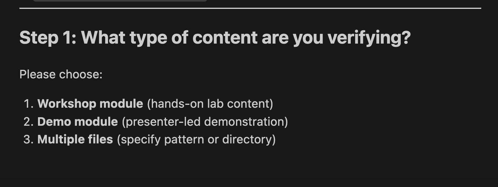

# Claude Code & VS Code Setup (Recommended)

Native Agent Skills support - the best experience.

**Works with:**
- Claude Code CLI
- VS Code with Claude extension

---

## Installation

```bash
curl -fsSL https://raw.githubusercontent.com/rhpds/rhdp-skills-marketplace/main/install.sh -o /tmp/rhdp-install.sh
bash /tmp/rhdp-install.sh
```

When prompted:
1. Select **1 (Claude Code or VS Code with Claude extension)**
2. Choose your namespace

Restart Claude Code or VS Code after installation.

---

## Usage

Skills work natively with `/` commands:

**Showroom:**
- `/create-lab` - Generate workshop module
- `/create-demo` - Generate demo content
- `/verify-content` - Validate quality
- `/blog-generate` - Create blog post

**AgnosticV:**
- `/agnosticv-catalog-builder` - Create/update catalog items (unified)
- `/agnosticv-validator` - Validate configuration

**Health:**
- `/deployment-health-checker` - Create validation role

---

## Verify Installation

```bash
ls ~/.claude/skills/
```

You should see: create-lab, create-demo, agnosticv-catalog-builder, etc.

---

## How to Use Skills in VS Code

### Step 1: Open Claude Code

Click the Claude icon in the VS Code activity bar to open Claude Code.


### Step 2: Use Slash Commands

Type `/` to see available skills. The menu shows all installed skills under "Slash Commands".


### Step 3: Follow Skill Prompts

Skills guide you with interactive questions. Select your answers and follow the workflow.



---

## Updates

```bash
curl -fsSL https://raw.githubusercontent.com/rhpds/rhdp-skills-marketplace/main/update.sh -o /tmp/rhdp-update.sh
bash /tmp/rhdp-update.sh
```

---

[← Back to Home](../index.html)
