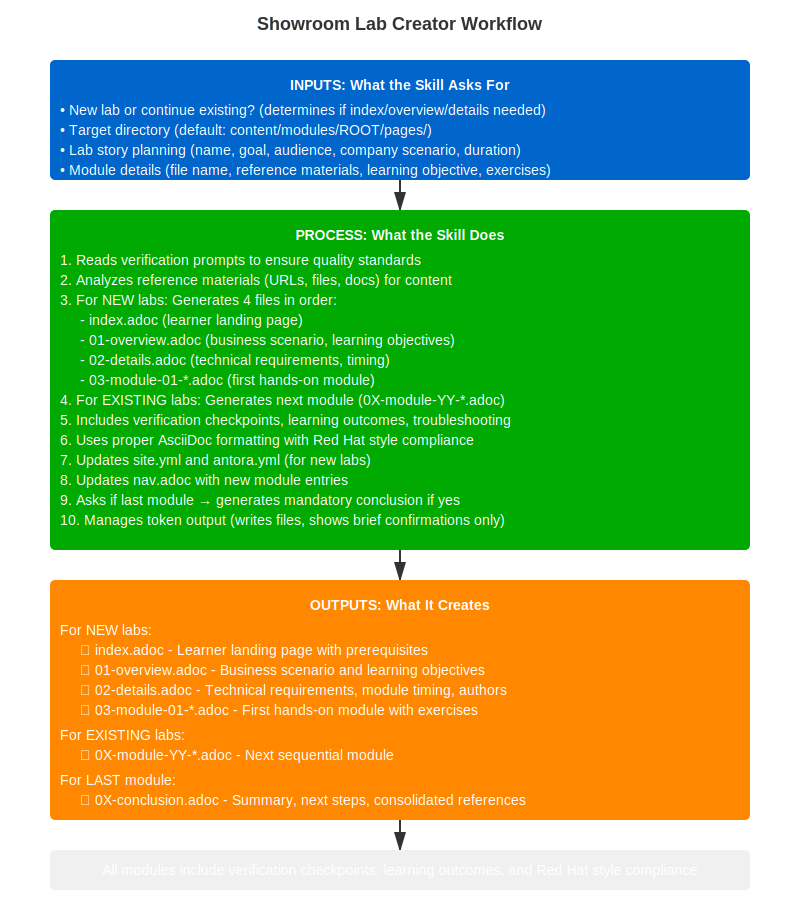

---
context: main
model: claude-opus-4-6
---

# Lab Module Generator

Guide you through creating a single Red Hat Showroom workshop module from reference materials (URLs, files, docs, or text) with business storytelling and proper AsciiDoc formatting.

## Workflow Diagram



## What You'll Need Before Starting

Have these ready before running this skill:

**Required:**
- 📁 **Target directory path** - Where to create modules (default: `content/modules/ROOT/pages/`)
- 📚 **Reference materials** - At least one of:
  - URLs to documentation, blogs, or guides
  - Local files with technical content
  - Text/notes describing what to build
- 🎯 **Learning objective** - What should learners accomplish?

**Helpful to have:**
- 🏢 **Company/scenario context** - Business story for the lab (e.g., "ACME Corp needs...")
- ⏱️ **Target duration** - How long should this module take? (e.g., 15 min, 30 min)
- 👥 **Audience level** - Beginner, Intermediate, or Advanced
- 📝 **Previous modules** - If continuing existing lab, know which module comes before this one

**Access needed:**
- ✅ Write permissions to the Showroom repository directory


## Shared Rules

See @showroom/docs/SKILL-COMMON-RULES.md for:
- Version pinning and attribute placeholders (REQUIRED)
- Reference enforcement (REQUIRED)
- Attribute file location and standard attributes (REQUIRED)
- AsciiDoc list formatting rules (REQUIRED)
- Image path conventions and clickable image syntax (REQUIRED)
- Navigation update expectations (REQUIRED)
- Failure-mode behavior patterns (REQUIRED)
- Quality gate integration
- Verification prompt file lists

## Arguments (Optional)

This skill supports optional command-line arguments for faster workflows.

**Usage Examples**:
```bash
/create-lab                                    # Interactive mode (asks all questions)
/create-lab <directory>                        # Specify target directory
/create-lab <directory> --new                  # Create new lab in directory
/create-lab <directory> --continue <module>    # Continue from specific module
```

**Parameters**:
- `<directory>` - Target directory for module files
  - Example: `/create-lab content/modules/ROOT/pages/`
  - If not provided, defaults to `content/modules/ROOT/pages/`
- `--new` - Flag to create new lab (generates index + overview + details + module-01)
- `--continue <module-path>` - Continue from specified previous module
  - Example: `/create-lab content/modules/ROOT/pages/ --continue content/modules/ROOT/pages/03-module-01-intro.adoc`
  - Reads previous module to detect story continuity

**How Arguments Work**:
- Arguments skip certain questions (faster workflow)
- You can still use interactive mode by calling `/create-lab` with no arguments
- Arguments are validated before use

## Workflow

**CRITICAL RULES**

### 1. Ask Questions SEQUENTIALLY

- Ask ONE question or ONE group of related questions at a time
- WAIT for user's answer before proceeding
- Do NOT ask questions from multiple steps together
- Do NOT skip workflows based on incomplete answers

### 2. File Generation Order (First Module ONLY)

**If this is the FIRST module of a NEW lab, you MUST generate files in this EXACT order:**

1. **index.adoc** - Learner landing page (NOT facilitator guide)
2. **01-overview.adoc** - Business scenario and learning objectives
3. **02-details.adoc** - Technical requirements and setup
4. **03-module-01-*.adoc** - First hands-on module

**NEVER skip index/overview/details for first module!**

**File naming convention**:
- index.adoc (no number prefix)
- 01-overview.adoc
- 02-details.adoc
- 03-module-01-*.adoc
- 04-module-02-*.adoc
- 05-module-03-*.adoc
- etc.

**If continuing existing lab**:
- Detect next file number from existing modules
- Generate: 0X-module-YY-*.adoc (where X = next sequential file number)
- Example: If existing has 03-module-01, 04-module-02, next is 05-module-03
- Skip index/overview/details (already exist)

### 3. Manage Output Tokens

- **NEVER output full module content** - Use Write tool to create files
- **Show brief confirmations only** - "✅ Created: filename (X lines)"
- **Keep total output under 5000 tokens** - Summaries, not content
- **Files are written, not displayed** - User reviews with their editor
- **Token limit**: Claude Code has 32000 token output limit - stay well below it

**Example of WRONG approach**:
```
❌ Asking all at once:
1. Module file name?
2. UserInfo variables?
3. Learning objective?
4. Number of exercises?
```

**Example of CORRECT approach**:
```
✅ Ask sequentially:
Step 2: Complete overall lab story planning
[WAIT for completion]

Step 3.1: Module file name?
[WAIT for answer]

Step 3.2: Reference materials?
[WAIT for answer]

etc.
```

---

### Step 1: Parse Arguments (If Provided)

**Check if user invoked skill with arguments**.

**Pattern 1: `/create-lab <directory> --new`**
```
Parsing arguments: "<directory> --new"

✓ Target directory: <directory>
✓ Mode: Create new lab
✓ Will generate: index.adoc → 01-overview → 02-details → 03-module-01

Validating directory...
[Check if directory exists, create if needed]

Skipping: Step 1 (mode already known: NEW lab)
Proceeding to: Step 2 (Plan Overall Lab Story)
```

**Pattern 2: `/create-lab <directory> --continue <module-path>`**
```
Parsing arguments: "<directory> --continue <module-path>"

✓ Target directory: <directory>
✓ Mode: Continue existing lab
✓ Previous module: <module-path>

Validating directory...
[Check if directory exists]

Reading previous module: <module-path>
[Extract story, company, progression]

Skipping: Step 1 (mode already known: CONTINUE)
Skipping: Step 2 (story detected from previous module)
Proceeding to: Step 3 (Module-Specific Details)
```

**Pattern 3: `/create-lab <directory>`**
```
Parsing arguments: "<directory>"

✓ Target directory: <directory>

Validating directory...
[Check if directory exists]

Skipping: Target directory question
Proceeding to: Step 1 (still need to ask: new vs continue)
```

**Pattern 4: `/create-lab` (no arguments)**
```
No arguments provided.

Using interactive mode.
Target directory: Will use default (content/modules/ROOT/pages/)

Proceeding to: Step 1 (Determine Context)
```

**Argument Validation**:
- If directory doesn't exist, ask user: "Directory not found. Create it? [Yes/No]"
- If `--continue` but module path invalid, fall back to asking for story recap
- All arguments are optional - skill always works in interactive mode

---

### Step 2: Determine Context (New Lab vs Existing Lab)

**SKIP THIS STEP IF**:
- User provided `--new` flag in arguments (already know: NEW lab)
- User provided `--continue <module>` in arguments (already know: EXISTING lab)

**CRITICAL: DO NOT read any files or make assumptions before asking this question!**

**First, ask the user**:

```
Welcome! Let's create your workshop together.

Are you starting a brand new lab or adding to an existing one?

1. 🆕 NEW lab (I'll create the whole thing: index → overview → details → first module)
2. ➕ EXISTING lab (I'll add the next module and continue your story)
3. 🤔 Something else (tell me what you need)

What's your situation? [1/2/3]
```

**ONLY AFTER user answers, proceed based on their response.**

### Step 2.5: Ask for Showroom Repository Path (if not provided as argument)

**SKIP THIS STEP IF**: User provided `<directory>` as argument

**Ask the user**:
```
What is the path to your cloned Showroom repository?

The RHDP team will have provided you with a Showroom repository to clone.
Provide the local path to that cloned repo.

Example: /Users/yourname/work/showroom-content/my-lab-showroom

Repo path:
```

Use `content/modules/ROOT/pages/` within that path as the target for lab files.

**If option 1 (NEW lab)**:
- Generate ALL workshop files: index.adoc, 01-overview.adoc, 02-details.adoc, 03-module-01-*.adoc
- Proceed to Step 2 (Plan Overall Lab Story)

**If option 2 (EXISTING lab)**:
- Detect next file number from existing modules
- Generate ONLY next module: 0X-module-YY-*.adoc
- Skip Step 2 (already have overall story)
- Ask for previous module path or story recap

**If continuing existing lab**:
- Option 1: Provide path to previous module (I'll read and auto-detect story)
- Option 2: If previous module not available, I'll ask for story recap:
  - Company name and scenario
  - What was completed in previous modules
  - Current learning state
  - What comes next in progression

**Fallback behavior**:
- If user says "continuing" but cannot provide previous module content or workspace access:
  - Ask user to paste content of last module (or key sections)
  - OR ask short "Story Recap" questions:
    1. Company/scenario name?
    2. What topics were covered in previous modules?
    3. What skills have learners gained so far?
    4. What's the current state in the story?
  - This prevents broken continuity

### Step 3: Plan Overall Lab Story (if first module)

Awesome! Let's design your workshop together. I'll ask you some questions to build the perfect learning experience.

**IMPORTANT**: Ask these as **conversational, open-ended questions**. Do NOT provide multiple choice options.

**Question 1 - What Should We Call This?**:
```
What's the name of your workshop?

Example: "Building AI/ML Workloads on OpenShift AI"

I'll use this to set up your lab title and generate a clean URL-friendly slug.

Your lab name:

[After user provides title, I'll suggest a slug like "building-ai-ml-workloads-openshift-ai"]
```

**Question 2 - The Learning Goal**:
```
What's the main goal of this lab?

What should learners be able to do when they finish?

Example: "Learn to build and deploy AI/ML workloads on OpenShift AI"

Your lab goal:
```

**Question 3 - Who's Learning?**:
```
Who is this lab designed for?

Examples: Developers, Architects, SREs, Data Scientists, Platform Engineers

Your target audience:

What's their experience level?
- Beginner (new to the technology)
- Intermediate (some hands-on experience)
- Advanced (production experience)

Their level:
```

**Question 4 - The Learning Journey**:
```
By the end of this lab, what should learners understand and be able to do?

List the key skills they'll gain:

Your learning outcomes:
```

**Question 5 - Make It Real**:
```
What company or business scenario should we use to make this relatable?

Examples: "ACME Corp", "RetailCo", "FinTech Solutions"
Or create your own!

Company name:

What business challenge are they facing that drives this learning?

Their challenge:
```

**Question 6 - How Long?**:
```
How much time should learners budget for the complete lab?

Typical options: 30min, 1hr, 2hr

Your target duration:
```

**Question 7 - Technical Environment**:
```
Let's nail down the technical details:

OpenShift version? (e.g., "4.18", "4.20", or I can use {ocp_version} placeholder)

Product versions? (e.g., "OpenShift Pipelines 1.12, OpenShift AI 2.8")

Cluster type? (SNO or multinode)

Access level? (admin only, or multi-user with keycloak/htpasswd)

Your environment details:

Note: If you're not sure, I'll use placeholders that work across versions.
```

**Then I'll recommend**:
- Suggested module breakdown (how many modules, what each covers)
- Progressive learning flow (foundational → intermediate → advanced)
- Story arc across modules
- Key milestones and checkpoints

**You can**:
- Accept the recommended flow
- Adjust module count and topics
- Change the progression

### Step 3.1: Showroom Setup (Recommended for new labs)

**For NEW labs only. Skip if adding a module to an existing lab.**

**Note to RHDP developers**: If you want console embedding (OpenShift Console, Bastion terminal, etc.) and split-view in Showroom, your Showroom deployment must be on version 1.5.1 or above. Contact your RHDP administrator to confirm the version before publishing.

Ask these questions SEQUENTIALLY — one at a time.

**Question A — Consoles and tools to embed:**

```
What consoles or tools should learners see in the Showroom right panel?

Each tab appears as a clickable pane next to the lab instructions.

Common options:
- OpenShift Console  → https://console-openshift-console.${DOMAIN}
- Bastion terminal   → path: /wetty, port: 443
- OpenShift AI       → https://rhods-dashboard-redhat-ods-applications.${DOMAIN}
- AAP dashboard      → https://aap-dashboard.${DOMAIN}
- External URL       → any https:// URL

List each console as: name | url  (or name | path + port for terminals)

Examples:
  OpenShift Console | https://console-openshift-console.${DOMAIN}
  Bastion | /wetty (port 443)

You can adjust these later by editing ui-config.yml.

Your consoles (or press Enter to leave as commented-out examples):
```

**Question B — ui-bundle theme:**

```
Which ui-bundle theme do you need?

Default: https://github.com/rhpds/rhdp_showroom_theme/releases/download/rh-one-2025/ui-bundle.zip

Available themes (see https://github.com/rhpds/rhdp_showroom_theme/releases):
- rh-one-2025 (default — Red Hat One 2025 theme)
- rh-summit-2025 (Red Hat Summit 2025 theme)

Press Enter to use the default, or paste a different URL:
```

**Check, fix, or create each infrastructure file — never blindly overwrite.**

For every file below: silently check if it exists first.
- **EXISTS** → read it, detect stale/template values, fix only what's wrong, report changes.
- **MISSING** → create it from scratch, report created.

**Known stale/template title values** (treat as "not updated"):
`Workshop Title`, `Lab Title`, `Showroom Template`, `Red Hat Showroom`, `My Workshop`, `Template`, `showroom_template_nookbag`, empty string, or any value that exactly matches the repository directory name.

---

**1. `default-site.yml`** (at repo root):

**First — check for `site.yml` naming mismatch:**

```bash
# Check which playbook file exists
ls default-site.yml 2>/dev/null && echo "found default-site.yml"
ls site.yml 2>/dev/null && echo "found site.yml"
```

| State | Action |
|---|---|
| `default-site.yml` exists | Proceed to check/fix below |
| `site.yml` exists, no `default-site.yml` | Rename to `default-site.yml` silently, then check/fix |
| Both exist | Use `default-site.yml`, warn user that `site.yml` is unused |
| Neither exists | Create `default-site.yml` from scratch |

If renaming:
```bash
mv site.yml default-site.yml
```
Report: `✓ Renamed site.yml → default-site.yml (role default)`

*If EXISTS (or just renamed) — check and fix:*
- `site.title` is stale/template → update to `"{{ lab_title }}"`
- `site.start_page` is not `modules::index.adoc` → fix
- `ui.bundle.url` is the old default nookbag bundle (not the theme from Question B) → update to `{{ ui_bundle_url }}`
- `ui.supplemental_files` is missing or not `./supplemental-ui` → fix
- `runtime.fetch` is missing → add `fetch: true`

*If MISSING — create:*
```yaml
site:
  title: "{{ lab_title }}"
  start_page: modules::index.adoc

content:
  sources:
  - url: ./
    start_path: content

ui:
  bundle:
    url: {{ ui_bundle_url }}
    # Themes: https://github.com/rhpds/rhdp_showroom_theme/releases
    snapshot: true
  supplemental_files: ./supplemental-ui

runtime:
  fetch: true

asciidoc:
  attributes:
    source-highlighter: rouge
```

---

**2. `ui-config.yml`** (at repo root, Showroom 1.5.1 format):

*If EXISTS — check and fix:*
- `type: showroom` missing → add at top
- `view_switcher.enabled` is false or missing → set `enabled: true`, `default_mode: split`
- `tabs:` section is entirely commented out AND user provided tabs in Question A → uncomment/add tabs
- `persist_url_state` missing → add `persist_url_state: true`

*If MISSING — create:*
```yaml
---
type: showroom

default_width: 30
persist_url_state: true

view_switcher:
  enabled: true
  default_mode: split

tabs:
{{ generated_tabs_from_Question_A }}
```

If user pressed Enter (no tabs): add common examples as commented lines:
```yaml
tabs:
# - name: OpenShift Console
#   url: 'https://console-openshift-console.${DOMAIN}'
# - name: Bastion
#   path: /wetty
#   port: 443
```

---

**3. `content/antora.yml`**:

*If EXISTS — check and fix:*
- `title:` is stale/template value → update to `"{{ lab_title }}"`
- `name:` is not `modules` → fix to `modules`
- `start_page:` is missing or not `index.adoc` → fix
- `asciidoc.attributes.lab_name` is stale/template or missing → update to `"{{ lab_slug }}"`
- `nav:` list missing `modules/ROOT/nav.adoc` → add it

*If MISSING — create:*
```yaml
name: modules
title: "{{ lab_title }}"
version: master
start_page: index.adoc
nav:
- modules/ROOT/nav.adoc

asciidoc:
  attributes:
    lab_name: "{{ lab_slug }}"
```

---

**4. `content/lib/`** — 4 JS extension files:

Check each file individually. For each that is MISSING, clone reference repo and copy it:
```bash
# Clone reference if not already available
git clone https://github.com/rhpds/lb2298-ibm-fusion /tmp/showroom-reference 2>/dev/null || true
```

Files to check/copy if missing:
- `content/lib/all-attributes-console-extension.js`
- `content/lib/attributes-page-extension.js`
- `content/lib/dev-mode.js`
- `content/lib/unlisted-pages-extension.js`

If all 4 already exist → confirm present, skip clone.

---

**5. `supplemental-ui/`** — 4 UI asset files:

Same pattern — check each, copy only missing ones:
- `supplemental-ui/css/site-extra.css`
- `supplemental-ui/img/favicon.ico`
- `supplemental-ui/partials/head-meta.hbs`
- `supplemental-ui/partials/header-content.hbs`

---

**6. `.github/workflows/gh-pages.yml`**:

*If EXISTS* → do not modify (workflow is rarely wrong, and changes could break CI). Just confirm it's present.

*If MISSING — create:*
```yaml
name: github pages

on:
  workflow_dispatch:
  push:
    branches: [main]
    paths-ignore:
      - "README.adoc"
      - ".gitignore"

permissions:
  pages: write
  id-token: write

concurrency:
  group: gh-pages
  cancel-in-progress: false

jobs:
  build:
    runs-on: ubuntu-latest
    steps:
      - name: checkout
        uses: actions/checkout@v4
      - name: configure pages
        uses: actions/configure-pages@v5
      - name: setup node
        uses: actions/setup-node@v4
        with:
          node-version: 20.13.1
      - name: install antora
        run: npm install --global @antora/cli@3.1 @antora/site-generator@3.1
      - name: antora generate
        run: antora generate default-site.yml --stacktrace
      - name: upload pages artifact
        uses: actions/upload-pages-artifact@v3
        with:
          path: www
  deploy:
    needs: build
    environment:
      name: github-pages
      url: ${{ steps.deployment.outputs.page_url }}
    runs-on: ubuntu-latest
    steps:
    - name: deploy github pages
      id: deployment
      uses: actions/deploy-pages@v4
```

---

**Confirm scaffold status:**

```
✅ Scaffold complete:

  default-site.yml      → [created | updated: title, ui-bundle] | no changes
  ui-config.yml         → [created | updated: view_switcher, tabs] | no changes
  content/antora.yml    → [created | updated: title, lab_name] | no changes
  content/lib/          → [all present | copied 2 missing files]
  supplemental-ui/      → [all present | copied 1 missing file]
  .github/workflows/    → [created | already present]
```

**Note**: These files must exist and have correct values BEFORE generating any content modules (Step 8).

---

### Step 4: Gather Module-Specific Details

Now for this specific module:

1. **Module file name and numbering**:
   - **Naming convention**: `0X-module-YY-<slug>.adoc` (e.g., `03-module-01-pipelines-intro.adoc`)
   - **Title convention**: `= Module X: <Title>` (e.g., `= Module 1: Pipeline Fundamentals`)
   - Files go in `content/modules/ROOT/pages/`
   - **Number prefix**: 03 for first module, 04 for second, etc. (after 01-overview, 02-details)
   - **Conflict detection**: If file exists, suggest next available number
   - **Warning**: Don't overwrite existing modules without confirmation

2. **Reference materials** (optional but recommended):
   - URLs to Red Hat product documentation
   - Local file paths (Markdown, AsciiDoc, text, PDF)
   - Pasted content
   - **Better references = better content quality**
   - If not provided: Generate from templates and common patterns

3. **UserInfo variables** (optional, for accurate showroom content):
   - **I must ask the user:**

   ```
   Q: Do you have access to a deployed environment on demo.redhat.com or integration.demo.redhat.com?

   If YES (RECOMMENDED - easiest and most accurate):
   Please share the UserInfo variables from your deployed service:

   1. Login to https://demo.redhat.com (or integration.demo.redhat.com)
   2. Go to "My services" → Your service
   3. Click "Details" tab
   4. Expand "Advanced settings" section
   5. Copy and paste the output here

   This provides exact variable NAMES like:
   - openshift_cluster_console_url
   - openshift_cluster_admin_username
   - gitea_console_url
   - [custom workload variables]

   CRITICAL: I will use these to know WHICH variables exist, NOT to replace them with actual values!
   Variables will stay as placeholders: {openshift_cluster_console_url}
   Showroom replaces these at runtime with actual deployment values.

   If NO:
   Q: Would you like to use placeholder attributes for now?

   If YES:
   I'll use placeholders: {openshift_console_url}, {user}, {password}
   You can update these later when you get Advanced settings.

   If NO (RHDP internal team only):
   I can extract variables from AgnosticV repository if you have it cloned locally.
   This requires AgV path and catalog name.
   Note: Less reliable than Advanced settings.
   ```

4. **Main learning objective**:
   - Example: "Create and run a CI/CD pipeline with Tekton"

5. **Business scenario**:
   - Auto-detect from previous module (if exists)
   - Or ask for company name (default: ACME Corp)

6. **Technology/product focus**:
   - Example: "OpenShift Pipelines", "Podman"

7. **Number of exercises**:
   - Recommended: 2-3

8. **Diagrams, screenshots, or code blocks** (optional):
   - Do you have diagrams, screenshots, or code examples to include?
   - If yes: Provide file paths or paste content
   - I'll save them to `content/modules/ROOT/assets/images/`
   - And reference them properly in AsciiDoc

9. **Troubleshooting section** (optional):
   ```
   Q: Would you like to include a troubleshooting section in this module?

   A troubleshooting section helps learners solve common issues they may encounter.

   Options:
   1. Yes, include troubleshooting (Recommended for production workshops)
   2. No, skip it for now (I'll add it later if needed)

   Your choice? [1/2]
   ```

   **When to recommend "Yes"**:
   - Production-ready workshops
   - Complex technical modules with many potential failure points
   - Modules involving external dependencies (registries, APIs, networks)

   **When "No" is acceptable**:
   - Simple introductory modules
   - Proof-of-concept content
   - Modules with very straightforward steps

### Step 5: UserInfo Variables

UserInfo variables are collected in Step 4, item 3. If skipped there, use placeholder attributes (`{openshift_console_url}`, `{user}`, `{password}`) and proceed.

### Step 6: Handle Diagrams, Screenshots, and Code Blocks (if provided)

If you provided visual assets or code:

**For images (diagrams, screenshots)**:

See @showroom/docs/SKILL-COMMON-RULES.md for image path conventions and clickable image syntax.

**For code blocks**:
- If you provide code snippets: Format them in AsciiDoc
- Detect language (bash, yaml, python, etc.)
- Add proper syntax highlighting:
  ```asciidoc
  [source,bash]
  ----
  oc create deployment my-app --image=myimage:latest
  ----
  ```


### Step 7: Fetch and Analyze References

Based on your references, I'll:
- Fetch URLs with WebFetch
- Read local files (supports PDF)
- Extract procedures, commands, concepts
- Identify hands-on opportunities
- Combine with AgnosticV variables (if provided)
- Integrate provided code blocks and diagrams

**Reference Enforcement**:

See @showroom/docs/SKILL-COMMON-RULES.md for reference enforcement patterns.

**Reference Tracking** (for conclusion generation):
- Track all references used across all modules
- Store reference URLs, titles, and which modules used them
- References will be consolidated in the conclusion module, NOT in individual modules
- Each module can cite sources inline (e.g., "According to the Red Hat documentation...") but the formal References section will only appear in the conclusion

**IMPORTANT: External Link Format**:
- ALL external links MUST use `^` caret to open in new tab
- Format: `link:https://example.com[Link Text^]`
- The `^` ensures users don't lose their place in the workshop
- Internal xrefs (module navigation) should NOT use `^`
- Examples:
  - External: `link:https://docs.redhat.com/...[Red Hat Documentation^]`
  - Internal: `xref:03-module-02-next.adoc[Next Module]` (no caret)

### Step 8: Read Templates and Verification Criteria (BEFORE Generating)

**CRITICAL: I MUST read all these files BEFORE generating content to ensure output meets all standards.**

**Templates to read:**
- `showroom/templates/workshop/templates/00-index-learner.adoc` - Learner-facing index template
- `showroom/templates/workshop/templates/03-module-01.adoc` - Module template
- `showroom/templates/workshop/example/00-index.adoc` - Example index (but write for LEARNERS, not facilitators)
- `showroom/templates/workshop/example/01-overview.adoc` - Example overview
- `showroom/templates/workshop/example/02-details.adoc` - Example details
- `showroom/templates/workshop/example/03-module-01.adoc` - Example module

See @showroom/docs/SKILL-COMMON-RULES.md for verification prompt file lists and how to use them.

### Step 9: Generate Files (Using Verification Criteria)

**IMPORTANT: Use the bundled workshop templates read in Step 8 as quality references.**

Apply patterns from the bundled templates to new content:
- Section structure (= Title, == Heading, === Subheading)
- Code block formatting and syntax highlighting
- Admonition usage (TIP, NOTE, WARNING, IMPORTANT)
- Image references (link=self,window=blank)
- List formatting (blank lines before/after)
- External links (^ caret for new tabs)
- Business scenario integration

**CRITICAL: If this is the FIRST module of a NEW lab, generate files in this order:**

#### Step 9.1: Generate index.adoc (First Module Only)

**Purpose**: Learner-facing landing page - NOT a facilitator guide

**Content**:
```asciidoc
= {{ Workshop Title }}

Welcome to the {{ workshop name }} workshop!

== What you'll learn

In this workshop, you will:

* {{ Learning objective 1 }}
* {{ Learning objective 2 }}
* {{ Learning objective 3 }}
* {{ Learning objective 4 }}

== Who this is for

This workshop is designed for {{ target audience }} who want to {{ main goal }}.

== Prerequisites

Before starting this workshop, you should have:

* {{ Prerequisite 1 }}
* {{ Prerequisite 2 }}
* Access to {{ environment/tools }}

== Workshop environment

{{ Brief description of the lab environment }}

* OpenShift cluster: {openshift_console_url}
* Login credentials will be provided

== Let's get started!

Click on the next section to begin the workshop.
```

**What NOT to do**:
- ❌ Don't copy facilitator guide template from workshop/templates/00-index.adoc
- ❌ Don't include facilitator instructions
- ❌ Don't write "This guide helps workshop facilitators..."

**What TO do**:
- ✅ Write for LEARNERS, not facilitators
- ✅ Simple welcome and what they'll learn
- ✅ Prerequisites and environment info
- ✅ Encouragement to get started

#### Step 9.2: Generate 01-overview.adoc (First Module Only)

**Purpose**: Business scenario and learning objectives

**Content**: See workshop/example/01-overview.adoc for pattern
- Business scenario/story
- Detailed learning objectives
- Expected outcomes
- Estimated time

#### Step 9.3: Generate 02-details.adoc (First Module Only)

**Purpose**: Technical requirements and setup

**Content**: See workshop/example/02-details.adoc for pattern
- Module timing breakdown
- Technical requirements
- Environment details
- Authors/contact

#### Step 9.4: Generate 03-module-01-*.adoc (Always)

I'll create a complete module with:

**CRITICAL: Image Syntax Enforcement**:
When generating ANY image reference in the module content, you MUST include `link=self,window=blank`:

✅ **CORRECT - Always use this format**:
```asciidoc
image::filename.png[Description,link=self,window=blank,width=700]
image::pipeline-view.png[Pipeline Execution,link=self,window=blank,width=700,title="Pipeline Running"]
```

❌ **WRONG - Never generate images without link parameter**:
```asciidoc
image::filename.png[Description,width=700]
image::pipeline-view.png[Pipeline Execution,width=700]
```

**Why**: This makes images clickable to open full-size in new tab, preventing learners from losing their place in the workshop.

**CRITICAL: AsciiDoc List Formatting Enforcement**:

See @showroom/docs/SKILL-COMMON-RULES.md for AsciiDoc list formatting rules with examples.

**CRITICAL: Content Originality - No Plagiarism**:
All generated content MUST be original. Never copy from external sources without proper attribution.

✅ **CORRECT - Original with attribution**:
```asciidoc
According to link:https://kubernetes.io/docs/...[Kubernetes documentation^],
Kubernetes is "an open-source system for automating deployment." Red Hat OpenShift
extends Kubernetes with enterprise features including integrated CI/CD and security.
```

❌ **WRONG - Copied without attribution**:
```asciidoc
Kubernetes is an open-source system for automating deployment, scaling,
and management of containerized applications.
```

**Prohibited**:
- Copying documentation verbatim from external sources
- Slightly rewording existing tutorials
- Presenting others' examples as original work

**Required**:
- Write original explanations
- Add Red Hat-specific context
- Use proper attribution with quotes and links

**CRITICAL: No Em Dashes**:
Never use em dashes (—). Use commas, periods, or en dashes (–) instead.

✅ **CORRECT**:
```asciidoc
OpenShift, Red Hat's platform, simplifies deployments.
The process is simple. Just follow these steps.
2020–2025 (en dash for ranges)
```

❌ **WRONG - Em dash used**:
```asciidoc
OpenShift—Red Hat's platform—simplifies deployments.
The process is simple—just follow these steps.
```

**Why**: Follows Red Hat Corporate Style Guide and improves readability.

**CRITICAL: External Links Must Open in New Tab**:
All external links MUST use `^` caret to open in new tab, preventing learners from losing their place.

✅ **CORRECT - External links with caret**:
```asciidoc
According to link:https://docs.redhat.com/...[Red Hat Documentation^], OpenShift provides...
See the link:https://www.redhat.com/guides[Getting Started Guide^] for more details.
```

❌ **WRONG - Missing caret**:
```asciidoc
According to link:https://docs.redhat.com/...[Red Hat Documentation], OpenShift provides...
See the link:https://www.redhat.com/guides[Getting Started Guide] for more details.
```

**Internal links (NO caret)**:
```asciidoc
✅ CORRECT - Internal navigation without caret:
Navigate to xref:04-module-02.adoc[Next Module] to continue.
See xref:02-details.adoc#prerequisites[Prerequisites] section.
```

**Why**: External links without caret replace current tab, causing learners to lose their place in the workshop. Internal xrefs should NOT use caret to keep flow within the workshop.

**CRITICAL: Bullets vs Numbers - Knowledge vs Tasks**:
Knowledge/information sections use bullets (*). Task/step sections use numbers (.).

✅ **CORRECT - Bullets for knowledge, numbers for tasks**:
```asciidoc
== Learning Objectives

By the end of this module, you will understand:

* How Tekton tasks encapsulate CI/CD steps
* The relationship between tasks and pipelines
* Best practices for pipeline design

== Exercise 1: Create Your First Pipeline

Follow these steps:

. Open the OpenShift Console at {openshift_console_url}
. Navigate to Pipelines → Create Pipeline
. Enter the pipeline name: my-first-pipeline
. Add a task from the catalog
. Click Create

=== Verify

Check that your pipeline was created successfully:

* Pipeline appears in the list
* Status shows "Not started"
* All tasks are configured correctly
```

❌ **WRONG - Mixed up bullets and numbers**:
```asciidoc
== Exercise 1: Create Your First Pipeline

Follow these steps:

* Open the OpenShift Console  ← WRONG (should be numbers)
* Navigate to Pipelines
* Click Create

=== Verify

. Pipeline appears in the list  ← WRONG (should be bullets)
. Status shows "Not started"
```

**Rule**:
- Learning objectives → Use bullets (*) for concepts to understand
- Exercise steps → Use numbers (.) for sequential actions
- Verification → Use bullets (*) for success indicators
- Prerequisites → Use bullets (*) for requirements list
- Benefits/features → Use bullets (*) for information points

**Why**: Bullets indicate information to absorb; numbers indicate sequential actions to perform.

**Required Structure**:
- Learning objectives (3-4 items)
- Business introduction with scenario
- 2-3 progressive exercises
- Step-by-step instructions with commands
- **Verification checkpoints** (REQUIRED - see below)
- Image placeholders
- **Troubleshooting section** (OPTIONAL - if user requested in Step 3, see below)
- **Learning outcomes checkpoint** (REQUIRED - see below)
- Module summary

**Note**: References are NOT included in individual modules. All references will be consolidated in the mandatory conclusion module.

**Mandatory: Verification Checkpoints**:
Each major step must include:
```asciidoc
=== Verify

Run the following to confirm success:

[source,bash]
----
oc get pods
----

Expected output:
----
NAME                     READY   STATUS    RESTARTS   AGE
my-app-xxxxx-xxxxx      1/1     Running   0          2m
----

✓ Pod status is "Running"
✓ READY shows 1/1
```

**Optional: Troubleshooting Section (If Requested)**:
If the user requested troubleshooting in Step 3, include this section:
```asciidoc
== Troubleshooting

**Issue**: Pod stuck in "ImagePullBackOff"
**Solution**:
. Check image name: `oc describe pod <pod-name>`
. Verify registry credentials
. Common fix: `oc set image-lookup <deployment>`

**Issue**: Permission denied errors
**Solution**:
. Verify you're in correct project: `oc project`
. Check RBAC: `oc whoami` and `oc auth can-i create pods`

**Issue**: Command not found
**Solution**:
. Verify OpenShift CLI installed: `oc version`
. Expected version: {ocp_version}
```

**Guidelines for troubleshooting section**:
- Include 3-5 common issues specific to the module's technology
- Provide clear, actionable solutions
- Use real commands and expected outputs
- Tailor scenarios to the module's exercises
- If user declined troubleshooting, skip this section entirely

**Mandatory: Learning Outcomes Checkpoint**:

See @showroom/docs/SKILL-COMMON-RULES.md for Learning Outcomes Checkpoint requirements.

**Optional but Recommended: Cleanup**:
If module changes shared state:
```asciidoc
== Cleanup (Optional)

To reset your environment:

[source,bash]
----
oc delete project my-project
----
```

**Quality**:
- Valid AsciiDoc syntax
- Proper Red Hat product names
- Sentence case headlines
- Second-person narrative
- Code blocks with syntax highlighting

### Step 10: Final Quality Check

**Since verification criteria were applied during generation (Step 7-8), the module should already meet all standards.**

See @showroom/docs/SKILL-COMMON-RULES.md for quality gate integration checks (AsciiDoc syntax, navigation, instruction clarity, module sizing).

### Step 11: Update Navigation (REQUIRED)

See @showroom/docs/SKILL-COMMON-RULES.md for navigation update rules and conflict handling.

### Step 12: Deliver

**CRITICAL: Manage Output Tokens to Prevent Overflow**

**Token Management Rules**:
1. **Write files using Write tool** - Don't output full file contents to user
2. **Show brief confirmations only** - "✅ Created: file.adoc (X lines)"
3. **Provide summary at end** - List what was created, not the full content
4. **Never output entire module content** - Files are already written
5. **Keep total output under 5000 tokens** - Brief summaries only

**Output Format for FIRST module**:

```
✅ Workshop Generation Complete

**Files Created**:
- content/modules/ROOT/pages/index.adoc (32 lines) - Learner landing page
- content/modules/ROOT/pages/01-overview.adoc (85 lines) - Business scenario
- content/modules/ROOT/pages/02-details.adoc (67 lines) - Technical details
- content/modules/ROOT/pages/03-module-01-intro.adoc (234 lines) - First hands-on module
- content/modules/ROOT/nav.adoc (updated)
```

**Output Format for CONTINUATION modules**:

```
✅ Module Generation Complete

**Files Created**:
- content/modules/ROOT/pages/04-module-02-advanced.adoc (198 lines)
- content/modules/ROOT/nav.adoc (updated)

**Module Structure**:
- Learning objectives: 4 items
- Exercises: 3
- Verification checkpoints: 3
- Troubleshooting scenarios: 5 (if included)
- Learning outcomes: 4 items

**Assets**:
- Images needed: 2 placeholders (see module for TODO comments)
- Dynamic attributes used: {openshift_console_url}, {user}, {password}

**Next Steps**:
1. Review module: content/modules/ROOT/pages/04-module-02-advanced.adoc
2. Capture screenshots for placeholder images
3. Test commands in your environment
4. Run: verify-content to check quality
5. Create next module: create-lab (continuing existing lab)

**Note**: All files have been written. Use your editor to review them.
```

**What NOT to do**:
- ❌ Don't show full module content in response
- ❌ Don't output the entire file you just created
- ❌ Don't paste hundreds of lines of generated AsciiDoc
- ❌ Don't include long example sections in output

**What TO do**:
- ✅ Write files using Write tool
- ✅ Show brief "Created: filename (X lines)" confirmations
- ✅ Provide structured summary
- ✅ Give clear next steps
- ✅ Keep output concise (under 5000 tokens)

### Step 13: Generate Conclusion Module (MANDATORY)

**After delivering the final module, ask if this is the last module:**

```
Q: Is this the last module of your workshop?

If YES, I will now generate the mandatory conclusion module that includes:
- Summary of what learners accomplished
- Key takeaways from all modules
- ALL REFERENCES used across the entire workshop
- Next steps and resources
- Related workshops and certification paths

If NO, you can continue creating more modules, and I'll generate the conclusion when you're done.

Is this your last module? [Yes/No]
```

**If user answers YES (this is the last module)**:

1. Read ALL previous modules to extract:
   - All learning outcomes from each module
   - All references cited in each module
   - Key concepts and skills taught
   - Technologies and products covered

2. Ask about references:

   **First, extract all references from previous modules:**
   - Read all module files (index.adoc, 01-overview.adoc, 02-details.adoc, 03-module-01-*.adoc, etc.)
   - Extract all external links found in the content
   - Identify reference materials provided during module creation (Step 3 question 2)
   - Compile a comprehensive list with:
     - URL
     - Link text/title
     - Which module(s) referenced it

   **Then ask the user:**
   ```
   Q: How would you like to handle references in the conclusion?

   I found these references used across your modules:
   1. https://docs.openshift.com/container-platform/4.18/... [OpenShift Documentation] - Used in: Modules 1, 3
   2. https://tekton.dev/docs/pipelines/ [Tekton Pipelines] - Used in: Module 2
   3. https://developers.redhat.com/... [Developer Guide] - Used in: Module 1
   {{ additional_references_if_found }}

   Options:
   1. Use these references as-is (I'll organize them by category)
   2. Let me provide additional references to include
   3. Let me curate the reference list (add/remove specific items)

   Your choice? [1/2/3]
   ```

   **If option 1**: Use extracted references, organize by category

   **If option 2**: Ask user to provide additional references:
   ```
   Q: Please provide additional references to include in the conclusion.

   Format: URL and description, one per line
   Example:
   https://docs.redhat.com/... - OpenShift documentation
   https://developers.redhat.com/... - Developer guides

   Your additional references:
   ```

   **If option 3**: Ask user which references to keep/remove/add:
   ```
   Q: Let's curate the reference list.

   Current references:
   {{ numbered_list_of_references }}

   Options:
   - Type numbers to REMOVE (e.g., "3, 5, 7")
   - Type "add" to add new references
   - Type "done" when finished

   Your action:
   ```

3. Detect highest module number (e.g., if last module is 07-module-05, conclusion will be 08-conclusion.adoc)

4. Generate conclusion module using the embedded template below

5. Customize the template by:
   - Extracting all learning outcomes from previous modules
   - Listing 3-5 key takeaways from the workshop
   - **Using the curated reference list from step 2** (REQUIRED)
   - Providing next steps (related workshops, docs, practice projects)

6. Update nav.adoc with conclusion entry at the end

7. Provide brief confirmation

**If user answers NO (more modules to come)**:
- Note that conclusion will be generated after the last module
- User can invoke /create-lab again to add more modules
- When adding the final module, this question will be asked again

**Embedded Conclusion Template**:
```asciidoc
= Conclusion and Next Steps

Congratulations! You've completed the {{ workshop_name }} workshop.

== What You've Learned

Throughout this workshop, you've gained hands-on experience with:

* ✅ {{ learning_outcome_1 }}
* ✅ {{ learning_outcome_2 }}
* ✅ {{ learning_outcome_3 }}
* ✅ {{ learning_outcome_4 }}

You now have the skills to {{ primary_capability }}.

== Key Takeaways

The most important concepts to remember:

. **{{ key_concept_1 }}**: {{ brief_explanation_1 }}
. **{{ key_concept_2 }}**: {{ brief_explanation_2 }}
. **{{ key_concept_3 }}**: {{ brief_explanation_3 }}

== Next Steps

Ready to continue your journey? Here are some recommended next steps:

=== Recommended Workshops

Explore related workshops to expand your skills:

* link:{{ related_workshop_1_url }}[{{ related_workshop_1_name }}^] - {{ related_workshop_1_description }}
* link:{{ related_workshop_2_url }}[{{ related_workshop_2_name }}^] - {{ related_workshop_2_description }}

=== Documentation and Resources

Deepen your knowledge with these resources:

* link:{{ docs_url_1 }}[{{ product_name }} Official Documentation^]
* link:{{ docs_url_2 }}[{{ feature_name }} Guide^]
* link:{{ community_url }}[{{ product_name }} Community^]

=== Practice Projects

Put your new skills to work:

. **{{ project_idea_1 }}**: {{ project_description_1 }}
. **{{ project_idea_2 }}**: {{ project_description_2 }}
. **{{ project_idea_3 }}**: {{ project_description_3 }}

== References

**CRITICAL**: This section consolidates ALL references used across the entire workshop.

Read all previous modules and extract every reference cited, then organize them by category:

=== Official Documentation

* link:{{ docs_url_1 }}[{{ product_name }} Documentation^] - Used in: Modules {{ modules_list }}
* link:{{ docs_url_2 }}[{{ feature_name }} Guide^] - Used in: Modules {{ modules_list }}

=== Red Hat Resources

* link:{{ redhat_resource_1 }}[{{ resource_title_1 }}^] - Used in: Module {{ module_number }}
* link:{{ redhat_resource_2 }}[{{ resource_title_2 }}^] - Used in: Module {{ module_number }}

=== Community and Open Source

* link:{{ community_url_1 }}[{{ community_resource_1 }}^] - Used in: Module {{ module_number }}
* link:{{ community_url_2 }}[{{ community_resource_2 }}^] - Used in: Module {{ module_number }}

=== Additional Reading

* link:{{ additional_url_1 }}[{{ additional_title_1 }}^] - Background information
* link:{{ additional_url_2 }}[{{ additional_title_2 }}^] - Advanced topics

**Guidelines for References section**:
- Group references by category (Official Docs, Red Hat Resources, Community, etc.)
- Include which module(s) used each reference
- ALL external links must use `^` caret to open in new tab
- Provide brief context for each reference (what it covers)
- Ensure ALL references from ALL modules are included

== Share Your Feedback

Help us improve this workshop:

* What did you find most valuable?
* What could be improved?
* What topics would you like to see covered in future workshops?

Contact us: {{ feedback_contact }}

== Thank You!

Thank you for participating in this workshop. We hope you found it valuable and informative.

Keep building, keep learning! 🚀

---

**Workshop**: {{ workshop_name }} +
**Completed**: {localdate} +
**Platform**: Red Hat Showroom
```

**Conclusion Module Naming**:
- File: `0X-conclusion.adoc` (sequential number, e.g., 08-conclusion.adoc)
- Title: `= Conclusion and Next Steps`
- Nav entry: `* xref:0X-conclusion.adoc[Conclusion and Next Steps]`

**Content to Include** (ALL REQUIRED):
- ✅ "What You've Learned" - Extract from all module learning outcomes
- ✅ "Key Takeaways" - 3-5 most important concepts
- ✅ "Next Steps" - Related workshops, documentation, practice projects
- ✅ **"References"** - Consolidate ALL references from ALL modules (MANDATORY)
- ✅ "Share Your Feedback" - Feedback prompts
- ✅ "Thank You" - Closing message

**CRITICAL**: The References section MUST include every reference used across all modules, organized by category.

## Related Skills

- `/showroom:verify-content` -- Run quality checks on generated content before publishing
- `/showroom:blog-generate` -- Convert workshop modules into blog posts

