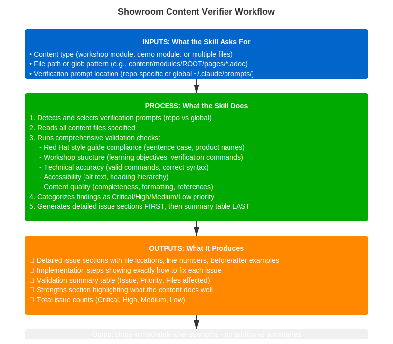

---
context: main
model: claude-opus-4-6
---

# Content Verification Skill

Verify workshop or demo content against Red Hat quality standards, style guidelines, technical accuracy, and accessibility requirements.

## Workflow Diagram



## What You'll Need Before Starting

Have these ready before running this skill:

**Required:**
- 📁 **Path to content directory** - Where your workshop/demo modules are located
  - Example: `content/modules/ROOT/pages/`
- 📝 **Content type** - Know if it's a workshop (hands-on) or demo (presenter-led)

**Helpful to have:**
- ✅ **Completed modules** - Verification works best on finished content
- 📋 **Specific concerns** - Any areas you want extra validation on?
- 🎯 **Target audience** - Who will use this content? (Affects technical depth checks)

**Access needed:**
- ✅ Read permissions to the Showroom repository directory
- ✅ Verification prompts available in:
  - `showroom/prompts/` (repo-specific prompts), or
  - `~/showroom/prompts/` (global prompts), or
  - RHDP marketplace default prompts

**What gets checked:**
- Technical accuracy
- Accessibility compliance (A11y standards)
- Red Hat style guide compliance
- Workshop structure (modules, navigation, learning objectives)
- AsciiDoc formatting and syntax

## When to Use

**Use this skill when you want to**:
- Verify workshop content before publishing
- Check demo modules for quality and completeness
- Validate technical accuracy and Red Hat style compliance
- Review content for accessibility standards
- Get actionable feedback on content improvements

**Don't use this for**:
- Creating new content → use `/create-lab` or `/create-demo`
- Converting between formats → use `/blog-generate`

## Workflow

### Step 1: Load Verification Prompts (REQUIRED)

Prompts are bundled with the marketplace plugin at `@showroom/prompts/`. Read them directly — no detection or user choice needed.

```
📋 Verification prompts loaded from marketplace plugin.
```

Proceed immediately to Step 1.5.

---

### Step 1.5: Showroom Scaffold Check

Silently check all scaffold files in the repo root and `content/`. Do not check AgnosticV or any external catalog. Do not block verification — collect all findings and include them in the Step 5 results summary.

**Known stale/template title values** — flag any of these as not updated:
`Workshop Title`, `Lab Title`, `Showroom Template`, `Red Hat Showroom`, `My Workshop`, `Template`, `showroom_template_nookbag`, empty string, or a value matching the repository directory name.

---

**Antora playbook** (`site.yml` or `default-site.yml`) (repo root):

The showroom role supports both `site.yml` and `default-site.yml` — both are valid. `site.yml` is the going-forward standard. `default-site.yml` is silently supported by the role. You can also override with `ocp4_workload_showroom_content_antora_playbook: custom.yml`.

Check which file is present and use whichever exists for field validation:

| State | Severity | Message |
|---|---|---|
| `site.yml` present | — | Proceed to field checks on `site.yml` |
| `default-site.yml` present, no `site.yml` | High | ⚠️ Rename to `site.yml` (new standard). Fix: `mv default-site.yml site.yml` — then check if `.github/workflows/gh-pages.yml` references `default-site.yml` and update it to `site.yml` |
| Both present | High | ⚠️ Both exist — remove `default-site.yml`: `rm default-site.yml` — check `.github/workflows/gh-pages.yml` references `site.yml` not `default-site.yml` |
| Neither present | Critical | ❌ No Antora playbook found. Showroom cannot build. Run `/showroom:create-lab --new` to scaffold. |

Check fields in whichever playbook file is present:

| Field | Check | Message if wrong |
|---|---|---|
| `site.title` | Not a stale/template value | ⚠️ `site.title` looks like a template default — update to your actual lab name |
| `site.start_page` | Equals `modules::index.adoc` | ⚠️ `start_page` is not `modules::index.adoc` — learners may land on wrong page |
| `ui.bundle.url` | Present and not empty | ⚠️ `ui.bundle.url` missing — Showroom will use default theme |
| `ui.supplemental_files` | Equals `./supplemental-ui` | ⚠️ `supplemental_files` path is wrong — custom CSS/partials won't load |
| `runtime.fetch` | Equals `true` | ⚠️ `runtime.fetch` not set to true — remote content sources won't update |

---

**`ui-config.yml`** (repo root):

**First — detect catalog infra type** from ui-config.yml content (silently):
- Contains `console-openshift-console` or `rhods-dashboard` → OCP catalog
- Contains `/wetty` with a `port:` entry, or AAP/Cockpit URLs → VM catalog
- Cannot determine → ask user:
  ```
  Q: Is this Showroom for an OCP-based or VM-based (cloud-vms-base) catalog?
  1. OCP cluster  2. VM / RHEL
  ```

If MISSING:
```
❌  ui-config.yml not found
    Showroom 1.5.3 requires this file for split-view and tab configuration.
    Run /showroom:create-lab --new to scaffold.
```

If found — check common fields:

| Field | Check | Message if wrong |
|---|---|---|
| `type: showroom` | Present at top | ⚠️ `type: showroom` missing — Showroom won't recognize this config |
| `view_switcher.enabled` | Equals `true` | ⚠️ Split screen not enabled — learners can't switch between split and full-screen modes |
| `view_switcher.default_mode` | Equals `split` | ⚠️ Default mode is not `split` — learners start in full-screen, may not notice the panel |
| `persist_url_state` | Equals `true` | ⚠️ `persist_url_state` not set — browser refresh resets the UI position |

Then check `tabs:` section based on detected infra type:

*OCP catalog:*
| Check | Message if wrong |
|---|---|
| At least one uncommented tab | ⚠️ **No tabs configured — learners will see a blank right panel.** Add at least one tab. Common OCP examples: `- name: Terminal / path: /wetty / port: 443`, `- name: OCP Console / url: 'https://console-openshift-console.${DOMAIN}'`. See `@showroom/skills/create-lab/references/showroom-scaffold.md` for full tab reference. |

*VM / RHEL catalog:*
| Check | Message if wrong |
|---|---|
| At least one uncommented tab | ⚠️ **No tabs configured — learners will see a blank right panel.** Add at least one tab. Common VM examples: `- name: Terminal / port: 3000 / path: /wetty`, `- name: AAP Dashboard / url: 'https://aap.${DOMAIN}'`. See `@showroom/skills/create-lab/references/showroom-scaffold.md` for full tab reference. |
| No `console-openshift-console` URL | ⚠️ OCP console URL found in VM catalog — this won't work without an OCP cluster. Use bastion-accessible URLs instead. |

---

**`content/antora.yml`**:

If MISSING:
```
❌  content/antora.yml not found
    Antora cannot build without it.
```

If found — check:

| Field | Check | Message if wrong |
|---|---|---|
| `title` | Not a stale/template value | ⚠️ `title` in antora.yml looks like a template default — update to your actual lab name |
| `name` | Equals `modules` | ⚠️ `name` is not `modules` — navigation xrefs will break |
| `start_page` | Equals `index.adoc` | ⚠️ `start_page` is not `index.adoc` — learners may land on wrong page |
| `nav` list | Contains `modules/ROOT/nav.adoc` | ⚠️ `nav` does not reference `modules/ROOT/nav.adoc` — sidebar navigation won't render |
| `asciidoc.attributes.lab_name` | Present and not stale | ⚠️ `lab_name` attribute missing or still a template value — attribute placeholders in content won't resolve |

---

**`content/lib/`** — Antora JS extension files (optional):

Check if `content/lib/` exists. Only required if `site.yml` references `./content/lib`.

```
ℹ️  content/lib/ not found — only needed if site.yml references ./content/lib
    If referenced: copy JS files from a reference Showroom repo.
```

---

**`content/supplemental-ui/`** — Red Hat branding files:

Check at `content/supplemental-ui/` (inside the content directory, referenced from `site.yml` as `./content/supplemental-ui`).

```
⚠️  Missing content/supplemental-ui/ files:
    Red Hat branding (CSS, header partials) will not be applied.
    Copy from showroom_template_nookbag or another RHDP Showroom repo.
```

Files checked:
- `content/supplemental-ui/css/site-extra.css`
- `content/supplemental-ui/partials/head-meta.hbs`

---

**`.github/workflows/gh-pages.yml`**:

If MISSING:
```
❌  .github/workflows/gh-pages.yml not found
    GitHub Pages auto-deploy won't work.
    Run /showroom:create-lab --new to create.
```

If found — check the `antora generate` command references the correct playbook, then remind the user to verify GitHub Pages is enabled:

```
ℹ️  Remember: GitHub Pages must be enabled in repo Settings → Pages → Source: GitHub Actions
    Without this, the workflow runs but nothing is published (404 on the guide URL).
```


Determine which playbook file the repo uses (`site.yml` or `default-site.yml`), then check the workflow references it:

| Workflow references | Repo has | Severity | Message |
|---|---|---|---|
| `site.yml` | `site.yml` | — | ✓ Correct |
| `default-site.yml` | `site.yml` | Critical | ❌ `gh-pages.yml` runs `antora generate default-site.yml` but repo has `site.yml` — build will fail. Fix: change to `antora generate site.yml` |
| `default-site.yml` | `default-site.yml` | High | ⚠️ `gh-pages.yml` references `default-site.yml`. If you rename to `site.yml` (recommended), also update the workflow. |
| `site.yml` | `default-site.yml` | Critical | ❌ `gh-pages.yml` runs `antora generate site.yml` but repo only has `default-site.yml` — build will fail. Fix: rename `default-site.yml` → `site.yml` |

---

Include all scaffold findings in the Step 5 results under a dedicated **"Scaffold Issues"** section, listed before content quality issues. Severity: missing required files = Critical, stale title/missing optional fields = High.

---

### Step 2: Identify Content Type

**Q: What type of content are you verifying?**

Options:
1. Workshop module (hands-on lab content)
2. Demo module (presenter-led demonstration)
3. Multiple files (specify pattern)

### Step 3: Locate Content

**Start with the current working directory — do NOT scan for or list available labs.**

Check if CWD is a Showroom repo:
- Does `content/modules/ROOT/pages/` exist in CWD? → Use it. Proceed silently.
- Does `content/modules/ROOT/` exist but no `pages/`? → Ask: "No module files found. Please provide the path to your AsciiDoc files."
- No Showroom structure found? → Ask: "What is the path to your Showroom content? (e.g. `~/work/showroom-content/my-lab-showroom`)"

**CRITICAL: Never auto-discover labs from CLAUDE.md, from `~/work/showroom-content/`, or from any other directory.** Do NOT list available repos for the user to choose from — that creates confusion when people have multiple labs checked out. Always work on the directory the user provides or the current working directory.

Once content is located:
- Single file: use directly
- Directory: glob `*.adoc` under `content/modules/ROOT/pages/`

### Step 4: Run Verification — Checklist Mode

**Why checklist mode:** Open-ended review produces inconsistent results — the model notices different things each run. A numbered checklist forces an explicit PASS/FAIL for every item, so output is the same structure every time.

**MANDATORY RULES — no exceptions:**
- **ALWAYS run passes in this exact order: B → C → D → E → (F if demo)**
- **ALWAYS run ALL passes** — never skip a pass because the content "looks fine"
- Run ONE pass at a time. Output its **full result table** before starting the next pass
- Every single check item MUST produce exactly one of:
  - `PASS` — condition met
  - `FAIL: <file>:<line> — <specific detail>`
  - `N/A: <one-line reason>`
- `N/A` is only valid when the check genuinely does not apply. Uncertainty is NOT a valid reason for N/A
- Do NOT group items. List each one individually with file and line
- **The output structure is always:** Scaffold Issues → Pass B table → Pass C table → Pass D table → Pass E table → (Pass F table) → Summary table → Strengths. Never deviate.

Use `@showroom/prompts/` files as reference criteria for each pass, but the driver is the explicit numbered list below — not the prompts.

---

#### PASS B: Structure and Learning Design

Read all files in `content/modules/ROOT/pages/`. For each check, state which file and line the evidence comes from.

| # | Check | Pass condition |
|---|---|---|
| B.1 | `index.adoc` exists | File present |
| B.2 | `index.adoc` is learner-facing (not facilitator guide) | Does not start with "This guide helps facilitators..." |
| B.3 | `01-overview.adoc` exists with business scenario | File present, contains company/scenario context |
| B.4 | `02-details.adoc` exists with technical requirements | File present |
| B.5 | At least one hands-on module exists (`03-*` or higher) | ≥1 module file |
| B.6 | `nav.adoc` exists and includes all module files | All `*.adoc` in pages/ listed in nav.adoc |
| B.7 | Conclusion module exists (`*conclusion*.adoc`) | File present |
| B.8 | Each module has learning objectives (3+ items) | `== Learning Objectives` or equivalent section with bullets |
| B.9 | Each module has at least 2 exercises | ≥2 `== Exercise` or equivalent sections |
| B.10 | Exercise steps use numbered lists (`.`) not bullets (`*`) | Sequential actions use `.` |
| B.11 | Learning objectives use bullets (`*`) not numbers (`.`) | Concepts/outcomes use `*` |
| B.12 | Every exercise has a `=== Verify` section with expected output | Present after each major task |
| B.13 | No individual module has a `== References` section | References only in conclusion |
| B.14 | Conclusion has `== What You've Learned` section | Present in conclusion |
| B.15 | Conclusion has `== References` section consolidating all module refs | Present in conclusion |

Output result table for PASS B before continuing.

---

#### PASS C: AsciiDoc Formatting

Scan every `.adoc` file in the content directory.

| # | Check | Pass condition |
|---|---|---|
| C.1 | All `image::` macros include `link=self,window=blank` | No image without this parameter |
| C.2 | All images have non-empty descriptive alt text | Not blank, not "image", not filename |
| C.3 | All external links use `^` caret (new tab) | `link:https://...[\[text^\]]` pattern |
| C.4 | Internal `xref:` links do NOT use `^` caret | `xref:file.adoc[text]` (no caret) |
| C.5 | Code blocks use `[source,<lang>]` with language specified | Not bare `----` blocks |
| C.6 | No em dashes (`—`) anywhere in content | Zero occurrences |
| C.7 | Lists have blank line before and after | No lists immediately adjacent to text |
| C.8 | Document title uses `= ` (single equals, one space) | First line of each file |
| C.9 | All headings are sentence case (not Title Case) | No mid-word capitals in headings |
| C.10 | No `include::` referencing files that don't exist | All includes resolve |

Output result table for PASS C before continuing.

---

#### PASS D: Red Hat Style Guide

Scan all content files. Reference `@showroom/prompts/redhat_style_guide_validation.txt` for full criteria.

| # | Check | Pass condition |
|---|---|---|
| D.1 | No "the Red Hat OpenShift Platform" — use "Red Hat OpenShift" | Zero occurrences |
| D.2 | No bare "OCP", "AAP", "RHOAI" without first-use expansion | Acronyms spelled out on first use |
| D.3 | No prohibited vague terms: "robust", "powerful", "leverage", "synergy", "game-changer" | Zero occurrences |
| D.4 | No unsupported superlatives: "best", "leading", "most" without citation | Zero bare superlatives |
| D.5 | No non-inclusive terms: "whitelist/blacklist", "master/slave" | Zero occurrences — use "allowlist/denylist", "primary/replica" |
| D.6 | Numbers 0-9 written as numerals, not words | "3 steps" not "three steps" |
| D.7 | Oxford comma used in lists of 3+ items | "X, Y, and Z" pattern |
| D.8 | No em dashes used (style rule, duplicate of C.6 for completeness) | Zero occurrences |
| D.9 | No "he/she" — use "they/them" for gender-neutral | Zero gendered pronouns |
| D.10 | Product version numbers match environment or use `{ocp_version}` placeholder | No hardcoded version mismatches |

Output result table for PASS D before continuing.

---

#### PASS E: Technical Accuracy and Accessibility

| # | Check | Pass condition |
|---|---|---|
| E.1 | All `oc` CLI commands use lowercase subcommands | `oc get pods` not `oc Get Pods` |
| E.2 | YAML code blocks have consistent indentation (2 spaces) | No mixed tabs/spaces |
| E.3 | Expected command outputs are present after commands | Each `[source,bash]` block followed by expected output |
| E.4 | No hardcoded cluster URLs, usernames, or passwords | Use `{openshift_console_url}`, `{user}`, `{password}` |
| E.5 | All `{attribute}` placeholders are defined in `antora.yml` or `_attributes.adoc` | No undefined attributes |
| E.6 | All images have alt text (WCAG accessibility) | No `image::[,]` with empty first bracket |
| E.7 | Heading hierarchy has no skipped levels (e.g. `=` then `===` skipping `==`) | Correct nesting throughout |
| E.8 | No instructions reference UI elements that don't exist in current OCP version | e.g. no deprecated menu paths |
| E.9 | Code examples are syntactically valid for stated language | YAML/JSON/bash syntax correct |

Output result table for PASS E before continuing.

---

#### PASS F: Demo-specific (skip if workshop content)

| # | Check | Pass condition |
|---|---|---|
| F.1 | Each section has Know (context/why) before Show (demonstration) | Know/Show structure present |
| F.2 | Business value is stated for each demonstration | ROI/outcome framing present |
| F.3 | Presenter notes present (`[NOTE]` blocks or aside sections) | Guidance for presenter exists |
| F.4 | No hands-on exercises requiring participant input | Demo is presenter-led only |
| F.5 | Key talking points highlighted for each section | Callout or note blocks used |

Output result table for PASS F before continuing.

---

**After all passes:** Scan the checklist from B.1 to E.9 (and F.1-F.5 if applicable). Confirm every item has an explicit result. If any item has no result, address it before generating the report.

### Step 5: Present Results

I'll provide results in this order:

**1. Scaffold Issues FIRST** (from Step 1.5):
- Missing required files (Critical)
- Stale/template titles, wrong paths, missing view_switcher (High)

**2. Checklist FAIL items** (from Step 4 passes B–F):
- Group by pass (B: Structure, C: AsciiDoc, D: Style, E: Technical, F: Demo)
- For each FAIL: check ID, file:line, what is wrong, before/after, exact fix
- Do NOT list PASS items here — only FAILs

**3. Validation Summary Table LAST**:
- One row per FAIL item: Check ID | Issue | Priority | File:Line
- Priority: Critical (scaffold missing, broken navigation), High (style, missing verifications), Medium (formatting), Low (suggestions)
- Total FAIL count by pass

**4. Strengths Section** (after summary table):
- What your content does exceptionally well
- Positive highlights to reinforce good practices
- Recognition of quality work

**CRITICAL OUTPUT RULES:**
- Summary table comes LAST, not first
- Detailed sections are at the TOP
- **STOP IMMEDIATELY after strengths section**
- **DO NOT add any additional summaries, assessments, or recaps**
- **NO "Overall Assessment", NO "Quick Stats", NO "Top 3 Fixes"**
- **NO text after strengths - that's the END of output**

The output must end with the strengths section. Nothing comes after it.

### Step 6: Offer Fixes (Optional)

After showing results, I can:
- Apply fixes automatically (with your approval)
- Provide code snippets for manual fixes
- Explain why each change improves quality

## Example Usage

### Example 1: Verify Single Workshop Module

```
User: /verify-content

Skill: What type of content are you verifying?
User: Workshop module

Skill: File path?
User: content/modules/ROOT/pages/module-01-install-aap.adoc

[Runs all workshop verification agents]

Skill:

## 3 missing verification commands
**Priority: Critical**
**Affected Files:** module-01-install-aap.adoc

### Details:

1. **Line 45, module-01-install-aap.adoc**
   - Current: Deployment step with no verification
   - Required: Add `oc get pods -n ansible-automation-platform` with expected output
   - Why: Learners can't verify deployment success
   - Fix: Add verification command after deployment step showing expected "Running" status

[... additional detailed sections for each issue ...]

---

## Validation Summary

┌──────────────────────────────────┬──────────┬───────────┐
│              Issue               │ Priority │   Files   │
├──────────────────────────────────┼──────────┼───────────┤
│ 3 missing verification commands  │ Critical │ 1 file    │
├──────────────────────────────────┼──────────┼───────────┤
│ 1 incorrect product name "OCP"   │ Critical │ 1 file    │
├──────────────────────────────────┼──────────┼───────────┤
│ 2 images missing alt text        │ Critical │ 1 file    │
├──────────────────────────────────┼──────────┼───────────┤
│ Incomplete troubleshooting       │ High     │ 1 file    │
├──────────────────────────────────┼──────────┼───────────┤
│ Missing learning outcomes        │ High     │ 1 file    │
├──────────────────────────────────┼──────────┼───────────┤
│ Commands lack expected output    │ Medium   │ 1 file    │
└──────────────────────────────────┴──────────┴───────────┘

**Total Issues:** 11 (6 Critical, 3 High, 2 Medium)

---

✅ Strengths Worth Highlighting

Your module excels in these areas:

1. Clear Step-by-Step Instructions - Installation steps are well-structured and easy to follow
2. Proper AsciiDoc Formatting - Code blocks and syntax highlighting are correctly implemented
3. Strong Technical Content - Accurate AAP installation procedures for OpenShift

[END OF VERIFICATION OUTPUT - NOTHING AFTER THIS]
```

### Example 2: Verify All Modules in Workshop

```
User: Verify all my workshop modules

Skill: Content location?
User: content/modules/ROOT/pages/

[Scans and finds 3 modules + index/overview]

Skill: Found 5 files:
- index.adoc
- 01-overview.adoc
- 02-details.adoc
- module-01-install-aap.adoc
- module-02-configure-aap.adoc

Verify all? [Yes/Select specific files]

User: Yes

[Runs verification on all files]

Skill:

## 5 title case headings found across all files
**Priority: High**
**Affected Files:** index.adoc, 01-overview.adoc, 02-details.adoc, module-01-install-aap.adoc, module-02-configure-aap.adoc

### Details:

1. **Line 12, index.adoc**
   - Current: `= Introduction To Ansible Automation Platform`
   - Required: `= Introduction to Ansible Automation Platform`
   - Why: Red Hat style guide requires sentence case
   - Fix: Lowercase "To"

[... additional detailed sections for each issue ...]

---

## Validation Summary

┌──────────────────────────────────┬──────────┬───────────┐
│              Issue               │ Priority │   Files   │
├──────────────────────────────────┼──────────┼───────────┤
│ Inconsistent heading styles      │ Critical │ All files │
├──────────────────────────────────┼──────────┼───────────┤
│ 4 images missing alt text        │ Critical │ 3 files   │
├──────────────────────────────────┼──────────┼───────────┤
│ 5 title case headings            │ High     │ All files │
├──────────────────────────────────┼──────────┼───────────┤
│ 3 missing Red Hat product names  │ High     │ 3 files   │
├──────────────────────────────────┼──────────┼───────────┤
│ Incomplete verification commands │ Medium   │ 2 files   │
└──────────────────────────────────┴──────────┴───────────┘

**Total Issues:** 17 (6 Critical, 8 High, 3 Medium)
**Files Affected:** 5 files

---

✅ Strengths Worth Highlighting

Your workshop excels in these areas:

1. Excellent Business Context - Outstanding scenario in overview addressing real organizational challenges
2. Progressive Learning Flow - Well-structured progression from basic to advanced concepts
3. Strong Technical Depth - Comprehensive AAP configuration coverage across modules
4. Good Documentation Structure - Clear separation of overview, details, and hands-on modules

[END OF VERIFICATION OUTPUT - NOTHING AFTER THIS]
```

## Verification Standards

Every verification includes:

**Red Hat Style Guide**:
- ✓ Sentence case headlines
- ✓ Official Red Hat product names
- ✓ No prohibited terms (whitelist/blacklist, etc.)
- ✓ Proper hyphenation and formatting
- ✓ Serial comma usage

**Technical Accuracy**:
- ✓ Valid commands for current versions
- ✓ Correct syntax and options
- ✓ Working code examples
- ✓ Accurate technical terminology

**Workshop Quality** (for labs):
- ✓ Clear learning objectives
- ✓ Step-by-step instructions
- ✓ Verification commands with expected outputs
- ✓ Troubleshooting guidance
- ✓ Progressive skill building

**Demo Quality** (for demos):
- ✓ Know/Show structure
- ✓ Business value messaging
- ✓ Presenter guidance
- ✓ Visual cues for slides/diagrams
- ✓ Quantified metrics and ROI

**Accessibility**:
- ✓ Alt text for all images
- ✓ Proper heading hierarchy
- ✓ Clear, inclusive language
- ✓ Keyboard-accessible instructions

**Content Quality**:
- ✓ Complete prerequisites
- ✓ Consistent formatting
- ✓ Proper AsciiDoc syntax
- ✓ References and citations
- ✓ Professional tone

## Output Format

Results are presented in clear, actionable format with **detailed sections FIRST, summary table LAST**:

```markdown
## 3 duplicate References sections found
**Priority: Critical**
**Affected Files:** 03-module-01.adoc, 04-module-02.adoc, 05-conclusion.adoc

### Details:

1. **Line 245, 03-module-01.adoc**
   - Current: `== References` section in module
   - Required: Remove - all references go in conclusion module only
   - Why: Multiple References sections confuse readers
   - Fix: Move references to conclusion module, delete from here

2. **Line 189, 04-module-02.adoc**
   - Current: `== References` section in module
   - Required: Remove - consolidate in conclusion
   - Why: Duplicate sections violate Red Hat doc standards
   - Fix: Copy references to conclusion, delete from module

[... additional detailed issue sections ...]

---

## Validation Summary

┌──────────────────────────────────┬──────────┬───────────┐
│              Issue               │ Priority │   Files   │
├──────────────────────────────────┼──────────┼───────────┤
│ Duplicate References sections    │ Critical │ 3 files   │
├──────────────────────────────────┼──────────┼───────────┤
│ Missing descriptive alt text     │ Critical │ 3 files   │
├──────────────────────────────────┼──────────┼───────────┤
│ Title case headings              │ High     │ All files │
├──────────────────────────────────┼──────────┼───────────┤
│ Missing blank lines before lists │ High     │ 2 files   │
├──────────────────────────────────┼──────────┼───────────┤
│ "Powerful" usage                 │ High     │ 4 files   │
└──────────────────────────────────┴──────────┴───────────┘

**Total Issues:** 15 (5 Critical, 7 High, 3 Medium)
**Files Affected:** 5 files

---

✅ Strengths Worth Highlighting

Your workshop excels in these areas:

1. Exceptional RBAC Implementation Guidance - Module 01 provides comprehensive step-by-step RBAC configuration that's production-ready
2. Strong Business Context - Outstanding business scenario addressing real organizational challenges
3. Excellent Verification Sections - Checkpoints with ✅ expected results and troubleshooting are exemplary
4. Perfect External Link Formatting - ALL external links correctly use ^ caret (opens in new tab)
5. Clear Persona-Based Learning - User persona approach effectively demonstrates RBAC in action
```

---

## Detailed Issue Breakdown

### 1. Missing Verification Commands
**File**: module-01-install-aap.adoc:145
**Impact**: Learners can't verify success, leading to confusion
**Priority**: Critical

**Current**:
```asciidoc
. Deploy the AutomationController:
```

**Fixed**:
```asciidoc
. Deploy the AutomationController:
+
[source,bash]
----
oc get automationcontroller -n ansible-automation-platform
----
+
Expected output:
----
NAME                  STATUS   AGE
platform-controller   Running  5m
----
```

**How to fix**:
1. Add verification command after deployment step
2. Include expected output
3. Add success indicator
```

## Priority Levels

Issues are categorized by priority:

- **Critical**: Must fix before publishing - impacts functionality, accessibility, or brand compliance
- **High**: Should fix soon - affects quality and user experience significantly
- **Medium**: Recommended fixes - improves overall quality
- **Low**: Nice to have - polish and optimization

## Integration with Other Skills

**After `/create-lab`**:
- Run verification on generated module
- Apply fixes before committing
- Ensure quality standards met

**After `/create-demo`**:
- Verify Know/Show structure
- Check business messaging
- Validate presenter guidance

**Before publishing**:
- Final verification of all content
- Batch check entire workshop
- Generate quality report

## Tips for Best Results

**Be specific about content type**:
- Workshop modules use different standards than demos
- Infrastructure files (nav.adoc, README.adoc) have different requirements

**Review before auto-fix**:
- Understand why changes are recommended
- Some fixes may need manual adjustment
- Technical accuracy requires domain knowledge

**Run verification regularly**:
- After creating new modules
- Before submitting PRs
- After major content updates

## Quality Standards

Every verification run checks:
- ✓ Red Hat brand compliance
- ✓ Technical accuracy for current versions
- ✓ Accessibility (WCAG 2.1 AA)
- ✓ Learning effectiveness
- ✓ Professional formatting
- ✓ Complete documentation
- ✓ Consistent style

## Files Used

**Verification prompts** (from marketplace plugin `@showroom/prompts/`):
- `enhanced_verification_workshop.txt`
- `enhanced_verification_demo.txt`
- `redhat_style_guide_validation.txt`
- `verify_workshop_structure.txt`
- `verify_technical_accuracy_workshop.txt`
- `verify_technical_accuracy_demo.txt`
- `verify_accessibility_compliance_workshop.txt`
- `verify_accessibility_compliance_demo.txt`
- `verify_content_quality.txt`

**Bundled templates** (quality references from marketplace plugin):
- `@showroom/templates/workshop/example/` -- Workshop examples
- `@showroom/templates/workshop/templates/` -- Workshop structural templates
- `@showroom/templates/demo/` -- Demo examples

## Related Skills

- `/showroom:create-lab` -- Create new workshop modules
- `/showroom:create-demo` -- Create presenter-led demo content
